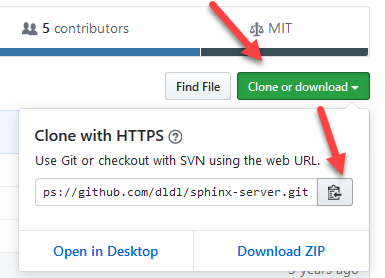

# [Step 1: Building a Docker Image](#id6)[#](#step-1-building-a-docker-image "Link to this heading")

****Objective****: Build a Docker image from an existing project.

There are many projects in GitHub that you can host yourself! A user
has created a list called [awesome-selfhosted](https://github.com/awesome-selfhosted/awesome-selfhosted). Some of the projects
have a Docker image, but others don’t. We built a Docker image to
host our [help desk](https://www.hesk.com/) site. This site runs Sphinx in Docker using
[a customer Dockerfile](../../workshops/rst/vps-config.html#sphinx-docker-environment) built from
the `nginx:alpine` image.

Let’s start with an existing project that includes a Dockerfile called
[pandoc-as-a-service](https://github.com/mrded/pandoc-as-a-service). [Pandoc](https://pandoc.org/) is a library that converts files many
types of files. We have our version running on site [pandoc.bilimedtech.com](https://pandoc.bilimedtech.com/).

## [4.1.1 Cloning a project](#id7)[#](#cloning-a-project "Link to this heading")

1. First, we will clone the [pandoc-as-a-service](https://github.com/mrded/pandoc-as-a-service) project.

   Cloning a GitHub project using Ubuntu 18.04 is easy! You use the
   command `git clone` with the site to clone as the argument.

   1. ****Go to**** the [pandoc-as-a-service](https://github.com/mrded/pandoc-as-a-service) project page
   2. ****Copy**** the project `clone URL`
   3. ****Clone**** the project using `git clone <project-url.git>`

      * Change to the root directory using `cd ~` or change to the directory
        of your choice before cloning the project.
   4. `git clone` will create a folder called `pandoc-as-a-service`.
   ```
   cd ~
   git clone https://github.com/mrded/pandoc-as-a-service.git
   cd pandoc-as-a-service

   ```
   Output[#](#id1 "Link to this code")
   ```
    1root@vps298933:~# cd ~
    2root@vps298933:~# git clone https://github.com/mrded/pandoc-as-a-service.git
    3Cloning into 'pandoc-as-a-service'...
    4remote: Enumerating objects: 171, done.
    5remote: Total 171 (delta 0), reused 0 (delta 0), pack-reused 171
    6Receiving objects: 100% (171/171), 32.36 KiB | 571.00 KiB/s, done.
    7Resolving deltas: 100% (77/77), done.
    8root@vps298933:~#
    9root@vps298933:~# cd pandoc-as-a-service/
   10root@vps298933:~/pandoc-as-a-service# ls -lh
   11total 60K
   12-rw-r--r-- 1 root root  486 Nov 13 11:27 Dockerfile
   13-rw-r--r-- 1 root root  18K Nov 13 11:27 LICENSE
   14-rw-r--r-- 1 root root   17 Nov 13 11:27 Procfile
   15-rw-r--r-- 1 root root  538 Nov 13 11:27 README.md
   16-rw-r--r-- 1 root root  212 Nov 13 11:27 helpers.js
   17-rw-r--r-- 1 root root   75 Nov 13 11:27 index.js
   18-rw-r--r-- 1 root root  872 Nov 13 11:27 package.json
   19drwxr-xr-x 3 root root 4.0K Nov 13 11:27 public
   20-rw-r--r-- 1 root root  887 Nov 13 11:27 server.js
   21drwxr-xr-x 2 root root 4.0K Nov 13 11:27 tests
   22drwxr-xr-x 2 root root 4.0K Nov 13 11:27 views
   23root@vps298933:~/pandoc-as-a-service#

   ```

## [4.1.2 The Docker Build Process](#id8)[#](#the-docker-build-process "Link to this heading")

> **Tip**
> The overview of the [Dockerfile Elements](../references/dockerfile.html#dockerfile-elements)
is in lab 5 and in the references section.

The `Dockerfile` contains the specific instructions to build the image. You
can view the [pandoc-as-a-service Dockerfile](https://github.com/mrded/pandoc-as-a-service/blob/master/Dockerfile) on their GitHub page.
The file is in our project directory because we cloned the
project. You can view the contents using on the local VPS using
`nano Dockerfile`.

The Docker build process will execute each command as if the user types
them into the bash terminal.

Dockerfile Contents[#](#id2 "Link to this code")
```
 1 FROM node:6.10
 2
 3 # Create app directory
 4 COPY . /usr/src/pandoc-as-a-service
 5 WORKDIR /usr/src/pandoc-as-a-service
 6
 7 # Install packages
 8 RUN apt-get update --fix-missing \
 9   && apt-get install -y pandoc \
10   && apt-get clean \
11   && rm -rf /var/lib/apt/lists/* \
12   && npm install
13
14 EXPOSE 8080
15
16 CMD ["npm", "start"]

```
> **Note**
> This project is several years old and it might not build without modifications.

---

1. First, we build the image without modifications to verify that the build
   process succeeds.

   We’ll use `docker build` to execute the build. Here is a look at the
   command and the arguments:

   ```
   docker build -t pandoc:default .

   ```

   `docker build`
   :   The build command

   `-t pandoc:default`
   :   Specifies an image name.

       * `pandoc:default` is a name:tag pair.
       * `name` defines the name of the project.
       * `tag` defines a specific build, such as a product or test version.
       * We will call ours `default` because it is the default image without any modifications.

   `.`
   :   Instructs the build process to look in the current directory for the Dockerfile

   > **Note**
   > You might get the error `free(): invalid pointer`.
   If so, just ignore it.

   1. You will notice that there is a step for each command in the `Dockerfile`.
   Output[#](#id3 "Link to this code")
   ```
     1root@vps298933:~# cd ~/pandoc-as-a-service/
     2root@vps298933:~/pandoc-as-a-service# docker build -t pandoc:default .
     3Sending build context to Docker daemon    148kB
     4Step 1/9 : FROM node:6.10
     56.10: Pulling from library/node
     610a267c67f42: Pull complete
     7fb5937da9414: Pull complete
     89021b2326a1e: Pull complete
     9dbed9b09434e: Pull complete
    1074bb2fc384c6: Pull complete
    119b0a326fab3b: Pull complete
    128089dfd0519a: Pull complete
    13f2be1898eb92: Pull complete
    14Digest: sha256:39c92a576b42e5bee1b46bd283c7b260f8c364d8826ee07738f77ba74cc5d355
    15Status: Downloaded newer image for node:6.10
    16 ---> 3f3928767182
    17Step 2/9 : COPY . /usr/src/pandoc-as-a-service
    18 ---> 23dad85d5658
    19Step 3/9 : WORKDIR /usr/src/pandoc-as-a-service
    20 ---> Running in 4f5cc68ad59f
    21Removing intermediate container 4f5cc68ad59f
    22 ---> 47e79eda57ab
    23Step 4/9 : RUN apt-get update --fix-missing   && apt-get install -y pandoc   && apt-get clean   && rm -rf /var/lib/apt/lists/*   && npm install
    24 ---> Running in 7b54baf06e47
    25Get:1 http://security.debian.org jessie/updates InRelease [44.9 kB]
    26Ign http://deb.debian.org jessie InRelease
    27Get:2 http://deb.debian.org jessie-updates InRelease [16.3 kB]
    28Get:3 http://deb.debian.org jessie Release.gpg [1652 B]
    29Get:4 http://deb.debian.org jessie Release [77.3 kB]
    30Get:5 http://security.debian.org jessie/updates/main amd64 Packages [992 kB]
    31Get:6 http://deb.debian.org jessie-updates/main amd64 Packages [20 B]
    32Get:7 http://deb.debian.org jessie/main amd64 Packages [9098 kB]
    33Fetched 10.2 MB in 5s (1847 kB/s)
    34Reading package lists...
    35W: There is no public key available for the following key IDs:
    36AA8E81B4331F7F50
    37Reading package lists...
    38Building dependency tree...
    39Reading state information...
    40The following extra packages will be installed:
    41  liblua5.1-0 pandoc-data
    42Suggested packages:
    43  texlive-latex-recommended texlive-xetex texlive-luatex pandoc-citeproc
    44  etoolbox
    45The following NEW packages will be installed:
    46  liblua5.1-0 pandoc pandoc-data
    470 upgraded, 3 newly installed, 0 to remove and 183 not upgraded.
    48Need to get 4764 kB of archives.
    49After this operation, 38.9 MB of additional disk space will be used.
    50Get:1 http://deb.debian.org/debian/ jessie/main liblua5.1-0 amd64 5.1.5-7.1 [108 kB]
    51Get:2 http://deb.debian.org/debian/ jessie/main pandoc-data all 1.12.4.2~dfsg-1 [202 kB]
    52Get:3 http://deb.debian.org/debian/ jessie/main pandoc amd64 1.12.4.2~dfsg-1+b14 [4453 kB]
    53debconf: delaying package configuration, since apt-utils is not installed
    54Fetched 4764 kB in 0s (26.8 MB/s)
    55Selecting previously unselected package liblua5.1-0:amd64.
    56(Reading database ... 21217 files and directories currently installed.)
    57Preparing to unpack .../liblua5.1-0_5.1.5-7.1_amd64.deb ...
    58Unpacking liblua5.1-0:amd64 (5.1.5-7.1) ...
    59Selecting previously unselected package pandoc-data.
    60Preparing to unpack .../pandoc-data_1.12.4.2~dfsg-1_all.deb ...
    61Unpacking pandoc-data (1.12.4.2~dfsg-1) ...
    62Selecting previously unselected package pandoc.
    63Preparing to unpack .../pandoc_1.12.4.2~dfsg-1+b14_amd64.deb ...
    64Unpacking pandoc (1.12.4.2~dfsg-1+b14) ...
    65Setting up liblua5.1-0:amd64 (5.1.5-7.1) ...
    66Setting up pandoc-data (1.12.4.2~dfsg-1) ...
    67Setting up pandoc (1.12.4.2~dfsg-1+b14) ...
    68Processing triggers for libc-bin (2.19-18+deb8u9) ...
    69npm info it worked if it ends with ok
    70npm info using npm@3.10.10
    71npm info using node@v6.10.3
    72. . .
    73npm info lifecycle http-signature@1.2.0~postinstall: http-signature@1.2.0
    74npm info lifecycle ejs@2.7.4~postinstall: ejs@2.7.4
    75
    76> ejs@2.7.4 postinstall /usr/src/pandoc-as-a-service/node_modules/ejs
    77> node ./postinstall.js
    78
    79Thank you for installing EJS: built with the Jake JavaScript build tool (https://jakejs.com/)
    80
    81npm info lifecycle express@4.17.1~postinstall: express@4.17.1
    82npm info lifecycle mocha@2.5.3~postinstall: mocha@2.5.3
    83npm info lifecycle pdc@0.2.3~postinstall: pdc@0.2.3
    84npm info lifecycle request@2.88.2~postinstall: request@2.88.2
    85npm info linkStuff pandoc-as-a-service@1.0.0
    86npm info lifecycle pandoc-as-a-service@1.0.0~install: pandoc-as-a-service@1.0.0
    87npm info lifecycle pandoc-as-a-service@1.0.0~postinstall: pandoc-as-a-service@1.0.0
    88npm info lifecycle pandoc-as-a-service@1.0.0~prepublish: pandoc-as-a-service@1.0.0
    89pandoc-as-a-service@1.0.0 /usr/src/pandoc-as-a-service
    90+-- ejs@2.7.4
    91+-- express@4.17.1
    92| +-- accepts@1.3.7
    93| | -- negotiator@0.6.2
    94. . .
    95| -- to-iso-string@0.0.2
    96+-- pdc@0.2.3
    97npm info ok
    98Removing intermediate container 7b54baf06e47
    99 ---> c9695d3f8147
   100Step 5/9 : EXPOSE 8080
   101 ---> Running in 3c9812aad9f4
   102Removing intermediate container 3c9812aad9f4
   103 ---> b18246a14903
   104Step 6/9 : CMD ["npm", "start"]
   105 ---> Running in 207441ad6c54
   106Removing intermediate container 207441ad6c54
   107 ---> 83ecfb330e4c
   108Successfully built bfb93547ba62
   109Successfully tagged pandoc:default
   110root@vps298933:~/pandoc-as-a-service#

   ```
2. We should verify that the image build successfully.

> 1. Use command `docker images` to view the list of images on the VPS
> 2. You should see an image called `pandoc-` with tag `default`
> 3. The `pandoc` image was built from a base image called
>    `node:6.10` in step 1. Notice that this is version is three years old!
>    We need to rebuild using an updated version that contains security
>    updates.
>
>    Output[#](#id4 "Link to this code")
>    ```
>    root@vps298933:~/pandoc-as-a-service# docker images
>    REPOSITORY          TAG                 IMAGE ID            CREATED             SIZE
>    pandoc              default             bfb93547ba62        10 minutes ago      720MB
>    mariadb             latest              2ab9d091310d        32 hours ago        414MB
>    nextcloud           latest              3ed6ea445002        7 days ago          811MB
>    wordpress           latest              6edecd0f5c75        7 days ago          546MB
>    redis               latest              62f1d3402b78        2 weeks ago         104MB
>    mysql               5.7                 1b12f2e9257b        3 weeks ago         448MB
>    hello-world         latest              bf756fb1ae65        10 months ago       13.3kB
>    node                6.10                3f3928767182        3 years ago         661MB
>    root@vps298933:~/pandoc-as-a-service#
>
>    ```

## [4.1.3 Create the docker-compose file](#id9)[#](#create-the-docker-compose-file "Link to this heading")

The `docker-compose.yml` file is simple. We will use port `20852`
for our Pandoc service. The pandoc service in the docker container
listens on port `8080`. We need to create the correct port map in
the docker-complete.yml file.

1. Create a new directory for your project

   ```
   cd ~
   mkdir pandoc-docker
   cd pandoc-docker

   ```
2. Create a `docker-compose.yml` file and add this text:

   docker-compose.yml[#](#id5 "Link to this code")
   ```
   1version: "3.3"
   2
   3services:
   4  pandoc:
   5    image: pandoc:default
   6    ports:
   7      - 20852:8080
   8    restart: always

   ```
3. Start the service and verify connectivity

   ```
   docker-compose up -d
   curl --head http://localhost:20852
   curl http://localhost:20852

   ```

## [4.1.4 Create a Reverse Proxy for Pandoc](#id10)[#](#create-a-reverse-proxy-for-pandoc "Link to this heading")

Lastly, we need to create a reverse proxy. Here is my site, for example:
[pandoc.y.jj8i.com](https://pandoc.y.jj8i.com).

1. Create sub-domain ****pandoc.example.com****
2. Create your [Reverse Proxy](../references/nginx.html#nginx-reverse-proxy) using these settings

   * `server_name pandoc.example.com;`
   * `proxy_pass http://localhost:20852;`
3. Enable the Nginx Site
4. Restart Nginx

> **Source & license**
> Reproduced ****verbatim, without modification**** from
[© 2022, BilimEdtech Labs](https://labs.bilimedtech.com/index.html),
licensed under
[Creative Commons Attribution 4.0 International (CC BY 4.0)](https://creativecommons.org/licenses/by/4.0/deed.en).

Source page:
<https://labs.bilimedtech.com/cloud-computing/4/4.1.html>

See [LICENSE](../../LICENSE_edtech.html) for the full license text.