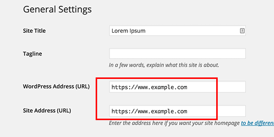
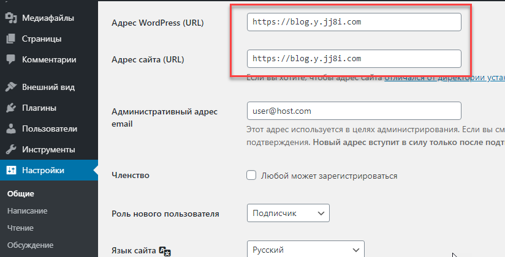

# [Step 3: Extending a Docker Image](#id9)[#](#step-3-extending-a-docker-image "Link to this heading")

****Objective****: Create an SSL version of WordPress

Migrating WordPress to an SSL version requires two steps in the correct
sequence. Making the changes in the wrong order could require database
modifications to regain access to the site.

## [4.3.1. Change the WordPress URL to HTTPS](#id10)[#](#change-the-wordpress-url-to-https "Link to this heading")

Let’s do this first so that you do not lock yourself out of your site.

1. Open the admin panel of your WordPress site.

   Did you forget your password? You can reset it using
   [Reset admin password](../references/wordpress.html#wp-reset-password).
2. Go to `Settings -> General Settings`
3. Change the values to read `https`

   
   

At this point, you cannot access your site until you configure
an SSL transport layer.

## [4.3.2. Build the new WordPress Image](#id11)[#](#build-the-new-wordpress-image "Link to this heading")

Extending an existing image is simple. We don’t have to rebuild
the entire project. We could clone the WordPress code from GitHub and
manually build the project using the base [WordPress Dockerfile](https://github.com/docker-library/wordpress/blob/master/php7.4/apache/Dockerfile)
for Apache, but we will let someone else maintain that Dockerfile.
We only need to base our image on [an official WordPress image](https://hub.docker.com/_/wordpress)
of our choice. For this lab, we will use the latest Apache version
(`wordpress:apache`).

To enable SSL in an image, we need to:

1. Base our project from an existing image (`wordpress:apache`)
2. Enable the Apache modules required for SSL
3. Copy self-signed certificates
4. Build our custom image

We’ll start by creating our project directory and files.

1. Create the directory for our image and other files.

   ```
   cd ~
   mkdir wordpress-docker-image
   cd wordpress-docker-image
   touch Dockerfile

   ```
2. The image needs self-signed SSL certificates to work. We will create
   them using package `make-ssl-cert`.

   ```
   apt-get -y install ssl-cert
   make-ssl-cert generate-default-snakeoil

   # Verify the new SSL certificates exist.
   ls -l /etc/ssl/certs/ssl-cert-snakeoil.pem /etc/ssl/private/ssl-cert-snakeoil.key

   ```

   Then, we need to copy the files to our current directory.

   ```
   cp -p /etc/ssl/certs/ssl-cert-snakeoil.pem .
   cp -p /etc/ssl/private/ssl-cert-snakeoil.key .

   ```
   Output[#](#id1 "Link to this code")
   ```
    1root@vps298933:~/wordpress-docker-image# apt-get -y install ssl-cert
    2Reading package lists... Done
    3Building dependency tree
    4Reading state information... Done
    5Suggested packages:
    6  openssl-blacklist
    7The following NEW packages will be installed:
    8  ssl-cert
    90 upgraded, 1 newly installed, 0 to remove and 4 not upgraded.
   10Need to get 17.0 kB of archives.
   11After this operation, 64.5 kB of additional disk space will be used.
   12Get:1 http://fr.archive.ubuntu.com/ubuntu bionic/main amd64 ssl-cert all 1.0.39 [17.0 kB]
   13Fetched 17.0 kB in 0s (442 kB/s)
   14Preconfiguring packages ...
   15Selecting previously unselected package ssl-cert.
   16(Reading database ... 128224 files and directories currently installed.)
   17Preparing to unpack .../ssl-cert_1.0.39_all.deb ...
   18Unpacking ssl-cert (1.0.39) ...
   19Setting up ssl-cert (1.0.39) ...
   20Processing triggers for man-db (2.8.3-2ubuntu0.1) ...
   21root@vps298933:~/wordpress-docker-image# make-ssl-cert generate-default-snakeoil
   22root@vps298933:~/wordpress-docker-image#  ls -l /etc/ssl/certs/ssl-cert-snakeoil.pem /etc/ssl/private/ssl-cert-snakeoil.key
   23-rw-r--r-- 1 root root     1034 Nov 13 22:21 /etc/ssl/certs/ssl-cert-snakeoil.pem
   24-rw-r----- 1 root ssl-cert 1708 Nov 13 22:21 /etc/ssl/private/ssl-cert-snakeoil.key
   25root@vps298933:~/wordpress-docker-image# cp -p /etc/ssl/certs/ssl-cert-snakeoil.pem .
   26root@vps298933:~/wordpress-docker-image# cp -p /etc/ssl/private/ssl-cert-snakeoil.key .
   27root@vps298933:~/wordpress-docker-image#
   28root@vps298933:~/wordpress-docker-image# ls -lh
   29total 8.0K
   30-rw-r--r-- 1 root root        0 Nov 13 22:21 Dockerfile
   31-rw-r----- 1 root ssl-cert 1.7K Nov 13 22:21 ssl-cert-snakeoil.key
   32-rw-r--r-- 1 root root     1.1K Nov 13 22:21 ssl-cert-snakeoil.pem
   33root@vps298933:~/wordpress-docker-image#

   ```
3. We can now create our Dockerfile.

   Dockerfile[#](#id2 "Link to this code")
   ```
    1# The base image
    2FROM wordpress:apache
    3
    4# Enabling the SSL module
    5RUN a2enmod ssl
    6
    7# Copy the SSL certs to the image
    8RUN mkdir /etc/apache2/certs
    9COPY ssl-cert-snakeoil.pem /etc/apache2/certs/ssl-cert.pem
   10COPY ssl-cert-snakeoil.key /etc/apache2/certs/ssl-cert.key

   ```
4. Lastly, build and the new image. You can give any name, but this
   example uses `ssl-wordpress`.

   ```
   docker build -t ssl-wordpress:latest .

   ```
   Output[#](#id3 "Link to this code")
   ```
    1root@vps298933:~/wordpress-docker-image# docker build -t ssl-wordpress:latest .
    2Sending build context to Docker daemon  6.656kB
    3Step 1/5 : FROM wordpress:apache
    4apache: Pulling from library/wordpress
    5Digest: sha256:20bffad04c9c3e696b3c6fbc48d769c5948718b57af8c9457d9a0f28b5066b4b
    6Status: Downloaded newer image for wordpress:apache
    7 ---> 6edecd0f5c75
    8Step 2/5 : RUN a2enmod ssl
    9 ---> Running in cfa4595ed571
   10Considering dependency setenvif for ssl:
   11Module setenvif already enabled
   12Considering dependency mime for ssl:
   13Module mime already enabled
   14Considering dependency socache_shmcb for ssl:
   15Enabling module socache_shmcb.
   16Enabling module ssl.
   17See /usr/share/doc/apache2/README.Debian.gz on how to configure SSL and create self-signed certificates.
   18To activate the new configuration, you need to run:
   19  service apache2 restart
   20Removing intermediate container cfa4595ed571
   21 ---> 028793b3215f
   22Step 3/5 : RUN mkdir /etc/apache2/certs
   23 ---> Running in 66bf5da33f60
   24Removing intermediate container 66bf5da33f60
   25 ---> 8123001e5c7a
   26Step 4/5 : COPY ssl-cert-snakeoil.pem /etc/apache2/certs/ssl-cert.pem
   27 ---> 872b8b06ddc4
   28Step 5/5 : COPY ssl-cert-snakeoil.key /etc/apache2/certs/ssl-cert.key
   29 ---> 61532a6d1302
   30Successfully built 61532a6d1302
   31Successfully tagged ssl-wordpress:latest
   32root@vps298933:~/wordpress-docker-image#

   ```
   Output[#](#id4 "Link to this code")
   ```
    1root@vps298933:~/wordpress-docker-image# docker images
    2REPOSITORY          TAG                 IMAGE ID            CREATED             SIZE
    3ssl-wordpress       latest              61532a6d1302        23 minutes ago      546MB
    4pandoc              latest              79ad25bc9c62        4 hours ago         1.03GB
    5pandoc              default             7eb0798f4080        10 hours ago        720MB
    6node                latest              f1974cfde44f        40 hours ago        935MB
    7mariadb             latest              2ab9d091310d        44 hours ago        414MB
    8nextcloud           latest              3ed6ea445002        7 days ago          811MB
    9wordpress           apache              6edecd0f5c75        7 days ago          546MB
   10wordpress           latest              6edecd0f5c75        7 days ago          546MB
   11redis               latest              62f1d3402b78        2 weeks ago         104MB
   12node                6.10                3f3928767182        3 years ago         661MB
   13root@vps298933:~/wordpress-docker-image#

   ```

## [4.4.3. Add SSL Configuration](#id12)[#](#add-ssl-configuration "Link to this heading")

The Apache webserver running in the new image called `ssl-wordpress`
supports both HTTP and HTTPS. We need to add a configuration
file for the WordPress site to use SSL. We do the same thing when
we create an Nginx site.

1. First, we need to create an Apache SSL configuration for
   WordPress to listen on port 433 (SSL). We will store these
   files in a volume directory called `apache`.

   ```
   # Create the volume directory and file
   cd ~/wordpress-docker
   mkdir apache
   touch apache/site.conf

   ```

   Add this information to `apache/site.conf`.

   apache/site.conf[#](#id5 "Link to this code")
   ```
    1<VirtualHost *:80>
    2    #ServerName www.example.com
    3    DocumentRoot /var/www/html
    4
    5    ErrorLog ${APACHE_LOG_DIR}/error.log
    6    CustomLog ${APACHE_LOG_DIR}/access.log combined
    7</VirtualHost>
    8<IfModule mod_ssl.c>
    9    <VirtualHost _default_:443>
   10       #ServerName www.example.com
   11        DocumentRoot /var/www/html
   12
   13        ErrorLog ${APACHE_LOG_DIR}/error.log
   14        CustomLog ${APACHE_LOG_DIR}/access.log combined
   15
   16        SSLEngine on
   17        SSLCertificateFile      /etc/apache2/certs/ssl-cert.pem
   18        SSLCertificateKeyFile   /etc/apache2/certs/ssl-cert.key
   19
   20        <FilesMatch "\.(cgi|shtml|phtml|php)$">
   21            SSLOptions +StdEnvVars
   22        </FilesMatch>
   23        <Directory /usr/lib/cgi-bin>
   24            SSLOptions +StdEnvVars
   25        </Directory>
   26    </VirtualHost>
   27</IfModule>

   ```
2. Next, we need to modify the `docker-compose.yml` so that the
   running container can use SSL.

   1. Change the image to `ssl-wordpress:latest`
   2. Create a volume for our custom `site.conf` file.
   3. Tell the container to listen on port 443 by adding a new port
      map (20843:443).

      > **Tip**
      > We can the numbers 8 and 4 to differentiate between
      HTTP and HTTPS maps.

      * HTTP sites use port 80 or 8080. We use 208xx
      * HTTPS sites use port 443 or 4443. We use 204xxdocker-compose.yml[#](#id6 "Link to this code")
   ```
   . . .
   wordpress:
     depends_on:
       - db
       - redis
     image: ssl-wordpress:latest
     volumes:
       - ./wordpress:/var/www/html
       - ./apache/site.conf:/etc/apache2/sites-enabled/000-default.conf
     ports:
       - "20851:80"
       - "20435:443"
     restart: always
   . . .

   ```
3. Restart and verify that the container responds to HTTPS requests.

   ```
   docker-compose down && docker-compose up -d
   curl -k --head https://localhost:20435

   ```
   Output[#](#id7 "Link to this code")
   ```
   root@vps298933:~/wordpress-docker# docker-compose down && docker-compose up -d
   Stopping wordpressdocker_wordpress_1 ... done
   Stopping wordpressdocker_redis_1     ... done
   Stopping wordpressdocker_db_1        ... done
   Removing wordpressdocker_wordpress_1 ... done
   Removing wordpressdocker_redis_1     ... done
   Removing wordpressdocker_db_1        ... done
   Removing network wordpressdocker_default
   Creating network "wordpressdocker_default" with the default driver
   Creating wordpressdocker_redis_1 ...
   Creating wordpressdocker_db_1 ...
   Creating wordpressdocker_redis_1
   Creating wordpressdocker_redis_1 ... done
   Creating wordpressdocker_wordpress_1 ...
   Creating wordpressdocker_wordpress_1 ... done
   root@vps298933:~/wordpress-docker# curl -k --head https://localhost:20435
   HTTP/1.1 301 Moved Permanently
   Date: Fri, 13 Nov 2020 17:41:38 GMT
   Server: Apache/2.4.38 (Debian)
   X-Powered-By: PHP/7.4.12
   X-Redirect-By: WordPress
   Location: https://localhost/
   Content-Type: text/html; charset=UTF-8

   root@vps298933:~/wordpress-docker#

   ```
4. The last step is to configure Nginx to operate on SSL.
   Change `proxy_pass` to HTTPS.

   Edit your blog Nginx site:
   `nano /etc/nginx/sites-available/blog.example.com`

   Output[#](#id8 "Link to this code")
   ```
    1server {
    2    listen 80;
    3
    4    server_name blog.y.jj8i.com;
    5
    6    location / {
    7        #proxy_pass http://localhost:20851;
    8        proxy_pass https://localhost:20435;
    9        proxy_set_header Host $host;
   10        proxy_set_header X-Real-IP $remote_addr;
   11        proxy_set_header X-Forwarded-For $proxy_add_x_forwarded_for;
   12    }
   13}

   ```

   Restart Nginx and obtain an SSL certificate.

   ```
   nginx -t
   systemctl restart nginx
   certbot --nginx

   ```

View the page in your browser to verify that WordPress has SSL.

> **Source & license**
> Reproduced ****verbatim, without modification**** from
[© 2022, BilimEdtech Labs](https://labs.bilimedtech.com/index.html),
licensed under
[Creative Commons Attribution 4.0 International (CC BY 4.0)](https://creativecommons.org/licenses/by/4.0/deed.en).

Source page:
<https://labs.bilimedtech.com/cloud-computing/4/4.3.html>

See [LICENSE](../../LICENSE_edtech.html) for the full license text.