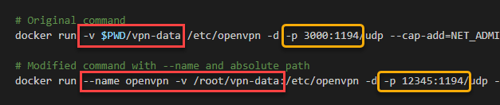

# [Step 1: Initialize OpenVPN using Docker](#id4)[#](#step-1-initialize-openvpn-using-docker "Link to this heading")

****Objective****: Create an OpenVPN Docker container using the default
configuration.

## [6.1.1. Choosing a VPN port](#id5)[#](#choosing-a-vpn-port "Link to this heading")

Before you begin, ****choose**** a UDP port (or ports) that you want to use for
your OpenVPN connection. You might ask, why does a port matter?

Outgoing port restrictions
:   Some networks restrict ports to control outgoing traffic. For example, a
    network wants to prevent torrents (port ranges 6700-6999) or defend again
    viruses that use Window’s file sharing (135-139). A network might block
    the VPN port `1194` intentionally.

    * Using a common port can bypass that restriction.

Seeking to be anonymous
:   Using port `1194` announces to your ISP or network admin that you are using
    a VPN. You might want to hide that you are using a VPN.

    * Using another port can help mask a VPN tunnel.
    * It takes a sophisticated operation to detect a VPN.

---

1. ****Browse**** the [List of TCP and UDP port numbers](https://en.wikipedia.org/wiki/List_of_TCP_and_UDP_port_numbers) from Wikipedia.
2. ****Select**** a well-known ****UDP**** port that is likely to be open (DNS, NTP),
   that masks your usage (masquerade your data as a streaming video or game),
   or pick a port at random.

   Suggested UDP Ports[#](#id2 "Link to this table")


   | UPD Port Number | Description |
   | --- | --- |
   | 22 | Secure Shell (SSH) |
   | 53 | Domain Name System (DNS) |
   | 123 | Network Time Protocol (NTP) |
   | 465 |  |
   | 554 | Real Time Streaming Protocol (RTSP) |
   | 943 |  |
   | 972 |  |
   | 995 | Post Office Protocol 3 over TLS/SSL (POP3S) |
   | 1935 | Real Time Messaging Protocol (RTMP) |
   | 1234 | VLC media player default port for UDP/RTP stream |
   | 10007 | VoIP providers (ports 10000-20000) |
   | 11211 | Memcached |
   | 3074 | Xbox LIVE |
   | 3748 |  |
   | 5005 | Real-time Transport Protocol media data (RTP) |
   | 5730 |  |
   | 8080 |  |
   | 17500 | Dropbox LanSync Protocol (db-lsp) |
   | 25575 | Minecraft |
3. ****Open**** the port in your firewall.

   * Typically, VPNs use UDP instead of TCP.
   * We can open a port on the firewall to accept UDP traffice only.
   * For example, this command open ports **123** using UDP. The firewall
     rejects TCP requests using port 123.

> ```
> ufw allow 123/udp
>
> ```

## [6.1.2. Set up the Docker Container](#id6)[#](#set-up-the-docker-container "Link to this heading")

> **Note**
> This page is based on @gurayy’s
[Set Up a VPN Server With Docker In 5 Minutes](https://medium.com/@gurayy/set-up-a-vpn-server-with-docker-in-5-minutes-a66184882c45) blog post.

* We will make some configuration changes.

1. Follow the [Set Up a VPN Server With Docker In 5 Minutes](https://medium.com/@gurayy/set-up-a-vpn-server-with-docker-in-5-minutes-a66184882c45) guide
2. Note the following changes

   1. Replace `$PWD` with `/root` for all instances

      * `$PWD` returns or displays the current directory.
      * This path will become incorrect if the user is not in the **home**
        directory.
   2. Replace `IP_ADDRESS:3000` with the IP address of your VPS.
   3. Replace the port (`3000`) with a port of your choice.
   4. Add the `--name` flag to the run command that starts the daemon process

> 
>
>
> Example of changes[#](#id3 "Link to this image")

### [Verify the Installation](#id7)[#](#verify-the-installation "Link to this heading")

At this point, you should have OpenVPN running in a Docker container and the
configs files stored in `~/vpn-data`.

Verify that:

> 1. the ****firewall**** accepts UDP connections on the specified port.
> 2. the Docker ****container**** is running.
>
>    * You should see your running OpenVPN container with an exposed port
>      mapped to `1194`.
> 3. the ****configuration**** files are in directory `~/vpn-data`.
>
>    ```
>    root@vps298933:~# ls -lh ~/vpn-data/
>    total 20K
>    drwxr-xr-x 2 root root 4.0K Apr 18 21:04 ccd
>    -rw-r--r-- 1 root root  650 Apr 18 21:06 crl.pem
>    -rw-r--r-- 1 root root  642 Apr 18 21:04 openvpn.conf
>    -rw-r--r-- 1 root root  813 Apr 18 21:04 ovpn_env.sh
>    drwx------ 6 root root 4.0K Apr 18 21:09 pki
>    root@vps298933:~#
>
>    ```
> 4. you have a file with an extension `.ovpn` in the root (`~`)
>    directory.
> 5. Edit the `.ovpn` file using `nano` or another editor and verify that
>    the IP address, port and protocol are correct.

The configuration might work on some systems, but there is a
[configuration error](https://github.com/kylemanna/docker-openvpn/issues/381) that prevents the client from communicating with the
VPN server. Please continue to the next step to correct the invalid
configuration.

> **Source & license**
> Reproduced ****verbatim, without modification**** from
[© 2022, BilimEdtech Labs](https://labs.bilimedtech.com/index.html),
licensed under
[Creative Commons Attribution 4.0 International (CC BY 4.0)](https://creativecommons.org/licenses/by/4.0/deed.en).

Source page:
<https://labs.bilimedtech.com/cloud-computing/6-open-vpn/6.1.html>

See [LICENSE](../../LICENSE_edtech.html) for the full license text.