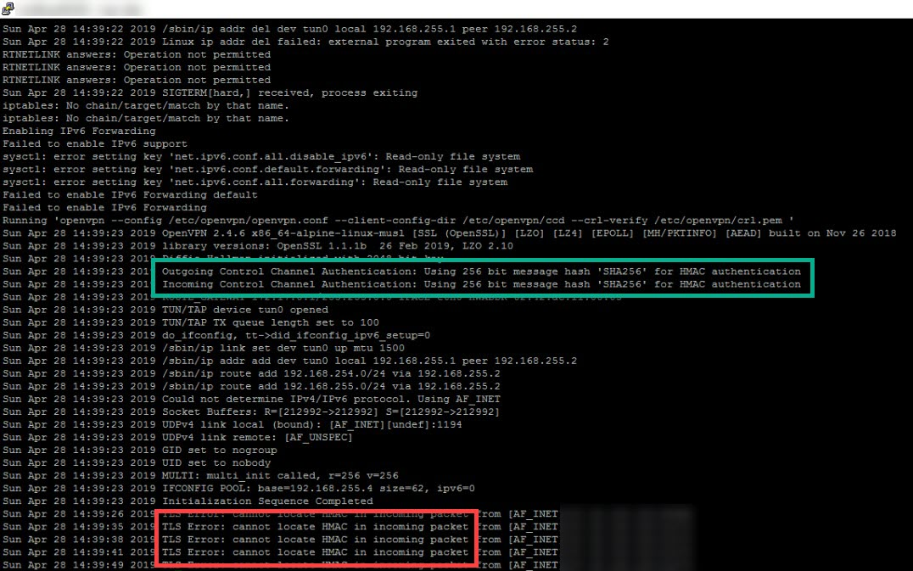

# [Step 5: Using a Stronger Cipher](#id7)[#](#step-5-using-a-stronger-cipher "Link to this heading")

****Objective****: Change the default weak cipher to a stronger cipher.

## [6.5.1. Cautionary Notes](#id8)[#](#cautionary-notes "Link to this heading")

This method of installing OpenVPN was quick and easy. You could put these
commands in a script and create a new VPN instance without effort. You could
easily fool yourself into thinking that you are secure just because you can
spin up a Docker-based VPN connection.

We didn’t talk about any security features. You shouldn’t rely on this Docker
version or any other OpenVPN configuring until you explore the cipher and
security settings of the build.

> **Attention**
> The default configuration of OpenVPN uses insecure settings.

For example, OpenVPN uses [cipher BF-CBC](https://community.openvpn.net/openvpn/wiki/SWEET32) by default, which they then
acknowledge is affected by the SWEET32 attack. To mitigate this attack, they
recommend using AES-256-CBC or AES-128-CBC. Furthermore, TLS version 1.0 is
old and no longer trusted. OpenVPN VPN leaves it up to the end-user to choose
the appropriate ciphers and security measures.

```
x.x.x.x:63081 peer info: IV_GUI_VER=OpenVPN_GUI_10
x.x.x.x:63081 Incoming Data Channel: Cipher 'BF-CBC' initialized with 128 bit key
x.x.x.x:63081 WARNING: INSECURE cipher with block size less than 128 bit (64 bit).  This allows attacks like SWEET32.  Mitigate by using a --cipher with a larger block size (e.g. AES-256-CBC).
x.x.x.x:63081 Incoming Data Channel: Using 160 bit message hash 'SHA1' for HMAC authentication
x.x.x.x:63081 WARNING: cipher with small block size in use, reducing reneg-bytes to 64MB to mitigate SWEET32 attacks.
x.x.x.x:63081 Control Channel: TLSv1.2, cipher TLSv1.2 ECDHE-RSA-AES256-GCM-SHA384, 2048 bit RSA

```

## [6.5.2. Security recommendations](#id9)[#](#security-recommendations "Link to this heading")

OpenVPN’s community guide on [Hardening OpenVPN](https://community.openvpn.net/openvpn/wiki/Hardening) provides recommendations.
Let’s see how we can implement some of these features easily.

| Recommendation | Our Action |
| --- | --- |
| 1. Use a strong cipher | Use `AES-128-CBC` because it offers security and has a speed   advantage over of AES-256. |
| 2. Use 2048-bit key size | OpenVPN uses a 2048 bits DH key by default. |
| 3. Use TLS version 1.2 or greater | Enable directive `tls-version-min 1.2` |
| 4. Use a TLS cipher from the list | Use directive `tls-cipher TLS-DHE-RSA-WITH-AES-128-GCM-SHA256` |
| 5. Use TLS auth | We can enable TLS auth, but we have to generate new keys |

## [6.5.3. Changing Ciphers](#id10)[#](#changing-ciphers "Link to this heading")

Changing ciphers in OpenVPN is simple. Both sides (the client and server)
must match except `tls-server` for the server and `tls-client` for the
client.

You can use other combinations, but here is a recommendation:

1. Add these lines to the ****server**** config.

   openvpn.conf[#](#id1 "Link to this code")
   ```
   # Uses a stronger cipher for a more secure connection
   cipher AES-128-CBC
   tls-server
   tls-version-min 1.2
   tls-cipher TLS-DHE-RSA-WITH-AES-128-GCM-SHA256

   ```
2. Add these lines to the ****client**** config.

   user.ovpn[#](#id2 "Link to this code")
   ```
   # Uses a stronger cipher for a more secure connection
   cipher AES-128-CBC
   tls-client
   tls-version-min 1.2
   tls-cipher TLS-DHE-RSA-WITH-AES-128-GCM-SHA256

   ```
3. Restart the OpenVPN server for the changes to take effect.

   Here the result after making some basic config changes. Notice that the
   warnings are gone.

   Output without INSECURE cipher warnings[#](#id3 "Link to this code")
   ```
   x.x.x.x:50676 TLS: Initial packet from [AF_INET]x.x.x.x:50676, sid=a354af3c c087f793
   x.x.x.x:50676 VERIFY OK: depth=1, CN=Easy-RSA CA
   x.x.x.x:50676 VERIFY OK: depth=0, CN=user2
   x.x.x.x:50676 peer info: IV_VER=2.3.10
   x.x.x.x:50676 peer info: IV_PLAT=win
   x.x.x.x:50676 peer info: IV_PROTO=2
   x.x.x.x:50676 peer info: IV_GUI_VER=OpenVPN_GUI_10
   x.x.x.x:50676 Outgoing Data Channel: Cipher 'AES-128-CBC' initialized with 128 bit key
   x.x.x.x:50676 Outgoing Data Channel: Using 160 bit message hash 'SHA1' for HMAC authentication
   x.x.x.x:50676 Incoming Data Channel: Cipher 'AES-128-CBC' initialized with 128 bit key
   x.x.x.x:50676 Incoming Data Channel: Using 160 bit message hash 'SHA1' for HMAC authentication
   x.x.x.x:50676 Control Channel: TLSv1.2, cipher TLSv1.2 DHE-RSA-AES128-GCM-SHA256, 2048 bit RSA
   x.x.x.x:50676 [user2] Peer Connection Initiated with [AF_INET]x.x.x.x:50676
   user2/x.x.x.x:50676 MULTI_sva: pool returned IPv4=192.168.255.6, IPv6=(Not enabled)
   user2/x.x.x.x:50676 MULTI: Learn: 192.168.255.6 -> user2/x.x.x.x:50676
   user2/x.x.x.x:50676 MULTI: primary virtual IP for user2/x.x.x.x:50676: 192.168.255.6
   user2/x.x.x.x:50676 PUSH: Received control message: 'PUSH_REQUEST'
   user2/x.x.x.x:50676 SENT CONTROL [user2]: 'PUSH_REPLY,block-outside-dns,dhcp-option DNS 163.172.185.51,dhcp-option DNS 80.67.169.40,comp-lzo no,route 192.168.255.1,topology net30,ping 10,ping-restart 60,ifconfig 192.168.255.6 192.168.255.5,peer-id 0' (status=1)

   ```

## [6.5.4. Adding TLS Authentication](#id11)[#](#adding-tls-authentication "Link to this heading")

We can enable HMAC authentication using SHA256 easily, but it requires
generating new client keys to use it.

1. Add `auth SHA256` to the ****server**** config.
2. Generate a new client.ovpn config. You will notice that it added a new
   section called `<tls-auth>`.

   openvpn.conf[#](#id4 "Link to this code")
   ```
   key-direction 1
   <tls-auth>
   #
   # 2048 bit OpenVPN static key
   #
   -----BEGIN OpenVPN Static ... V1-----
   439bfa594cc754c616bfed3b32a1d7b7
   d25bbea
           . . .
                 27922acd9a64ca76c
   c2aa62ae990b8e5d43f723a0785cd796
   -----END OpenVPN Static ... V1-----
   </tls-auth>

   ```
3. Add `auth SHA256` to the ****client**** config.

   * You will have to add the ciphers to the new client config.
4. Connect to the VPN server using your new key.

   * You can verify that it uses the more secure `SHA256`
     HMAC authentication.Output after enabling `auth SHA256`[#](#id5 "Link to this code")
   ```
    Tue Apr 23 15:22:44 2019 x.x.x.x:57670 TLS: Initial packet from [AF_INET]x.x.x.x:57670, sid=f45c37fa bf4202b6
    Tue Apr 23 15:22:44 2019 x.x.x.x:57670 VERIFY OK: depth=1, CN=Easy-RSA CA
    Tue Apr 23 15:22:44 2019 x.x.x.x:57670 VERIFY OK: depth=0, CN=client4
    Tue Apr 23 15:22:44 2019 x.x.x.x:57670 peer info: IV_VER=2.3.10
    Tue Apr 23 15:22:44 2019 x.x.x.x:57670 peer info: IV_PLAT=win
    Tue Apr 23 15:22:44 2019 x.x.x.x:57670 peer info: IV_PROTO=2
    Tue Apr 23 15:22:44 2019 x.x.x.x:57670 peer info: IV_GUI_VER=OpenVPN_GUI_10
    Tue Apr 23 15:22:44 2019 x.x.x.x:57670 Outgoing Data Channel: Cipher 'AES-128-CBC' initialized with 128 bit key
    Tue Apr 23 15:22:44 2019 x.x.x.x:57670 Outgoing Data Channel: Using 256 bit message hash 'SHA256' for HMAC authentication
    Tue Apr 23 15:22:44 2019 x.x.x.x:57670 Incoming Data Channel: Cipher 'AES-128-CBC' initialized with 128 bit key
    Tue Apr 23 15:22:44 2019 x.x.x.x:57670 Incoming Data Channel: Using 256 bit message hash 'SHA256' for HMAC authentication
    Tue Apr 23 15:22:44 2019 x.x.x.x:57670 Control Channel: TLSv1.2, cipher TLSv1.2 DHE-RSA-AES128-GCM-SHA256, 2048 bit RSA
    Tue Apr 23 15:22:44 2019 x.x.x.x:57670 [client4] Peer Connection Initiated with [AF_INET]x.x.x.x:57670
    Tue Apr 23 15:22:44 2019 client4/x.x.x.x:57670 MULTI_sva: pool returned IPv4=192.168.255.6, IPv6=(Not enabled)
    Tue Apr 23 15:22:44 2019 client4/x.x.x.x:57670 MULTI: Learn: 192.168.255.6 -> client4/x.x.x.x:57670
    Tue Apr 23 15:22:44 2019 client4/x.x.x.x:57670 MULTI: primary virtual IP for client4/x.x.x.x:57670: 192.168.255.6
    Tue Apr 23 15:22:47 2019 client4/x.x.x.x:57670 PUSH: Received control message: 'PUSH_REQUEST'
    Tue Apr 23 15:22:47 2019 client4/x.x.x.x:57670 SENT CONTROL [client4]: 'PUSH_REPLY,block-outside-dns,dhcp-option DNS 8.8.8.8,dhcp-option DNS 8.8.4.4,comp-lzo no,route 192.168.255.1,topology net30,ping 10,ping-restart 60,ifconfig 192.168.255.6 192.168.255.5,peer-id 0' (status=1)

   ```

   ****Authentication Error****

   Error message **TLS Error: cannot locate HMAC in incoming packet**
   indicates that the client configs is missing directive `auth SHA256`.

   


   HMAC error if the client config does not include `auth SHA256`[#](#id6 "Link to this image")

> **Source & license**
> Reproduced ****verbatim, without modification**** from
[© 2022, BilimEdtech Labs](https://labs.bilimedtech.com/index.html),
licensed under
[Creative Commons Attribution 4.0 International (CC BY 4.0)](https://creativecommons.org/licenses/by/4.0/deed.en).

Source page:
<https://labs.bilimedtech.com/cloud-computing/6-open-vpn/6.5.html>

See [LICENSE](../../LICENSE_edtech.html) for the full license text.