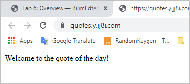

# [Step 3: The Development process](#id2)[#](#step-3-the-development-process "Link to this heading")

****The goal for Step 3****: Learn how to develop your Flask project in a
Docker environment

## [3.1. The Development Process](#id3)[#](#the-development-process "Link to this heading")

We want to maintain the separation between the code and platform by using volumes.

> **Caution**
> * ****Important!**** Do not need to enter the running container to change your
  code files.
* Change all code files in your volume directory: `~/flask-quotes/quotes-app`

1. Run your container **in your foreground** (without `-d`) so that you can
   see the error message.

   ```
   # First, stop any running containers
   docker-compose down

   # Then, start the container running the foreground
   docker-compose up

   ```
2. A page that shows `502 Bad Gateway` indicates that your Python code contains
   syntax errors and that your container crashed.
3. The container might exit when an error is encountered. Fix the error and
   then restart the container. In short, the running container works as your
   compiler.

   ```
   SyntaxError: EOL while scanning string literal
     File "./server.py", line 8
       welcome = welcome + "This site is a demo using Flask in Docker

   ```

## [3.2. Video of the Development Process](#id4)[#](#video-of-the-development-process "Link to this heading")

Watch this video that demonstrates the process.

## [3.3. Give it a try!](#id5)[#](#give-it-a-try "Link to this heading")

1. Run your container **in your foreground**

   ```
   # First, stop any running containers
   docker-compose down

   # Then, start the container running the foreground
   docker-compose up

   ```
   Expected output[#](#id1 "Link to this code")
   ```
   sysadmin@test2:~/flask-quotes$ docker-compose up
   Starting flaskquotes_flask_1 ...
   Starting flaskquotes_flask_1 ... done
   Attaching to flaskquotes_flask_1
   flask_1  |  * Serving Flask app 'index' (lazy loading)
   flask_1  |  * Environment: production
   flask_1  |    WARNING: This is a development server. Do not use it in a production deployment.
   flask_1  |    Use a production WSGI server instead.
   flask_1  |  * Debug mode: on
   flask_1  |  * Running on all addresses.
   flask_1  |    WARNING: This is a development server. Do not use it in a production deployment.
   flask_1  |  * Running on http://172.25.0.2:5000/ (Press CTRL+C to quit)
   flask_1  |  * Restarting with stat
   flask_1  |  * Debugger is active!
   flask_1  |  * Debugger PIN: 140-043-652

   ```
2. Change the `hello world` message, to something like:

   ```
   hello = "Welcome to the quote of the day!\n"

   ```
3. Save the file and verify that changes were detected.

   ```
   sysadmin@test2:~/flask-quotes$ docker-compose up
   Starting flaskquotes_flask_1 ...
   Starting flaskquotes_flask_1 ... done
   Attaching to flaskquotes_flask_1
   flask_1  |  * Serving Flask app 'index' (lazy loading)
   flask_1  |  * Environment: production
   flask_1  |    WARNING: This is a development server. Do not use it in a production deployment.
   flask_1  |    Use a production WSGI server instead.
   flask_1  |  * Debug mode: on
   flask_1  |  * Running on all addresses.
   flask_1  |    WARNING: This is a development server. Do not use it in a production deployment.
   flask_1  |  * Running on http://172.25.0.2:5000/ (Press CTRL+C to quit)
   flask_1  |  * Restarting with stat
   flask_1  |  * Debugger is active!
   flask_1  |  * Debugger PIN: 140-043-652
   flask_1  |  * Detected change in '/app/index.py', reloading
   flask_1  |  * Restarting with stat
   flask_1  |  * Debugger is active!
   flask_1  |  * Debugger PIN: 140-043-652

   ```
4. Refresh the page in the web browser to verify that the new welcome
   message displays.

   

## [3.4. Debugging](#id6)[#](#debugging "Link to this heading")

What do you do if you have an error and the container exits? 🤔

Here is an example `syntax error`. Notice that the debugger told you
the file name and exactly what line the error occurred on.

> In this case, the text string was not closed. It was missing the
> closing `"` on line 9 of `index.py`.
>
> > **Tip**
> > You can check your code online for compile errors to help you debug.
>
> * <http://pep8online.com/>   
>   Notice that this site also uses Flask!.
> * <https://www.tutorialspoint.com/online_python_formatter.htm>   
>   Validates he code and generate a compile error if problems are found.

Fix the error, save the file, and then start the container again.

> ```
> sysadmin@test2:~/flask-quotes$ docker-compose up
> Starting flaskquotes_flask_1 ...
> Starting flaskquotes_flask_1 ... done
> Attaching to flaskquotes_flask_1
> flask_1  |  * Serving Flask app 'index' (lazy loading)
> flask_1  |  * Environment: production
> flask_1  |    WARNING: This is a development server. Do not use it in a production deployment.
> flask_1  |    Use a production WSGI server instead.
> flask_1  |  * Debug mode: on
> flask_1  |  * Running on all addresses.
> flask_1  |    WARNING: This is a development server. Do not use it in a production deployment.
> flask_1  |  * Running on http://172.25.0.2:5000/ (Press CTRL+C to quit)
> flask_1  |  * Restarting with stat
> flask_1  |  * Debugger is active!
> flask_1  |  * Debugger PIN: 140-043-652
> flask_1  |  * Detected change in '/app/index.py', reloading
> flask_1  |  * Restarting with stat
> flask_1  |  * Debugger is active!
> flask_1  |  * Debugger PIN: 140-043-652
> flask_1  |  * Detected change in '/app/index.py', reloading
> flask_1  |  * Restarting with stat
> flask_1  |   File "/app/index.py", line 9
> flask_1  |     hello = "Welcome to the quote of the day!\n
> flask_1  |             ^
> flask_1  | SyntaxError: unterminated string literal (detected at line 9)
> flaskquotes_flask_1 exited with code 1
> sysadmin@test2:~/flask-quotes$
> sysadmin@test2:~/flask-quotes$ docker-compose up
> Starting flaskquotes_flask_1 ...
> Starting flaskquotes_flask_1 ... done
> Attaching to flaskquotes_flask_1
> flask_1  |  * Serving Flask app 'index' (lazy loading)
> . . .
>
> ```

> **Source & license**
> Reproduced ****verbatim, without modification**** from
[© 2022, BilimEdtech Labs](https://labs.bilimedtech.com/index.html),
licensed under
[Creative Commons Attribution 4.0 International (CC BY 4.0)](https://creativecommons.org/licenses/by/4.0/deed.en).

Source page:
<https://labs.bilimedtech.com/cloud-computing/6/6.3.html>

See [LICENSE](../../LICENSE_edtech.html) for the full license text.