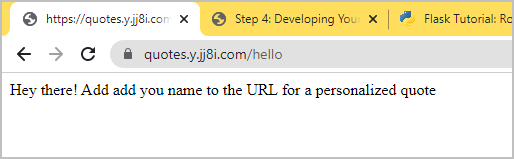
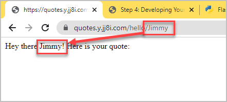
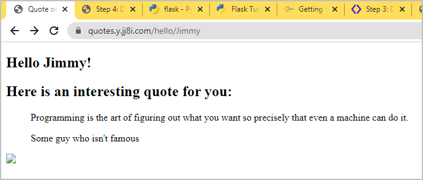
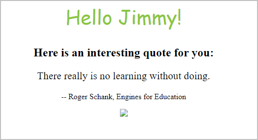

# [Step 4: Developing Your Flask App](#id7)[#](#step-4-developing-your-flask-app "Link to this heading")

****The goal for Step 4****: To develop a completed **Quote of the Day** Python Flask app

This activity was derived from these two sites

* [University of Washington CSE 154 - lec26-flask](https://courses.cs.washington.edu/courses/cse154/19sp/lectures/lec26-flask/index.html#/10)
* [Python Tutorial - flask](https://pythonspot.com/flask-web-app-with-python/)

## [4.1. Creating Routes](#id8)[#](#creating-routes "Link to this heading")

Flask does not have a filesystem directory to locate and serve files. Instead,
it uses a technique called [named routing](https://pythonbasics.org/flask-tutorial-routes/) to map a route name to a function.

Your hello-world `index.py` page already has the default or index route `/`.
Opening the web browser to the index page will display the contents of
function `hello_world`.

```
 @app.route("/")
 def hello_world():

     hello = "Welcome to the quote of the day!\n"
     return hello

```

Let’s create a named route to greet a person by name using
**flask route params**.

1. First, let’s rename `hello_world()` function to `index()`

   ```
   @app.route('/')
   def index():
       hello = "Welcome to the quote of the day!\n"
       return hello

   ```
2. Create a new route called `/hello` in your `index.py` file

   ```
   @app.route('/hello')
   def hello():
       return "Hey there! Add add you name to the URL for a personalized quote"

   ```

   Here is how your file should look:

   With added `hello` route[#](#id1 "Link to this code")
   ```
   from flask import Flask
   app = Flask(__name__)

   # Default route
   @app.route("/")
   def index():

       hello = "Welcome to the quote of the day!\n"
       return hello

   # /hello route
   @app.route('/hello')
   def hello():
      return "Hey there! Add add you name to the URL for a personalized quote"

   # Flask app server
   if __name__ == "__main__":
       app.run(host="0.0.0.0", port=int("5000"), debug=True)

   ```
3. Open the page in your browser to verify that it works as expected.

   
4. Add a new route with a string parameter called `name` and then
   verify the route works.

   ```
   @app.route('/hello/<name>/')
   def hello_visitor(name):
       return "Hey there " + str(name) + "! Here is your quote:"

   ```
   

   Here is how your `index.py` file should look:

   With added `/hello/name` route[#](#id2 "Link to this code")
   ```
   from flask import Flask
   app = Flask(__name__)

   # Default route
   @app.route("/")
   def index():

       hello = "Welcome to the quote of the day!\n"
       return hello

   # /hello route
   @app.route('/hello')
   def hello():
      return "Hey there! Add add you name to the URL for a personalized quote"

   # /hello route with a 'name' parameter
   @app.route('/hello/<name>/')
   def hello_visitor(name):
       return "Hey there " + str(name) + "! Here is your quote:"

   # Flask app server
   if __name__ == "__main__":
       app.run(host="0.0.0.0", port=int("5000"), debug=True)

   ```

## [4.2. Templates](#id9)[#](#templates "Link to this heading")

Flask uses [Jinja2]( https://flask.palletsprojects.com/en/2.1.x/templating/) as its template engine to provide code functionality
inside the HTML files.

We will separate code and user interface using a technique called templates.
We make two directories to contain non-Python code files:

`templates`
:   The `templates` folder contains the HTML files

`static`
:   The `static` folder contains other files, such as images, CSS, and JS.

1. Create the two directories in your `quotes-app` folder with the files we will need

   ```
   # Verify your directory
   # Expected directory: ~/flask-quotes/quotes-app
   echo $PWD

   # Create the directories
   mkdir templates
   mkdir static

   # Create empty files
   touch templates/quotes.html
   touch static/quotes.css

   ```

   Your folder structure should look like this:

   ```
   sysadmin@test2:~/flask-quotes/quotes-app$ tree
   .
   ├── index.py
   ├── static
   │   └── quotes.css
   └── templates
       └── quotes.html

   2 directories, 3 files
   sysadmin@test2:~/flask-quotes/quotes-app$

   ```
2. Edit `quotes.html` to include `name` variable.

   [Jinja2]( https://flask.palletsprojects.com/en/2.1.x/templating/) provides the logic and will render the `{{name}}` variable.

   quotes.html[#](#id3 "Link to this code")
   ```
   <h1>Hello {{name}}</h1>

   ```
3. Edit `index.py` to render a template instead of returning HTML code
   for route `/hello/<name>/`. Also, we have to import the libraries.

   python.py[#](#id4 "Link to this code")
   ```
   from flask import Flask, flash, redirect, render_template, request, session, abort

   app = Flask(__name__)

   # Default route
   @app.route("/")
   def index():

       hello = "Welcome to the quote of the day!\n"
       return hello

   # /hello route
   @app.route('/hello')
   def hello():
      return "Hey there! Add add you name to the URL for a personalized quote"

   # /hello route with a 'name' parameter
   @app.route('/hello/<name>/')
   def hello_visitor(name):

       # The template can access the variable using this format: {{variable}}
       return render_template('quotes.html', name=name)
       # return "Hey there " + str(name) + "! Here is your quote:"

   # Flask app server
   if __name__ == "__main__":
       app.run(host="0.0.0.0", port=int("5000"), debug=True)

   ```
4. Now, we can finish developing the HTML in `quotes.html`.

   ```
   <!DOCTYPE html>
   <html>
       <head>
           <title>Quote of the Day</title>
           <link rel="stylesheet" href="{{ url_for('static', filename='quotes.css') }}" type="text/css" />
       </head>
       <body>
           <section id="container">
               <h1>Hello {{name}}!</h1>
               <h2>Here is an interesting quote for you:</h2>
               <blockquote>
                   <p id="quote">{{quote}}</p>
                   <p id="author">-- {{author}}</p>
               </blockquote>
           
           </section>
       </body>
   </html>

   ```

We’ll beautify the HTML file later by adding a CSS file and image.

## [4.3. Adding the Quotes](#id10)[#](#adding-the-quotes "Link to this heading")

At this point, the HTML contains the essential structure to display the
quote.

Complements of UW, we have prepared the `quotes.txt` file for you.

1. Copy the `quotes.txt` to your project folder

   * ****Option 1:**** Download `quotes.txt`
     and upload to your VPS.
   * ****Option 2:**** Copy the path above and use `wget url-to-quotes.txt`.
2. Add the code to read a random quote.

   The template is expecting the variables `quote` and `author`.
   We’ll read the `quotes.txt` file and get a random quote.

   python.py[#](#id5 "Link to this code")
   ```
   from flask import Flask, flash, redirect, render_template, request, session, abort
   from random import randrange

   app = Flask(__name__)

   # Default route
   @app.route("/")
   def index():

       hello = "Welcome to the quote of the day!\n"
       return hello

   # /hello route
   @app.route('/hello')
   def hello():
      return "Hey there! Add add you name to the URL for a personalized quote"

   # /hello route with a 'name' parameter
   @app.route('/hello/<name>/')
   def hello_visitor(name):

       # Gets a list: [quote, author]
       # quote=quote[0]; author=quote[1]
       quote = get_quote()

       # The template can access the variable using this format: {{variable}}
       return render_template('quotes.html', name=name, quote=quote[0], author=quote[1])
       # return "Hey there " + str(name) + "! Here is your quote:"

   def get_quote():

       # Read in the file and get a random quote
       # [quote, author, quote, author, etc...]
       file = open("quotes.txt", "r")
       quotes = file.read().replace('\r', ' ').replace(
           '\n', ' ').replace('  ', '--').split("--")

       # Get a random odd number (1, 3, 5, etc.)
       randomNumber = randrange(0,len(quotes)-1, 2)

       quote = quotes[randomNumber]
       author = quotes[randomNumber + 1]

       return [quote, author]

   # Flask app server
   if __name__ == "__main__":
       app.run(host="0.0.0.0", port=int("5000"), debug=True)

   ```
3. Refresh your quotes page, correct any errors, and verify that it displays
   a random quote each time you refresh the page.

   

## [4.4. Adding Static Files](#id11)[#](#adding-static-files "Link to this heading")

Your project works functionality, but we need to beautify it. We’ll add:

* A CSS file called `quotes.css`
* An image called `smilingpython.gif`

[Jinja2]( https://flask.palletsprojects.com/en/2.1.x/templating/) has a function called `url_for` that automatically builds the
URL or path for files or other routes. Notice that our `quotes.html`
file contains these two lines to get the links to the CSS and image files.

```
<link rel="stylesheet" href="{{ url_for('static', filename='quotes.css') }}" type="text/css" />


```

1. Add the CSS to file `static/quotes.css` and then refresh the page.

   quotes.css[#](#id6 "Link to this code")
   ```
   #container {
       text-align: center;
   }

   p {
       font-size: 16pt;
   }

   h1 {
       font-family: 'Amatic SC', cursive;
       font-weight: normal;
       color: #8ac640;
       font-size: 2.5em;
   }

   #author {
       font-size: 12pt;
   }

   ```

   Expected output:

   
2. Next, we’ll upload the `smilingpython.gif` smilingpython.gif to the
   `static` directory.

   * ****Option 1:**** Download `smilingpython.gif`
     and upload to your VPS to folder `quotes-app/static/`.
   * ****Option 2:**** Use `wget`

     ```
     # Change to the static directory and download using wget
     cd static
     wget http://www.naturalprogramming.com/images/smilingpython.gif

     ```

That’s it! You’re done!! 🙌🎉


Your final directory structure should look like this:

```
sysadmin@test2:~/flask-quotes$ tree
.
├── docker-compose.yml
└── quotes-app
    ├── index.py
    ├── quotes.txt
    ├── static
    │   ├── quotes.css
    │   └── smilingpython.gif
    └── templates
        └── quotes.html

3 directories, 6 files

```
> **Source & license**
> Reproduced ****verbatim, without modification**** from
[© 2022, BilimEdtech Labs](https://labs.bilimedtech.com/index.html),
licensed under
[Creative Commons Attribution 4.0 International (CC BY 4.0)](https://creativecommons.org/licenses/by/4.0/deed.en).

Source page:
<https://labs.bilimedtech.com/cloud-computing/6/6.4.html>

See [LICENSE](../../LICENSE_edtech.html) for the full license text.