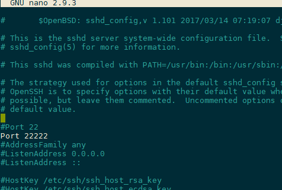

# Step 2: Change the Default SSH Port[#](#step-2-change-the-default-ssh-port "Link to this heading")

The next item listed by the OVH [Securing a VPS](https://docs.ovh.com/gb/en/vps/tips-for-securing-a-vps/) guide is to change the
default SSH port from 22 to something obscure. Hackers frequently probe
this port and to log in using common root passwords or brute force.

1. Choose a new port to use (higher ports are preferred).
2. ****Open**** the firewall and ****verify**** that the port is open

   > **Warning**
   > Don’t forget this step
   ```
   ufw allow [port]
   ufw enable
   ufw status

   ```
3. Edit the `sshd_config` file.
4. Add your new port below `#Port 22`

   ```
   nano /etc/ssh/sshd_config

   ```
   
5. Verify that the config file does not contain errors.

   > **Note**
   > No output from `sshd -t` indicates that the configuration
   is correct.
   No Errors[#](#id1 "Link to this code")
   ```
   root@vps298933:~# sshd -t
   root@vps298933:~#

   ```
   Configuration Errors[#](#id2 "Link to this code")
   ```
   root@vps298933:~# sshd -t
   /etc/ssh/sshd_config: line 15: Bad configuration option: Listen
   /etc/ssh/sshd_config: terminating, 1 bad configuration options
   root@vps298933:~#

   ```
6. Restart sshd
7. Verify that the SSH service is running on your new port

   ```
   systemctl restart sshd
   netstat -tlpn | grep ssh

   ```
   ```
   root@vps298933:~# netstat -tlpn| grep ssh
   tcp        0      0 0.0.0.0:22222           0.0.0.0:*               LISTEN      915/sshd
   tcp        0      0 127.0.0.1:6010          0.0.0.0:*               LISTEN      3211/sshd: root@pts
   tcp6       0      0 :::22                   :::*                    LISTEN      915/sshd
   tcp6       0      0 ::1:6010                :::*                    LISTEN      3211/sshd: root@pts
   root@vps298933:~#

   ```
   > **Note**
   > At this point, you can no longer login using port 22
8. Open a new terminal instance and verify that you can log in using the
   updated port.

   > **Note**
   > You must change the port setting in your terminal program after
   updating the port in your VPS.
9. Don’t exit your current terminal session until you verify that you can
   log in using the new port.

> **Source & license**
> Reproduced ****verbatim, without modification**** from
[© 2022, BilimEdtech Labs](https://labs.bilimedtech.com/index.html),
licensed under
[Creative Commons Attribution 4.0 International (CC BY 4.0)](https://creativecommons.org/licenses/by/4.0/deed.en).

Source page:
<https://labs.bilimedtech.com/cloud-computing/8/8.2.html>

See [LICENSE](../../LICENSE_edtech.html) for the full license text.