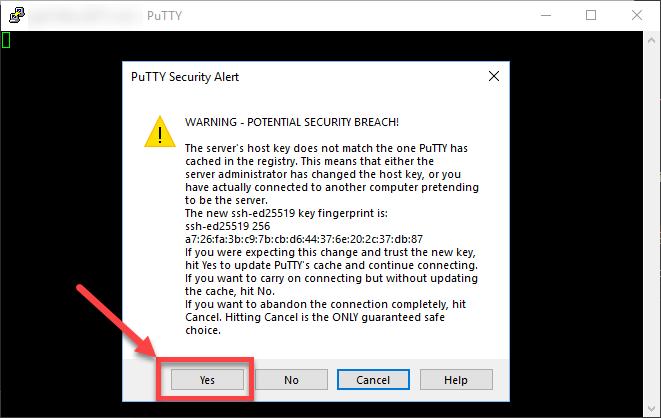
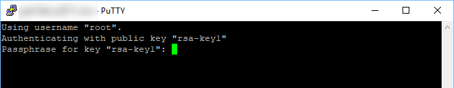

# Step 4: Restrict root Login[#](#step-4-restrict-root-login "Link to this heading")

Allowing root login with a password using SSH is risky. The password could be
exposed, or a hacker could use brute force to guess the login. Or, you can lose
it.

One method of securing the root log in is to login using SSH keys.

Linode’s article on how to use [Use Public Key Authentication with SSH](https://www.linode.com/docs/security/authentication/use-public-key-authentication-with-ssh)
provides an overview of how SSH-based authentication works.

## Login Using SSH Keys[#](#login-using-ssh-keys "Link to this heading")

Using a public and private key is highly advised. Using a private key
to login doesn’t require typing in the root password.

1. First, you [create the keys using PuTTY](https://www.digitalocean.com/docs/droplets/how-to/add-ssh-keys/create-with-putty/).
2. Then, copy the public key to the server and disable logging in using root
   with a password.

   * See post [How to Set Up SSH for your Ubuntu 18.04 VPS or Dedicated Server](https://hostadvice.com/how-to/how-to-set-up-ssh-for-your-ubuntu-18-04-vps/)
     to help you.
   * It is recommended to use a passphrase to protect your private key
     ****for the root account**** in case your key is leaked or compromised.

If successful, you will see the warning message that the host key changed.
Then, you will be prompted to enter the passphrase if you added one to the key.

PuTTY security alert to a changers host key[#](#id1 "Link to this image")

Login prompt using a key[#](#id2 "Link to this image")

> **Source & license**
> Reproduced ****verbatim, without modification**** from
[© 2022, BilimEdtech Labs](https://labs.bilimedtech.com/index.html),
licensed under
[Creative Commons Attribution 4.0 International (CC BY 4.0)](https://creativecommons.org/licenses/by/4.0/deed.en).

Source page:
<https://labs.bilimedtech.com/cloud-computing/8/8.4.html>

See [LICENSE](../../LICENSE_edtech.html) for the full license text.