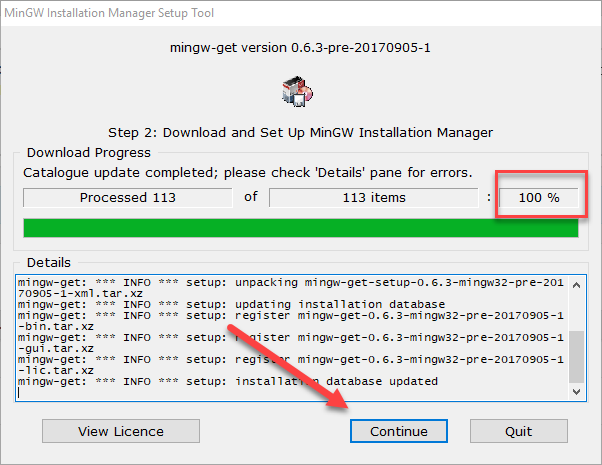
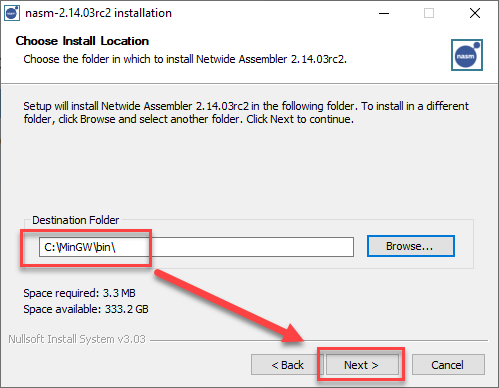
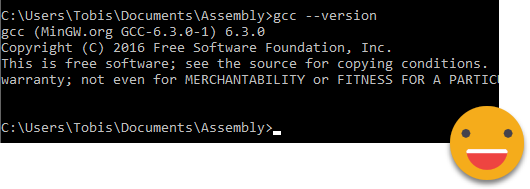

# [Step 2: Install a Compiler and Assembler](#id1)[#](#step-2-install-a-compiler-and-assembler "Link to this heading")

****Objective****: Install [MinGW](http://www.mingw.org/) and [NASM](https://www.nasm.us/) to compile an `.asm` file
and then create an `.exe` executable.

## [2.1: Install a GCC compiler](#id2)[#](#install-a-gcc-compiler "Link to this heading")

We will use [MinGW](http://www.mingw.org/) to compile our assembly projects

1. Find the installer on [MinGW](http://www.mingw.org/)’s site or download it from this site directly.

   > `mingw-get-setup-2017-09-06.exe`
2. Note the default the installation directory and then press `Continue`.

   > **Caution**
   > * MinGW might not work correctly if you install it in another directory
     other than the default.
   * So, we recommend using the default installation directory.

   
3. The installer will download and install MinGW.
4. Verify that the installer downloaded and installed all selected items.

   
5. Select `mingw32-base-bin` and apply changes.

   * From the menu: `Installation ➜ Apply Changes`
   * The installer might take a while depending on your internet connection.

   

   
6. Press the `Close` button when the packages finish downloading.

   
7. Verify that `ming32-base-bin` installed.

   
8. You can now close the installer window.

## [2.2: Download Netwide Assembler (NASM)](#id3)[#](#download-netwide-assembler-nasm "Link to this heading")

We will use the [Netwide Assembler (NASM)](https://www.nasm.us/) for this class. You can read
more information about NSAM from <https://en.wikipedia.org/wiki/Netwide_Assembler>.

1. Find the installer on [NASM](https://www.nasm.us/)’s site or download the Windows 10 x64
   version from this site directly.

   > `nasm-2.14.03rc2-installer-x64.exe`
2. Execute the installer as an administrator

   > **Note**
   > You will need to execute the installer as **Administrator**
   if your logged in user cannot write to `C:\MinGW\bin`.

   
3. Install to `C:\MinGW\bin`

   > **Note**
   > It is easiest to set up if you install it to the same directory
   as the GCC compiler. Otherwise, you have to add the systems paths
   for both applications.

   

## [Part 3: Set the path to the assembler](#id4)[#](#part-3-set-the-path-to-the-assembler "Link to this heading")

Windows needs to know where to find gcc.exe and nasm.exe, which it will
do by setting the `path=C:\MinGW\bin;%path%`

First, we’ll verify that Windows recognizes `gcc` and `nasm` using the
command line. Then, we’ll set the path as part of the system path.

### [Verify the programs execute in CMD](#id5)[#](#verify-the-programs-execute-in-cmd "Link to this heading")

> > **Note**
> > This path is set ****ONLY for this CMD instance****. You have to run
> the command again when you close the CMD window. Or, you can
> specify the absolute path to the file.
>
> You can add it permanently the System Environment Variables.

1. Open up Command Prompt (CMD)
2. Set the temporary path by executing: `path=C:\MinGW\bin;%path%`
3. Verify the path set correctly
4. Type: `echo %path%`
   
5. Type: `gcc --version`
   Verify that it displays the file version.
   
6. Type: `nasm --version`
   Verify that it displays the file version.
   

### [Errors](#id6)[#](#errors "Link to this heading")

If you get a `not recognized` error, then the path is not set correctly
or you installed MinGW or NASM in a different directory.

1. Try executing it using the full path: `C:\MinGW\bin\gcc --version`
2. Verify the installation path: `dir C:\MinGW\bin`

### [Set path in Windows System](#id7)[#](#set-path-in-windows-system "Link to this heading")

> **Tip**
> * Set the path to your assembler and compiler in the Windows path so
  that all applications can find it.
* Otherwise, you have to specify the full path to the applications.

1. Open the `Advanced System Properties` in Windows. There are several
   ways:

   1. Copy and paste one of these commands to `Windows Explorer` or
      `Start Menu`

      * `Advanced System Settings`
          
         -OR-
      * `C:\Windows\System32\SystemPropertiesAdvanced.exe`
   2. Navigate from the control panel:
      `Control Panel > System and Security > System`

      
2. Click on the ****Environment Variables**** button

   > 
3. Select `Path` under ****User variables**** and then click on the
   ****Edit**** button

   > 
4. Click on ****New**** and then add a variable for the ****bin**** folder of
   NASM and GCC: `C:\MinGW\bin`

   > **Note**
   > You must add both paths if you installed NASM in a different
   folder.

   
5. Press OK on all windows
6. ****Close and reopen**** the CMD windows to get a new prompt.
7. Verify that the NASM and GCC display the versions correctly
   before continuing.

   

> **Source & license**
> Reproduced ****verbatim, without modification**** from
[© 2022, BilimEdtech Labs](https://labs.bilimedtech.com/index.html),
licensed under
[Creative Commons Attribution 4.0 International (CC BY 4.0)](https://creativecommons.org/licenses/by/4.0/deed.en).

Source page:
<https://labs.bilimedtech.com/nasm/windows-install/2.html>

See [LICENSE](../../LICENSE_edtech.html) for the full license text.