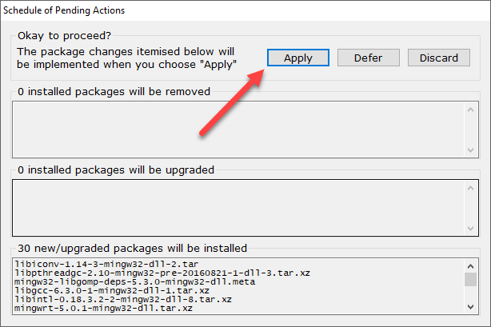
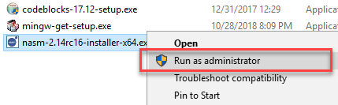

# [4. Reading a File using System Calls](#id5)[#](#reading-a-file-using-system-calls "Link to this heading")

This lab is an introduction to using systems call in C to interact with
the operating system directly. This lab shows you how to read a file
using the system call `read()`.

Please create a file called `lab4.c` from the
[template C file](../../c/templates/index.html#basic-c-template) for this assignment.

## [System Call overview](#id6)[#](#system-call-overview "Link to this heading")

In computing, a ****system call**** is the programmatic way in which a
computer program requests a service from the kernel of the operating
system it is executed on. A system call is a way for programs
****to interact with the operating system****. A computer program makes a
system call when it makes a request to the operating system’s kernel.
A system call ****provides**** the services of the operating system to
the user programs via Application Program Interface (API). It
provides an interface between a process and operating system to allow
user-level processes to request operating system services. System
calls are the only entry points into the kernel system. All programs
needing resources must use system calls.
  
 `Source:` [Introduction to System Calls (GeeksforGeeks)](https://www.geeksforgeeks.org/introduction-of-system-call/)

## [Reading a file](#id7)[#](#reading-a-file "Link to this heading")

Reading a file is a three-step process using system calls:

1. ****Open the file****: `open()` gets the filehandle or descriptor
2. ****Read the file****: `read()` gets the bytes as a file stream
3. ****Close the file:**** `close()` closes the filehandle


  
 `Source:` [A Handy Guide To Handling Handles](https://www.codeproject.com/Articles/1044/A-Handy-Guide-To-Handling-Handles)

### [4.1. `open()` System Call](#id8)[#](#open-system-call "Link to this heading")

* System call `open()` returns the [file descriptor handle](https://en.wikipedia.org/wiki/File_descriptor) that
  is used to access the file.
* More details at:

  * [open](http://codewiki.wikidot.com/c:system-calls:open) on Code Wiki for more details.
  * [open](https://docs.microsoft.com/en-us/cpp/c-runtime-library/reference/open-wopen) on Microsoft’s C Runtime Library reference.

****Required Include Files****

> ```
> #include <fcntl.h>
>
> ```

****Function Definition****

> ```
> int open(const char* path, int flags);
> int open(const char* path, int flags, int file_permissions);
>
> ```

****Example Usages****

> ```
> int file_descriptor;
> file_descriptor = open("file_name.txt", O_RDONLY);
>
> ```

[open](http://codewiki.wikidot.com/c:system-calls:open)[#](#id2 "Link to this table")


| Field | Description |
| --- | --- |
| `const char *path` | The relative or absolute path to the file that is to be opened. |
| `int flags` | A bitwise ‘or’ separated list of values that determine the method in which the file is to be opened (whether it should be read only, read/write, whether it should be cleared when opened, etc). |
| `int file_permissions` | A bitwise ‘or’ separated list of values that determine the permissions of the file if it is created. See a list of legal values at the end. |
| `return value` | Returns the file descriptor for the new file. The file descriptor returned is always the smallest integer greater than zero that is still available. If a negative value is returned, then there was an error opening the file. |

## [4.1.1. Task](#id9)[#](#task "Link to this heading")

Your first task is to open a file and create a filehandle (a file
descriptor object) to that file.

1. Create a text file and write data to it using `echo` and then verify
   using `type`

   ```
   echo echo|set /p="My code works if we can read this text." > lab4.txt
   type lab4.txt

   ```
   > **Note**
   > You should use CMD (not PowerShell) for this echo statement to work.

   ****Expected Output****:
   
2. Create file `lab4.c` or start with a
   [template C file](../../c/templates/index.html#basic-c-template).
3. Create the file descriptor handle using `open()`.
4. Verify that the file descriptor is valid. The return value
   of `open()` will be a positive number if the handle is valid.
5. Print an error message and exit the program with return 1 if the file
   is not valid.
6. Verify the code functions correctly.

   ****Expected Output****

   

### [4.2. `read()` System Call](#id10)[#](#read-system-call "Link to this heading")

* System call `read()` reads data from a file.
* More details at:

  * [read](http://codewiki.wikidot.com/c:system-calls:read) on Code Wiki for more details.
  * [\_read](https://docs.microsoft.com/en-us/cpp/c-runtime-library/reference/read) on Microsoft’s C Runtime Library reference.

****Required Include Files****

> ```
> #include <fcntl.h>
>
> ```

****Function Definition****

> ```
> int read(int file_descriptor, void* data, int num_bytes);
>
> ```

****Example Usages****

> ```
> int file_size;     // Number of bytes returned
> char data[128];    // Retrieved data
> int num_bytes;     // Number of bytes to read
>
> num_bytes = 128;   // Read in 128 bytes of the file
>
> file_size = read(file_descriptor, data, num_bytes);
>
> ```

[read](http://codewiki.wikidot.com/c:system-calls:read)[#](#id3 "Link to this table")


| Field | Description |
| --- | --- |
| `int file_descriptor` | The file descriptor of where to read the input. You can either use a file descriptor obtained from the open system call, or you can use 0, 1, or 2, to refer to standard input, standard output, or standard error, respectively. |
| `const void *data` | A character array where the read content will be stored. |
| `int num_bytes` | The number of bytes to read before truncating the data. If the data to be read is smaller than num\_bytes, all data is saved in the buffer. |
| `return value` | Returns the number of bytes that were read. If value is negative, then the system call returned an error. |

## [4.2.1. Task: Print the results from `read()`](#id11)[#](#task-print-the-results-from-read "Link to this heading")

Your second task is to read the file and print the contents to the
screen.

1. call `read()`
2. Print the results of `data` to the screen.

   ****Expected Output****:

   

You will notice some extra characters at the end of the text. The text
should stop at the period, but the `char array` is not terminated using
the [null terminator](https://drive.google.com/open?id%3D1AlgOASmTUzyxOivB8YV6zwQr7mcMw5KJcgZmK7HDhdo&sa=D&ust=1569996111991000).

## [4.2.2. Task: Insert the Null Terminator `\0`](#id12)[#](#task-insert-the-null-terminator-0 "Link to this heading")

The string that we print must be terminated:  
`My code works if we can read this text.\0`

However, our string does not have a null terminator. The program reads in
128 bytes, but our text string is shorter than 128 bytes. The memory
location still has leftover data that `print_f` writes to the output
buffer.

> ```
> //The length of the string 128 bytes:
> char* buffer[128];
>
> // read() obtained 128 bytes of data from memory:
> num_bytes = 128;
>
> ```

The solution to the problem is determining how many bytes to read. We
know the actual number of bytes read from variable `file_size`. We can
insert the null terminator into the array after the last byte read.

> ```
> printf("The number of bytes read is '%d'\n", file_size);
> // We should set '\0' at in char array at index file_size
>
> ```
>
> 

Before printing the string, set the value at array
index `file_size` to `\0`.

****Expected Output****:


### [4.3. `close()` System Call](#id13)[#](#close-system-call "Link to this heading")

* System call `close()` closes the filehandle.
* More details:

  * on Code Wiki for more details.
  * [\_close](https://docs.microsoft.com/en-us/cpp/c-runtime-library/reference/close?view=vs-2019) on Microsoft’s C Runtime Library reference.

****Required Include Files****

> ```
> #include <unistd.h>
>
> ```

****Function Definition****

> ```
> int close(int file_descriptor);
>
> ```

****Example Usages****

> ```
> close(file_descriptor);
>
> ```

[#](#id4 "Link to this table")


| Field | Description |
| --- | --- |
| `int file_descriptor` | The file descriptor to be closed. |
| `return value` | Returns a 0 upon success, and a -1 upon failure. It is important to check the return value, because some network errors are not returned until the file is closed. |

## [4.3.1. Task](#id14)[#](#id1 "Link to this heading")

Your third task is to close the file.

1. call `close()` to close the file.
2. If the file closed successfully, exit the program normally.
3. If the file failed to close, write and error message and exit the
   program with a return value of 1.

   ****Expected Output****:

   

> **Source & license**
> Reproduced ****verbatim, without modification**** from
[© 2022, BilimEdtech Labs](https://labs.bilimedtech.com/index.html),
licensed under
[Creative Commons Attribution 4.0 International (CC BY 4.0)](https://creativecommons.org/licenses/by/4.0/deed.en).

Source page:
<https://labs.bilimedtech.com/operating-systems/4/index.html>

See [LICENSE](../../LICENSE_edtech.html) for the full license text.