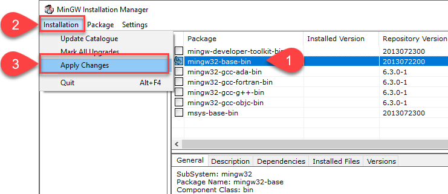

# [6: Creating a Process in C](#id4)[#](#creating-a-process-in-c "Link to this heading")

This lab shows how to create a process in Windows using the system call
`CreateProcess()`. More information on Microsoft’s site:

* [Creating Processes](https://docs.microsoft.com/en-us/windows/win32/procthread/creating-processes)
* [CreateProcessA function](https://docs.microsoft.com/en-gb/windows/win32/api/processthreadsapi/nf-processthreadsapi-createprocessa)

Please create a file called `lab6.c` from the
[template C file](../../c/templates/index.html#basic-c-template) for this assignment.

## [6.1. Creating a Process](#id5)[#](#creating-a-process "Link to this heading")

Creating a process in Windows is a multi-step process:

1. Create the variables
2. Allocate memory
3. Call `CreateProcess()`
4. Release the process handles

`CreateProcess()` requires several important parameters.

> 1. The full path to the application or program to execute.
> 2. Pointer to `STARTUPINFO` struct.
>
> > > **Note**
> > > You must allocate the memory required for the struct.

1. Pointer to [PROCESS\_INFORMATION](https://docs.microsoft.com/en-gb/windows/win32/api/processthreadsapi/ns-processthreadsapi-process_information) struct.

Here is the [full parameter list](https://docs.microsoft.com/en-gb/windows/win32/api/processthreadsapi/nf-processthreadsapi-createprocessa) for `CreateProcess()`.

### [`CreateProcess()` Template Code](#id6)[#](#createprocess-template-code "Link to this heading")

****Required Include Files****

> ```
> #include <windows.h>
>
> ```

****Example Usages****

> ```
> char exe_path[] = "C:\\Windows\\system32\\notepad.exe";
> STARTUPINFO startup_info;
> PROCESS_INFORMATION process_info;
>
> BOOL process_status = FALSE;
>
> // allocate memory and clear memory
> ZeroMemory(&startup_info, sizeof(startup_info));
> startup_info.cb = sizeof(startup_info);
> ZeroMemory(&process_info, sizeof(process_info));
>
> process_status = CreateProcess(
>     NULL,           // Use the command line arg instead
>     exe_path,       // path to exe using command line
>     NULL,           // Process handle not inheritable
>     NULL,           // Thread handle not inheritable
>     FALSE,          // Set handle inheritance to FALSE
>     0,              // No creation flags
>     NULL,           // Use parent's environment block
>     NULL,           // Use parent's starting directory
>     &startup_info,  // Pointer to STARTUPINFO structure
>     &process_info); // Pointer to PROCESS_INFORMATION structure
>
> /* Do work with handles */
>
> // Close process handles and clean up
> CloseHandle(process_info.hProcess);
> CloseHandle(process_info.hThread);
>
> ```

### [6.1.1. Task](#id7)[#](#task "Link to this heading")

Your first task is to create a process and verify the process status.

1. Create a new process for notepad.exe.
2. Verify if that process created successfully by evaluating the return
   `bool` flag.
3. Close the process handles.
4. Print an error message with the file path and exit the program with
   `return 1` if the process did not start.

****Expected Output****

```
// Failure
Error. Failed to execute C:\\Windows\\system64\\invalid\_file.exe.

// Success
A new Notepad opened.

```

## [6.2. Process Information](#id8)[#](#process-information "Link to this heading")

[PROCESS\_INFORMATION](https://docs.microsoft.com/en-gb/windows/win32/api/processthreadsapi/ns-processthreadsapi-process_information) struct contains these fields:

```
typedef struct _PROCESS_INFORMATION {
  HANDLE hProcess;
  HANDLE hThread;
  DWORD  dwProcessId;
  DWORD  dwThreadId;
} PROCESS_INFORMATION, *PPROCESS_INFORMATION, *LPPROCESS_INFORMATION;

```

### [6.2.1. Task](#id9)[#](#id2 "Link to this heading")

1. Print the process ID of the process

****Expected Output****

```
Created a new process with ID 14156.

```

## [6.3. Waiting for the Process to Exit](#id10)[#](#waiting-for-the-process-to-exit "Link to this heading")

At this point, your program created a new child process and then exited
immediately. We can observe the behavior by using the sleep function to
watch the process change parents from your program to root.

### [6.3.1. Task](#id11)[#](#id3 "Link to this heading")

1. Download and then start [Process Explorer](https://docs.microsoft.com/en-us/sysinternals/downloads/process-explorer).
2. Use the sleep function to pause your program for 15-20 seconds.

   * `Sleep(15000);`
3. Find your application in the Process Explorer list. Click on the child
   process to highlight it.|br|
   
4. Watch what happens when your application exits.|br|
      
   

Instead of exiting or processing additional code, the parent program can
use `WaitForSingleObject()` to wait on the child to complete its work
and then terminate.

> ```
> // The second field is milliseconds for a set time or INFINITE
> WaitForSingleObject( process_info.hProcess, INFINITE );
>
> ```

5. Add function `WaitForSingleObject()`.
6. Your program should stay active until you close the Notepad window.

> **Source & license**
> Reproduced ****verbatim, without modification**** from
[© 2022, BilimEdtech Labs](https://labs.bilimedtech.com/index.html),
licensed under
[Creative Commons Attribution 4.0 International (CC BY 4.0)](https://creativecommons.org/licenses/by/4.0/deed.en).

Source page:
<https://labs.bilimedtech.com/operating-systems/6/index.html>

See [LICENSE](../../LICENSE_edtech.html) for the full license text.