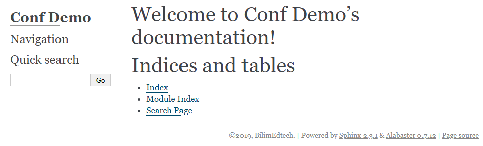
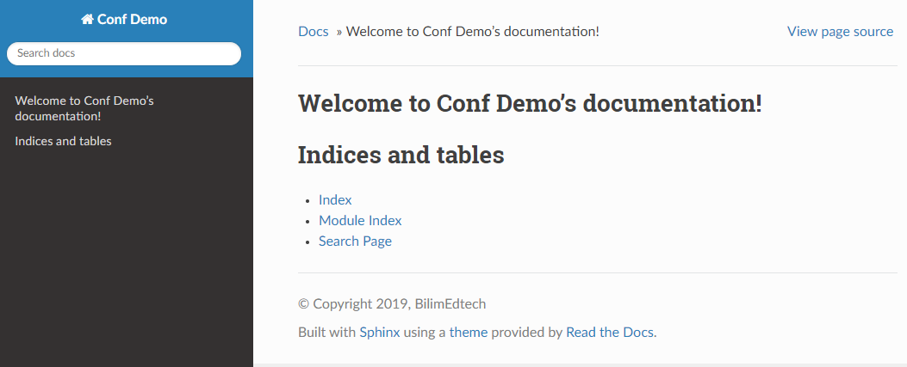

# [RST Workshop: Setting up a Sphinx Server](#id9)[#](#rst-workshop-setting-up-a-sphinx-server "Link to this heading")

> **Note**
> This guide serves two purposes:

1. It is ****the result of**** part 1, [RST Workshop: Overview](writing-rst-overview.html#writing-in-rst-overview).
2. It serves as a basic guide to configuring Sphinx on a server.

## [Overview](#id10)[#](#overview "Link to this heading")

****Sphinx**** is a platform that **renders RST files** to a web application
that is suitable for documentation. This guide provides a quick installation
guide for someone wanting to set up Sphinx on a VSP.

The [install sphinx guide](https://www.sphinx-doc.org/en/master/usage/quickstart.html)
provides a good starting point, but we will make other changes to install
the latest version of Sphinx from PyPI.

The VPS setup for this workshop uses Docker image
[nginx:latest](https://hub.docker.com/_/nginx), which uses Debian 10.

## [Installing Sphinx](#id11)[#](#installing-sphinx "Link to this heading")

The [Sphinx documentation](https://www.sphinx-doc.org/en/master/usage/installation.html)
provides instructions for Debian/Ubuntu (apt), RHEL/CentOS (yum),
and MacOS (homebrew). This guide will uses the `apt` package manager..

Unfortunately, the apt package manager for Debian has an old version of
Sphinx (Sphinx 1.8.4). It works, but PyPI has the [latest version of
Sphinx](https://pypi.org/project/Sphinx/). Therefore, this guide
shows to install Sphinx using both `apt` and `pip3`.

> **Note**
> Other distributions are supported using pip, such as Alpine Linux.
However, additional knowledge is required to install prerequisites for
specific Python packages.

### [Spin up a VPS with your favorite Linux distro](#id12)[#](#spin-up-a-vps-with-your-favorite-linux-distro "Link to this heading")

This workshop uses a simple `docker-compose.yml` file to start the
instance and then uses Nginx on the host as a reverse proxy. You can view
the [RST Workshop: Docker Environment](vps-config.html#sphinx-docker-environment).

### [Install Sphinx using the package manager](#id13)[#](#install-sphinx-using-the-package-manager "Link to this heading")

You can choose to install the Sphinx version (1.7.x) using the apt package
manager or you install the latest version (2.x) using from PyPI using.

> **Caution**
> Installing both versions could result in a conflict.

1. Update your repository and upgrade any out-of-date packages using
   `apt-get update && apt upgrade`.
2. Install a version of Sphinx:

   * Sphinx version 1.x

     1. Install Sphinx version 1: `apt-get -y install python3-sphinx`
   * Sphinx version 2.x

     1. Install pip3: `apt-get -y install python3-pip`
     2. Install Sphinx version 2: `pip3 install Sphinx`

## [Configure Sphinx using `sphinx-quickstart`](#id14)[#](#configure-sphinx-using-sphinx-quickstart "Link to this heading")

You need to configure Sphinx the first time you use it. Sphinx
provides a quickstart tool!

> **Important**
> Create and then change to the directory of your Sphinx
code and RST content. The default installation directory is `./`,
which is the ****current directory****.

1. Create a project folder, then navigate to that folder

   > * For example: `mkdir -p /opt/sphinx && cd /opt/sphinx`
2. Execute command `sphinx-quickstart`
3. Follow the prompts (from version 1.x)

   > We’ve highlighted the lines that we entered a value **other than**
   > default. Add the extensions that you find useful.
   >
   > Output of ‘sphinx-quickstart’ for v.1[#](#id3 "Link to this code")
   > ```
   >  1> Separate source and build directories (y/n) [n]:
   >  2
   >  3Inside the root directory, two more directories will be created; "_templates"
   >  4for custom HTML templates and "_static" for custom stylesheets and other static
   >  5files. You can enter another prefix (such as ".") to replace the underscore.
   >  6> Name prefix for templates and static dir [_]:
   >  7
   >  8The project name will occur in several places in the built documentation.
   >  9> Project name: Conference Demo
   > 10> Author name(s): BilimEdtech
   > 11> Project release []:
   > 12
   > 13If the documents are to be written in a language other than English,
   > 14you can select a language here by its language code. Sphinx will then
   > 15translate text that it generates into that language.
   > 16
   > 17For a list of supported codes, see
   > 18http://sphinx-doc.org/config.html#confval-language.
   > 19> Project language [en]:
   > 20
   > 21The file name suffix for source files. Commonly, this is either ".txt"
   > 22or ".rst".  Only files with this suffix are considered documents.
   > 23> Source file suffix [.rst]:
   > 24
   > 25One document is special in that it is considered the top node of the
   > 26"contents tree", that is, it is the root of the hierarchical structure
   > 27of the documents. Normally, this is "index", but if your "index"
   > 28document is a custom template, you can also set this to another filename.
   > 29> Name of your master document (without suffix) [index]:
   > 30Indicate which of the following Sphinx extensions should be enabled:
   > 31> autodoc: automatically insert docstrings from modules (y/n) [n]:
   > 32> doctest: automatically test code snippets in doctest blocks (y/n) [n]:
   > 33> intersphinx: link between Sphinx documentation of different projects (y/n) [n]:
   > 34> todo: write "todo" entries that can be shown or hidden on build (y/n) [n]: y
   > 35> coverage: checks for documentation coverage (y/n) [n]:
   > 36> imgmath: include math, rendered as PNG or SVG images (y/n) [n]:
   > 37> mathjax: include math, rendered in the browser by MathJax (y/n) [n]:
   > 38> ifconfig: conditional inclusion of content based on config values (y/n) [n]:
   > 39> viewcode: include links to the source code of documented Python objects (y/n) [n]: y
   > 40> githubpages: create .nojekyll file to publish the document on GitHub pages (y/n) [n]:
   > 41
   > 42A Makefile and a Windows command file can be generated for you so that you
   > 43only have to run e.g. `make html` instead of invoking sphinx-build
   > 44directly.
   > 45> Create Makefile? (y/n) [y]:
   > 46> Create Windows command file? (y/n) [y]: n
   >
   > ```

> **Note**
> * The configurations for your Sphinx project are in file `conf.py`.
* Delete file `conf.py` to run the quickstart again.

## [Rendering to HTML](#id15)[#](#rendering-to-html "Link to this heading")

We can configure Sphinx to **auto-build** the output when it detects a change,
or we can initiate a manual build.

The command to generate output is `make <output>`. Sphinx can convert RST
to various formats. You can run the `make command` without any args to
view the possible output types.

```
root@26f88a20b58c:/opt/sphinx# make
Sphinx v2.3.1
Please use `make target` where target is one of
html        to make standalone HTML files
dirhtml     to make HTML files named index.html in directories
singlehtml  to make a single large HTML file
pickle      to make pickle files
json        to make JSON files
htmlhelp    to make HTML files and an HTML help project
qthelp      to make HTML files and a qthelp project
devhelp     to make HTML files and a Devhelp project
epub        to make an epub
latex       to make LaTeX files, you can set PAPER=a4 or PAPER=letter
latexpdf    to make LaTeX and PDF files (default pdflatex)
latexpdfja  to make LaTeX files and run them through platex/dvipdfmx
text        to make text files
man         to make manual pages
texinfo     to make Texinfo files
info        to make Texinfo files and run them through makeinfo
gettext     to make PO message catalogs
changes     to make an overview of all changed/added/deprecated items
xml         to make Docutils-native XML files
pseudoxml   to make pseudoxml-XML files for display purposes
linkcheck   to check all external links for integrity
doctest     to run all doctests embedded in the documentation (if enabled)
coverage    to run coverage check of the documentation (if enabled)

```

Our desired output is HTML.

1. Build the HTML by executing command `make html`

   ```
   root@1a40c1841674:/opt/sphinx# make html
   Running Sphinx v2.3.1
   making output directory... done
   building [mo]: targets for 0 po files that are out of date
   building [html]: targets for 1 source files that are out of date
   updating environment: [new config] 1 added, 0 changed, 0 removed
   reading sources... [100%] index
   looking for now-outdated files... none found
   pickling environment... done
   checking consistency... done
   preparing documents... done
   writing output... [100%] index
   generating indices...  genindexdone
   writing additional pages...  searchdone
   copying static files... ... done
   copying extra files... done
   dumping search index in English (code: en)... done
   dumping object inventory... done
   build succeeded.

   ```
2. Navigate to the URL of the Sphinx instance to view rendered HTML.

   

## [Adding Content](#id16)[#](#adding-content "Link to this heading")

> **Note**
> All of the RST contents and settings are in the root of the
Sphinx directory.

### [Default index.html](#id17)[#](#default-index-html "Link to this heading")

Executing `make html` on a default project creates an `index.html`
in the root folder of the project using the parameters from `conf.py`.

> Default ‘index.rst’ file[#](#id4 "Link to this code")
> ```
> .. Demo documentation master file, created by
>    sphinx-quickstart on Sun Dec 29 06:49:53 2019.
>    You can adapt this file completely to your liking, but it should at least
>    contain the root `toctree` directive.
>
> Welcome to Demo's documentation!
> ================================
>
> .. toctree::
>    :maxdepth: 2
>    :caption: Contents:
>
>
>
> Indices and tables
> ==================
>
> * :ref:`genindex`
> * :ref:`modindex`
> * :ref:`search`
>
> ```

### [Create Folders](#id18)[#](#create-folders "Link to this heading")

Sphinx makes it easy to organize content in folders.

1. Create a folder, such as `web-guide`.
2. Create a file `web-guide/index.rst` with the following content:

   web-guide/index.rst contents[#](#id5 "Link to this code")
   ```
   *******************
   Project X Web Guide
   *******************

   This guide provides the documentation for our web frontend.

   ```
3. Now, link to the `web-guide/index.rst` by placing the path in the
   root `index.rst`.

   ./index.rst contents[#](#id6 "Link to this code")
   ```
    1.. Demo documentation master file, created by
    2   sphinx-quickstart on Sun Dec 29 06:49:53 2019.
    3   You can adapt this file completely to your liking, but it should at least
    4   contain the root `toctree` directive.
    5
    6Welcome to Demo's documentation!
    7================================
    8
    9.. toctree::
   10   :maxdepth: 2
   11   :caption: Contents:
   12
   13   web-guide/index
   14
   15
   16    . . .

   ```
4. Build the HTML and then refresh the page. The page should show up in
   the left navigation panel and on the home page.

   Pay close attention to the number of spaces, which should be exactly three.

   A wrong indentation level will result in an error similar to:

   ```
    1Running Sphinx v2.3.1
    2loading pickled environment... done
    3building [mo]: targets for 0 po files that are out of date
    4building [html]: targets for 1 source files that are out of date
    5updating environment: 0 added, 1 changed, 0 removed
    6reading sources... [100%] index
    7/opt/sphinx/index.rst:9: WARNING: toctree contains reference to
    8    nonexisting document ' web-guide/index'
    9looking for now-outdated files... none found
   10pickling environment... done
   11checking consistency... /opt/sphinx/web-guide/index.rst:
   12    WARNING: document isn’t included in any toctree
   13done
   14preparing documents... done
   15writing output... [100%] index
   16generating indices...  genindexdone
   17done
   18copying static files... ... done
   19copying extra files... done
   20dumping search index in English (code: en)... done
   21dumping object inventory... done
   22build succeeded, 2 warnings.
   23
   24The HTML pages are in _build/html.

   ```

## [Install a Different Theme](#id19)[#](#install-a-different-theme "Link to this heading")

Sphinx generates HTML, CSS, JS and support code using the
[Alabaster](https://github.com/bitprophet/alabaster) theme by default.
Sphinx has ample [support for themes](https://sphinx-themes.org/).
Write the Docs recommends these
[top four themes](https://www.writethedocs.org/guide/tools/sphinx-themes/).

> * [Read the Docs Theme](https://sphinx-rtd-theme.readthedocs.io/)
> * [Alabaster](https://github.com/bitprophet/alabaster)
> * [Sphinx Bootstrap Theme](https://github.com/ryan-roemer/sphinx-bootstrap-theme)
> * [Guzzle Theme](https://github.com/guzzle/guzzle_sphinx_theme)

### [Install Read the Docs Theme](#id20)[#](#install-read-the-docs-theme "Link to this heading")

[Read the Docs Theme](https://sphinx-rtd-theme.readthedocs.io/) is a
popular theme for Sphinx.
[PyPI hosts](https://pypi.org/project/sphinx-rtd-theme/)
Read the Docs theme.

1. Install `pip3` if you do not install it earlier:
   `apt-get -y install python3-pip`
2. Install `sphinx-rtd-theme` using pip3:
   `pip3 install sphinx-rtd-theme`
3. Edit your `conf.py` file and make the following modifications:

   conf.py[#](#id7 "Link to this code")
   ```
   import sphinx_rtd_theme

   extensions = [
       ...
       'sphinx_rtd_theme',
   ]

   # html_theme = 'alabaster'
   html_theme = "sphinx_rtd_theme"

   ```
4. Rebuild the HTML to display the new theme. You can rebuild the HTML
   in the container from the host using `docker exec`.

   > ```
   > # Using docker-compose
   > docker-compose exec sphinx bash -c "cd /opt/sphinx && make html"
   >
   > # Using docker
   > docker exec -t sphinx_nginx bash -c "cd /opt/sphinx && make html"
   >
   > ```

   

> **Hint**
> Sometimes the HTML in folder `_build` contains old data,
especially if you remove or rename a file.

To solve this problem, you can safely delete the `_build`
and then use `make html`` to generate a fresh copy.

From the host[#](#id8 "Link to this code")
```
rm -r sphinx/_build/html
docker-compose exec sphinx bash -c "cd /opt/sphinx && make html"

```
> **Source & license**
> Reproduced ****verbatim, without modification**** from
[© 2022, BilimEdtech Labs](https://labs.bilimedtech.com/index.html),
licensed under
[Creative Commons Attribution 4.0 International (CC BY 4.0)](https://creativecommons.org/licenses/by/4.0/deed.en).

Source page:
<https://labs.bilimedtech.com/workshops/rst/setting-up-sphinx.html>

See [LICENSE](../../LICENSE_edtech.html) for the full license text.