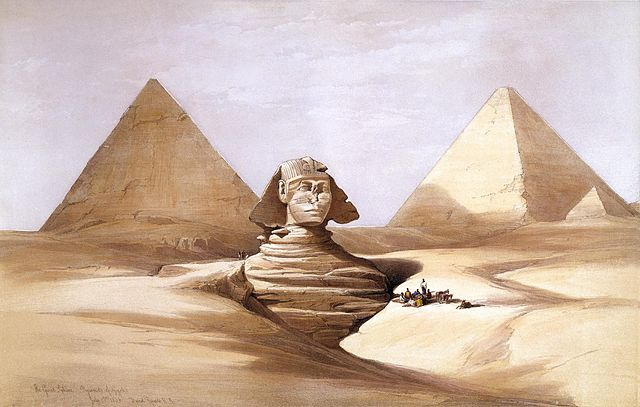

# [Task 6: Embed Images](#id7)[#](#task-6-embed-images "Link to this heading")

## [Embedding Images](#id8)[#](#embedding-images "Link to this heading")

### [Images](#id9)[#](#images "Link to this heading")

RST has directives for images and figures. Figures extend the capabilities
of images. If you need a caption, use a figure.

You can [embed images](https://sublime-and-sphinx-guide.readthedocs.io/en/latest/images.html)
(a) inline or (b) using a substitution.

The inline directive uses similar syntax to the `code block` that [includes
optional parameters](https://docutils.sourceforge.io/docs/ref/rst/directives.html#images).

> Essential ****Inline**** `.. image::` directives[#](#id1 "Link to this code")
> ```
> .. image:: path/filename.png
>
> ```
> ****Inline**** `.. image::` directives with parameters[#](#id2 "Link to this code")
> ```
> .. image:: picture.jpeg
>     :height: 100px
>     :width: 200 px
>     :scale: 50 %
>     :alt: alternate text
>     :align: right
>
> .. image:: images/the_great_sphinx_david_roberts.jpg
>     :width: 350
>     :alt: The Great Sphinx and Pyramids of Gizeh (Giza) by David Roberts
>     :align: center
>
> ```
> [](../../../../../_images/the_great_sphinx_david_roberts.jpg)

[A substitution](https://sublime-and-sphinx-guide.readthedocs.io/en/latest/reuse.html)
is an element definition that lets you **reuse that element**. Some of
the parameters apply to the substitution as to the inline directives.

> 1. Define the image in a substitution
> 2. The image displays where ever the substitution is
>
> ****substitution**** `.. image::` directives[#](#id3 "Link to this code")
> ```
> .. |substitution-name| image:: path/filename.png
>
> .. |David Roberts: The Great Sphinx| image:: images/the_great_sphinx_david_roberts.jpg
>     :alt: The Great Sphinx and Pyramids of Gizeh (Giza) by David Roberts
>     :width: 200
>
> ```
> Using a substitution[#](#id4 "Link to this code")
> ```
> Below is the famous The Great Sphinx and Pyramids of Gizeh (Giza),
> 17 July 1839, by David Roberts (Public domain Wikimedia Commons).
>
> |David Roberts: The Great Sphinx|
>
> ```
>
> Below is the famous The Great Sphinx and Pyramids of Gizeh (Giza),
> 17 July 1839, by David Roberts (Public domain Wikimedia Commons).
>
> [](../../../../../_images/the_great_sphinx_david_roberts.jpg)

### [Figures](#id10)[#](#figures "Link to this heading")

A figure is an image with a caption, legend, or other data. Use the
`.. figure:: filename.png` directly without creating a substitution.

> `.. figure::` directive[#](#id5 "Link to this code")
> ```
> .. figure:: path/filename.png
>
> .. figure:: images/the_great_sphinx_david_roberts.jpg
>     :alt: The Great Sphinx and Pyramids of Gizeh (Giza) by David Roberts
>     :width: 300
>     :align: center
>
>     The Great Sphinx and Pyramids of Gizeh (Giza) by David Roberts
>     Public domain from https://commons.wikimedia.org/
>
> ```
> [](../../../../../_images/the_great_sphinx_david_roberts.jpg)
>
>
> The Great Sphinx and Pyramids of Gizeh (Giza) by David Roberts
> Public domain from <https://commons.wikimedia.org/>[#](#id6 "Link to this image")

### [References](#id11)[#](#references "Link to this heading")

* <https://sublime-and-sphinx-guide.readthedocs.io/en/latest/images.html>
* <https://sphinx-rtd-theme.readthedocs.io/en/stable/demo/demo.html#figures>
* <https://docutils.sourceforge.io/docs/ref/rst/directives.html#figure>
* <https://thomas-cokelaer.info/tutorials/sphinx/rest_syntax.html#what-are-directives>

---

## [Task](#id12)[#](#task "Link to this heading")

****Task 6****: Add images and code block nested in a list.

1. Download and save this image to a sub folder to the .rst file.

   > [](../../../../../_images/default-sphinx-page.png)
2. Add the code blocks indented or nested in the list.
3. Add the code block **nested** in point 1. Highlight HTML
4. Create a named substitution, such as `|default-theme|`
5. Add the image **nested** in point 2.

---

## [Text to Add](#id13)[#](#text-to-add "Link to this heading")

> ```
> We can configure Sphinx to *auto-build* the output when it detects
> a change, or we can initiate a manual build.
>
> The command to generate output is ``make <output>``. Sphinx can convert RST
> to various formats. You can run the ``make command`` without any args to
> view the possible output types.
>
> ```
> ```
> root@26f88a20b58c:/opt/sphinx# make
> Sphinx v2.3.1
> Please use `make target` where target is one of
> html        to make standalone HTML files
> dirhtml     to make HTML files named index.html in directories
> singlehtml  to make a single large HTML file
> pickle      to make pickle files
> json        to make JSON files
> htmlhelp    to make HTML files and an HTML help project
> qthelp      to make HTML files and a qthelp project
> devhelp     to make HTML files and a Devhelp project
> epub        to make an epub
> latex       to make LaTeX files, you can set PAPER=a4 or PAPER=letter
> latexpdf    to make LaTeX and PDF files (default pdflatex)
> latexpdfja  to make LaTeX files and run them through platex/dvipdfmx
> text        to make text files
> man         to make manual pages
> texinfo     to make Texinfo files
> info        to make Texinfo files and run them through makeinfo
> gettext     to make PO message catalogs
> changes     to make an overview of all changed/added/deprecated items
> xml         to make Docutils-native XML files
> pseudoxml   to make pseudoxml-XML files for display purposes
> linkcheck   to check all external links for integrity
> doctest     to run all doctests embedded in the documentation (if enabled)
> coverage    to run coverage check of the documentation (if enabled)
>
> ```
> ```
> Our desired output is HTML.
>
> 1. Build the HTML by executing command ``make html``
>
> ```
> ```
> root@1a40c1841674:/opt/sphinx# make html
> Running Sphinx v2.3.1
> making output directory... done
> building [mo]: targets for 0 po files that are out of date
> building [html]: targets for 1 source files that are out of date
> updating environment: [new config] 1 added, 0 changed, 0 removed
> reading sources... [100%] index
> looking for now-outdated files... none found
> pickling environment... done
> checking consistency... done
> preparing documents... done
> writing output... [100%] index
> generating indices...  genindexdone
> writing additional pages...  searchdone
> copying static files... ... done
> copying extra files... done
> dumping search index in English (code: en)... done
> dumping object inventory... done
> build succeeded.
>
> ```
> ```
> 2. Navigate to the URL of the Sphinx instance to view rendered HTML.
>
> |image-substitution|
>
> ```

> **Source & license**
> Reproduced ****verbatim, without modification**** from
[© 2022, BilimEdtech Labs](https://labs.bilimedtech.com/index.html),
licensed under
[Creative Commons Attribution 4.0 International (CC BY 4.0)](https://creativecommons.org/licenses/by/4.0/deed.en).

Source page:
<https://labs.bilimedtech.com/workshops/rst/writing-rst-6.html>

See [LICENSE](../../LICENSE_edtech.html) for the full license text.