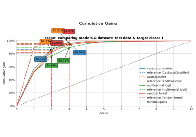
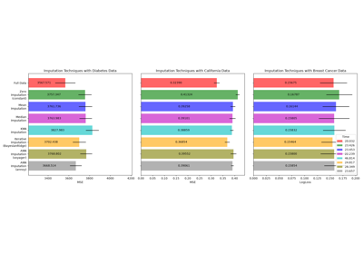

# \_\_version\_\_[#](#version "Link to this heading")

scikitplot.\_\_version\_\_ = '0.5.dev0+git.20260714.77015c4'[#](#scikitplot.__version__ "Link to this definition")
:   str(object=’’) -> str
    str(bytes\_or\_buffer[, encoding[, errors]]) -> str

    Create a new string object from the given object. If encoding or
    errors is specified, then the object must expose a data buffer
    that will be decoded using the given encoding and error handler.
    Otherwise, returns the result of object.\_\_str\_\_() (if defined)
    or repr(object).
    encoding defaults to sys.getdefaultencoding().
    errors defaults to ‘strict’.

## Gallery examples[#](#gallery-examples "Link to this heading")

[Introduction to modelplotpy](../../auto_examples/decile/plot_modelplotpy_script.html)

Introduction to modelplotpy

[annoy impute with examples](../../auto_examples/impute/plot_impute_script.html)

annoy impute with examples