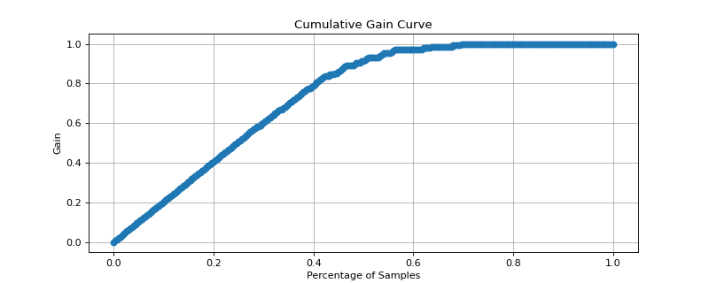

# cumulative\_gain\_curve[#](#cumulative-gain-curve "Link to this heading")

scikitplot.api.\_utils.cumulative\_gain\_curve(**y\_true**, **y\_score**, **pos\_label=None**)[[source]](https://github.com/scikit-plots/scikit-plots/blob/f06fe30/scikitplot/api/_utils/_helpers.py#L80)[#](#scikitplot.api._utils.cumulative_gain_curve "Link to this definition")
:   Generate the data points necessary to plot the Cumulative Gain curve for binary classification tasks.

    The Cumulative Gain curve helps in visualizing how well a binary classifier identifies the positive class
    as more instances are considered based on predicted scores. It shows the proportion of true positives
    captured as a function of the total instances considered.

    Parameters:
    :   ****y\_true****array-like of shape (n\_samples,)
        :   True class labels of the data. This array should contain exactly two unique classes
            (e.g., `[0, 1]`, `[-1, 1]`) to represent a binary classification problem. If more
            than two classes are present, the function will raise a `ValueError`.

        ****y\_score****array-like of shape (n\_samples,)
        :   Target scores for each instance. These scores are typically the predicted probability of the positive
            class, confidence scores, or any non-thresholded metric produced by a classifier.
            It is essential that these scores be continuous rather than binary (0/1).

        ****pos\_label****int or str, optional, default=None
        :   The label representing the positive class. If `pos_label` is not provided, the function
            attempts to infer it from `y_true`, assuming standard binary classification labels such as
            `{0, 1}`, `{-1, 1}`, or a single unique class. If inference is not possible, a `ValueError`
            is raised.

    Returns:
    :   ****percentages****numpy.ndarray of shape (n\_points,)
        :   The X-axis values representing the cumulative percentage of instances considered.
            Values range from 0 (no instances considered) to 1 (all instances considered), and an
            initial 0 is inserted at the start to represent the baseline.

        ****gains****numpy.ndarray of shape (n\_points,)
        :   The Y-axis values representing the cumulative gain, i.e., the proportion of true positives
            captured as a function of the total instances considered. Values range from 0 (no positives
            captured) to 1 (all positives captured), and an initial 0 is inserted at the start to represent
            the baseline.

    Raises:
    :   ValueError
        :   * If `y_true` does not contain exactly two distinct classes, indicating that the problem is
              not a binary classification task.
            * If `pos_label` is not provided and cannot be inferred from `y_true`, or if `y_score` is binary
              instead of continuous.
            * If the positive class does not appear in `y_true`, resulting in a gain of zero, which would
              mislead the user.

    Notes

    * ****Binary Classification Only:**** This implementation is strictly for binary classification.
      Multi-class problems are not supported and will result in a `ValueError`.
    * ****Score Type:**** The `y_score` array must contain continuous values. Binary scores (0/1) are
      not appropriate for plotting cumulative gain curves and will lead to incorrect results.
    * ****Performance:**** The function sorts the scores, which contributes to a time complexity of
      O(n log n), where `n` is the number of samples. For large datasets, this could be a
      performance bottleneck.
    * ****Baseline Insertion:**** A starting point of (0, 0) is included in both the `percentages` and `gains`
      arrays. This ensures that the cumulative gain curve starts at the origin, providing an accurate
      representation of the gain from zero instances considered.
    * ****Handling Edge Cases:**** If `y_true` contains no instances of the positive class, the function
      will raise a `ValueError`, as a cumulative gain curve would not be meaningful.

    Examples

    Try it in your browser!
    ```
    >>> from sklearn.datasets import make_classification
    >>> from sklearn.linear_model import LogisticRegression
    >>> from sklearn.model_selection import train_test_split
    >>> import matplotlib.pyplot as plt
    >>> # Generate a binary classification dataset
    >>> X, y = make_classification(
    ...     n_samples=1000,
    ...     n_classes=2,
    ...     n_informative=3,
    ...     random_state=42,
    ... )
    >>> # Split into training and test sets
    >>> X_train, X_test, y_train, y_test = train_test_split(
    ...     X, y, test_size=0.3, random_state=42
    ... )
    >>> # Train a logistic regression model
    >>> model = LogisticRegression()
    >>> model.fit(X_train, y_train)
    >>> # Predict probabilities for the test set
    >>> y_scores = model.predict_proba(X_test)[:, 1]
    >>> # Calculate the cumulative gain curve
    >>> import scikitplot as sp
    >>> percentages, gains = sp.api._utils.cumulative_gain_curve(y_test, y_scores)
    >>> # Plot the cumulative gain curve
    >>> plt.plot(percentages, gains, marker='o')
    >>> plt.xlabel('Percentage of Samples')
    >>> plt.ylabel('Gain')
    >>> plt.title('Cumulative Gain Curve')
    >>> plt.grid()
    >>> plt.show()

    ```

    ([`Source code`](../../_downloads/84303ae958e7c86ce1ebd32b63a7e330/scikitplot-api-_utils-cumulative_gain_curve-1.py), [`png`](../../_downloads/ce13857c8ac8b13121ebb2d2044f6ef5/scikitplot-api-_utils-cumulative_gain_curve-1.png))

    
    Go BackOpen In Tab