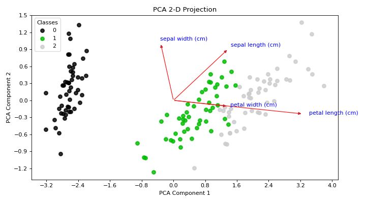
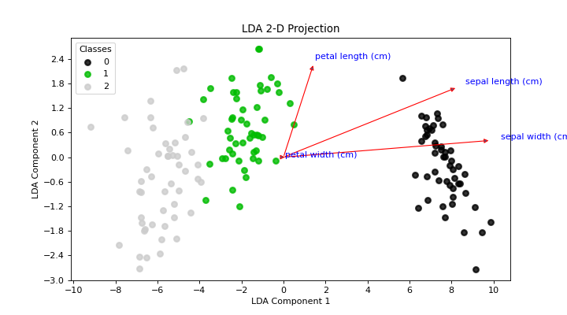

# plot\_pca\_2d\_projection[#](#plot-pca-2d-projection "Link to this heading")

scikitplot.api.decomposition.plot\_pca\_2d\_projection(**clf**, **X**, **y**, **\***, **biplot=False**, **feature\_labels=None**, **dimensions=[0, 1]**, **label\_dots=False**, **model\_type=None**, **title='PCA 2-D Projection'**, **title\_fontsize='large'**, **text\_fontsize='medium'**, **cmap='nipy\_spectral'**, **\*\*kwargs**)[[source]](https://github.com/scikit-plots/scikit-plots/blob/f800619/scikitplot/api/decomposition/_projection.py#L44)[#](#scikitplot.api.decomposition.plot_pca_2d_projection "Link to this definition")
:   Plots the 2-dimensional projection of PCA on a given dataset.

    Parameters:
    :   ****clf****object
        :   Fitted PCA instance that can `transform` given data set into 2 dimensions.

        ****X****array-like, shape (n\_samples, n\_features)
        :   Feature set to project, where n\_samples is the number of samples and
            n\_features is the number of features.

        ****y****array-like, shape (n\_samples) or (n\_samples, n\_features)
        :   Target relative to X for labeling.

        ****biplot****bool, optional, default=False
        :   If True, the function will generate and plot biplots. If False, the
            biplots are not generated.

        ****feature\_labels****array-like, shape (n\_features), optional, default=None
        :   List of labels that represent each feature of X. Its index position
            must also be relative to the features. If None is given, labels will
            be automatically generated for each feature (e.g. “variable1”, “variable2”,
            “variable3” …).

        ****title****str, optional, default=’PCA 2-D Projection’
        :   Title of the generated plot.

        ****title\_fontsize****str or int, optional, default=’large’
        :   Font size for the plot title.

        ****text\_fontsize****str or int, optional, default=’medium’
        :   Font size for the text in the plot.

        ****cmap****str or matplotlib.colors.Colormap, optional, default=’viridis’
        :   Colormap used for plotting the projection. See Matplotlib Colormap
            documentation for available options:
            <https://matplotlib.org/users/colormaps.html>

        ****\*\*kwargs: dict****
        :   Generic keyword arguments.

    Returns:
    :   ****ax****matplotlib.axes.Axes
        :   The axes on which the plot was drawn.

    Other Parameters:
    :   ****ax****matplotlib.axes.Axes, optional, default=None
        :   The axis to plot the figure on. If None is passed in the current axes
            will be used (or generated if required).

            Added in version 0.4.0.

        ****fig****matplotlib.pyplot.figure, optional, default: None
        :   The figure to plot the Visualizer on. If None is passed in the current
            plot will be used (or generated if required).

            Added in version 0.4.0.

        ****figsize****tuple, optional, default=None
        :   Width, height in inches.
            Tuple denoting figure size of the plot e.g. (12, 5)

            Added in version 0.4.0.

        ****nrows****int, optional, default=1
        :   Number of rows in the subplot grid.

            Added in version 0.4.0.

        ****ncols****int, optional, default=1
        :   Number of columns in the subplot grid.

            Added in version 0.4.0.

        ****plot\_style****str, optional, default=None
        :   Check available styles with “plt.style.available”. Examples include:
            [‘ggplot’, ‘seaborn’, ‘bmh’, ‘classic’, ‘dark\_background’, ‘fivethirtyeight’,
            ‘grayscale’, ‘seaborn-bright’, ‘seaborn-colorblind’, ‘seaborn-dark’,
            ‘seaborn-dark-palette’, ‘tableau-colorblind10’, ‘fast’].

            Added in version 0.4.0.

        ****show\_fig****bool, default=True
        :   Show the plot.

            Added in version 0.4.0.

        ****save\_fig****bool, default=False
        :   Save the plot.
            Used by `save_plot_decorator`.

            Added in version 0.4.0.

        ****save\_fig\_filename****str, optional, default=’’
        :   Specify the path and filetype to save the plot.
            If nothing specified, the plot will be saved as png
            inside `result_images` under to the current working directory.
            Defaults to plot image named to used `func.__name__`.
            Used by `save_plot_decorator`.

            Added in version 0.4.0.

        ****overwrite****bool, optional, default=True
        :   If False and a file exists, auto-increments the filename to avoid overwriting.

            Added in version 0.4.0.

        ****add\_timestamp****bool, optional, default=False
        :   Whether to append a timestamp to the filename.
            Default is False.

            Added in version 0.4.0.

        ****verbose****bool, optional
        :   If True, enables verbose output with informative messages during execution.
            Useful for debugging or understanding internal operations such as backend selection,
            font loading, and file saving status. If False, runs silently unless errors occur.

            Default is False.

            Added in version 0.4.0: The `verbose` parameter was added to control logging and user feedback verbosity.

    Examples

    Try it in your browser!
    ```
    >>> from sklearn.decomposition import PCA
    >>> from sklearn.datasets import load_iris as data_3_classes
    >>> import scikitplot as skplt
    >>> X, y = data_3_classes(return_X_y=True, as_frame=True)
    >>> pca = PCA(random_state=0).fit(X)
    >>> skplt.decomposition.plot_pca_2d_projection(
    ...     pca,
    ...     X,
    ...     y,
    ...     biplot=True,
    ...     feature_labels=X.columns.tolist(),
    ... )

    ```

    ([`Source code`](../../_downloads/af6753a4dd9e009787ceb91fe0fe991d/scikitplot-api-decomposition-plot_pca_2d_projection-1.py), [`png`](../../_downloads/602943e9b3bf275bb182e6cb27f8df1f/scikitplot-api-decomposition-plot_pca_2d_projection-1.png))

    
    ```
    >>> from sklearn.discriminant_analysis import (
    ...     LinearDiscriminantAnalysis,
    ... )
    >>> from sklearn.datasets import load_iris as data_3_classes
    >>> import scikitplot as skplt
    >>> X, y = data_3_classes(return_X_y=True, as_frame=True)
    >>> clf = LinearDiscriminantAnalysis().fit(X, y)
    >>> skplt.decomposition.plot_pca_2d_projection(
    ...     clf,
    ...     X,
    ...     y,
    ...     biplot=True,
    ...     feature_labels=X.columns.tolist(),
    ... )

    ```

    ([`Source code`](../../_downloads/e1fafadaa3ce4aa57ead79ee20c7ca17/scikitplot-api-decomposition-plot_pca_2d_projection-2.py), [`png`](../../_downloads/139b5ba9eabf67e014c79a12d90042a5/scikitplot-api-decomposition-plot_pca_2d_projection-2.png))

    
    Go BackOpen In Tab