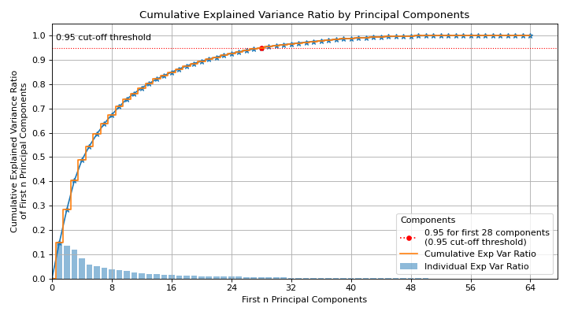
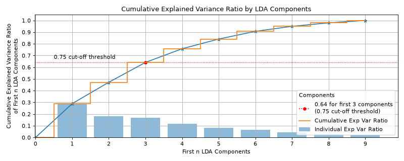

# plot\_pca\_component\_variance[#](#plot-pca-component-variance "Link to this heading")

scikitplot.api.decomposition.plot\_pca\_component\_variance(**clf**, **\***, **target\_explained\_variance=0.75**, **model\_type=None**, **title='Cumulative Explained Variance Ratio by Principal Components'**, **title\_fontsize='large'**, **text\_fontsize='medium'**, **x\_tick\_rotation=0**, **\*\*kwargs**)[[source]](https://github.com/scikit-plots/scikit-plots/blob/f4129c4/scikitplot/api/decomposition/_components.py#L35)[#](#scikitplot.api.decomposition.plot_pca_component_variance "Link to this definition")
:   Plots PCA components’ explained variance ratios. (new in v0.2.2)

    Added in version 0.2.2.

    Parameters:
    :   ****clf****object
        :   PCA instance that has the `explained_variance_ratio_` attribute.

        ****target\_explained\_variance****float, optional, default=0.75
        :   Looks for the minimum number of principal components that satisfies this
            value and emphasizes it on the plot.

        ****title****str, optional, default=’Cumulative Explained Variance Ratio by Principal Components’
        :   Title of the generated plot.

        ****title\_fontsize****str or int, optional, default=’large’
        :   Font size for the plot title. Use e.g., “small”, “medium”, “large” or integer-values.

        ****text\_fontsize****str or int, optional, default=’medium’
        :   Font size for the text in the plot. Use e.g., “small”, “medium”, “large” or integer-values.

        ****x\_tick\_rotation****int, optional, default=0
        :   Rotates x-axis tick labels by the specified angle.

            Added in version 0.3.9.

        ****\*\*kwargs: dict****
        :   Generic keyword arguments.

    Returns:
    :   ****ax****matplotlib.axes.Axes
        :   The axes on which the plot was drawn.

    Other Parameters:
    :   ****ax****matplotlib.axes.Axes, optional, default=None
        :   The axis to plot the figure on. If None is passed in the current axes
            will be used (or generated if required).

            Added in version 0.4.0.

        ****fig****matplotlib.pyplot.figure, optional, default: None
        :   The figure to plot the Visualizer on. If None is passed in the current
            plot will be used (or generated if required).

            Added in version 0.4.0.

        ****figsize****tuple, optional, default=None
        :   Width, height in inches.
            Tuple denoting figure size of the plot e.g. (12, 5)

            Added in version 0.4.0.

        ****nrows****int, optional, default=1
        :   Number of rows in the subplot grid.

            Added in version 0.4.0.

        ****ncols****int, optional, default=1
        :   Number of columns in the subplot grid.

            Added in version 0.4.0.

        ****plot\_style****str, optional, default=None
        :   Check available styles with “plt.style.available”. Examples include:
            [‘ggplot’, ‘seaborn’, ‘bmh’, ‘classic’, ‘dark\_background’, ‘fivethirtyeight’,
            ‘grayscale’, ‘seaborn-bright’, ‘seaborn-colorblind’, ‘seaborn-dark’,
            ‘seaborn-dark-palette’, ‘tableau-colorblind10’, ‘fast’].

            Added in version 0.4.0.

        ****show\_fig****bool, default=True
        :   Show the plot.

            Added in version 0.4.0.

        ****save\_fig****bool, default=False
        :   Save the plot.
            Used by `save_plot_decorator`.

            Added in version 0.4.0.

        ****save\_fig\_filename****str, optional, default=’’
        :   Specify the path and filetype to save the plot.
            If nothing specified, the plot will be saved as png
            inside `result_images` under to the current working directory.
            Defaults to plot image named to used `func.__name__`.
            Used by `save_plot_decorator`.

            Added in version 0.4.0.

        ****overwrite****bool, optional, default=True
        :   If False and a file exists, auto-increments the filename to avoid overwriting.

            Added in version 0.4.0.

        ****add\_timestamp****bool, optional, default=False
        :   Whether to append a timestamp to the filename.
            Default is False.

            Added in version 0.4.0.

        ****verbose****bool, optional
        :   If True, enables verbose output with informative messages during execution.
            Useful for debugging or understanding internal operations such as backend selection,
            font loading, and file saving status. If False, runs silently unless errors occur.

            Default is False.

            Added in version 0.4.0: The `verbose` parameter was added to control logging and user feedback verbosity.

    Examples

    Try it in your browser!
    ```
    >>> from sklearn.decomposition import PCA
    >>> from sklearn.datasets import load_digits as data_10_classes
    >>> import scikitplot as skplt
    >>> X, y = data_10_classes(return_X_y=True, as_frame=False)
    >>> pca = PCA(random_state=0).fit(X)
    >>> skplt.decomposition.plot_pca_component_variance(
    ...     pca, target_explained_variance=0.95
    ... )

    ```

    ([`Source code`](../../_downloads/d862bbd1437eb44f43b3178bb83aebfd/scikitplot-api-decomposition-plot_pca_component_variance-1.py), [`png`](../../_downloads/034da4e857fb5e306bc3bbedd2db81e0/scikitplot-api-decomposition-plot_pca_component_variance-1.png))

    
    ```
    >>> from sklearn.discriminant_analysis import (
    ...     LinearDiscriminantAnalysis,
    ... )
    >>> from sklearn.datasets import load_digits as data_10_classes
    >>> import scikitplot as skplt
    >>> X, y = data_10_classes(return_X_y=True, as_frame=False)
    >>> clf = LinearDiscriminantAnalysis().fit(X, y)
    >>> skplt.decomposition.plot_pca_component_variance(clf)

    ```

    ([`Source code`](../../_downloads/ec076f4f3a7991260cd317e63e7073f9/scikitplot-api-decomposition-plot_pca_component_variance-2.py), [`png`](../../_downloads/d74d1f7f9a34b7daa273d249f260d56b/scikitplot-api-decomposition-plot_pca_component_variance-2.png))

    
    Go BackOpen In Tab