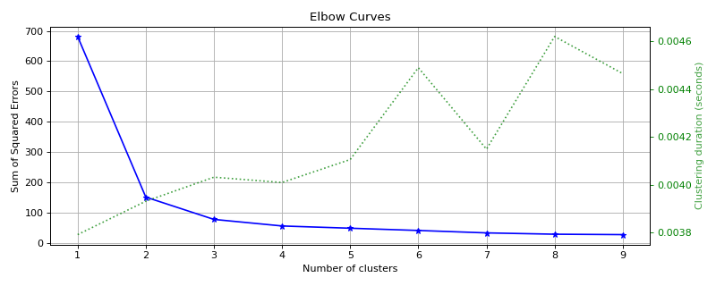

# plot\_elbow[#](#plot-elbow "Link to this heading")

scikitplot.api.estimators.plot\_elbow(**clf**, **X**, **\***, **cluster\_ranges=None**, **show\_cluster\_time=True**, **n\_jobs=1**, **title='Elbow Curves'**, **title\_fontsize='large'**, **text\_fontsize='medium'**, **\*\*kwargs**)[[source]](https://github.com/scikit-plots/scikit-plots/blob/829d7a7/scikitplot/api/estimators/_cluster/_elbow.py#L92)[#](#scikitplot.api.estimators.plot_elbow "Link to this definition")
:   Plot the elbow curve for different values of K in KMeans clustering.

    Parameters:
    :   ****clf****object
        :   A clusterer instance with `fit`, `fit_predict`, and `score` methods,
            and an `n_clusters` hyperparameter. Typically an instance of
            [`sklearn.cluster.KMeans`](https://scikit-learn.org/dev/modules/generated/sklearn.cluster.KMeans.html#sklearn.cluster.KMeans "(in scikit-learn v1.10)").

        ****X****array-like of shape (n\_samples, n\_features)
        :   The data to cluster, where `n_samples` is the number of samples and
            `n_features` is the number of features.

        ****cluster\_ranges****list of int or None, optional, default=range(1, 12, 2)
        :   List of values for `n_clusters` over which to plot the explained variances.

        ****show\_cluster\_time****bool, optional
        :   Whether to include a plot of the time taken to cluster for each value of K.

        ****n\_jobs****int, optional, default=1
        :   The number of jobs to run in parallel.

        ****title****str, optional, default=”Elbow Plot”
        :   The title of the generated plot.

        ****title\_fontsize****str or int, optional, default=”large”
        :   Font size of the title. Accepts Matplotlib font sizes,
            such as “small”, “medium”, “large”, or an integer value.

        ****text\_fontsize****str or int, optional, default=”medium”
        :   Font size of the text labels. Accepts Matplotlib font sizes,
            such as “small”, “medium”, “large”, or an integer value.

        ****\*\*kwargs: dict****
        :   Generic keyword arguments.

    Returns:
    :   ****ax****matplotlib.axes.Axes
        :   The axes on which the plot was drawn.

    Other Parameters:
    :   ****ax****matplotlib.axes.Axes, optional, default=None
        :   The axis to plot the figure on. If None is passed in the current axes
            will be used (or generated if required).

            Added in version 0.4.0.

        ****fig****matplotlib.pyplot.figure, optional, default: None
        :   The figure to plot the Visualizer on. If None is passed in the current
            plot will be used (or generated if required).

            Added in version 0.4.0.

        ****figsize****tuple, optional, default=None
        :   Width, height in inches.
            Tuple denoting figure size of the plot e.g. (12, 5)

            Added in version 0.4.0.

        ****nrows****int, optional, default=1
        :   Number of rows in the subplot grid.

            Added in version 0.4.0.

        ****ncols****int, optional, default=1
        :   Number of columns in the subplot grid.

            Added in version 0.4.0.

        ****plot\_style****str, optional, default=None
        :   Check available styles with “plt.style.available”. Examples include:
            [‘ggplot’, ‘seaborn’, ‘bmh’, ‘classic’, ‘dark\_background’, ‘fivethirtyeight’,
            ‘grayscale’, ‘seaborn-bright’, ‘seaborn-colorblind’, ‘seaborn-dark’,
            ‘seaborn-dark-palette’, ‘tableau-colorblind10’, ‘fast’].

            Added in version 0.4.0.

        ****show\_fig****bool, default=True
        :   Show the plot.

            Added in version 0.4.0.

        ****save\_fig****bool, default=False
        :   Save the plot.
            Used by `save_plot_decorator`.

            Added in version 0.4.0.

        ****save\_fig\_filename****str, optional, default=’’
        :   Specify the path and filetype to save the plot.
            If nothing specified, the plot will be saved as png
            inside `result_images` under to the current working directory.
            Defaults to plot image named to used `func.__name__`.
            Used by `save_plot_decorator`.

            Added in version 0.4.0.

        ****overwrite****bool, optional, default=True
        :   If False and a file exists, auto-increments the filename to avoid overwriting.

            Added in version 0.4.0.

        ****add\_timestamp****bool, optional, default=False
        :   Whether to append a timestamp to the filename.
            Default is False.

            Added in version 0.4.0.

        ****verbose****bool, optional
        :   If True, enables verbose output with informative messages during execution.
            Useful for debugging or understanding internal operations such as backend selection,
            font loading, and file saving status. If False, runs silently unless errors occur.

            Default is False.

            Added in version 0.4.0: The `verbose` parameter was added to control logging and user feedback verbosity.

    Examples

    Try it in your browser!
    ```
    >>> from sklearn.cluster import KMeans
    >>> from sklearn.datasets import load_iris as data_3_classes
    >>> import scikitplot as skplt
    >>> X, y = data_3_classes(return_X_y=True, as_frame=False)
    >>> kmeans = KMeans(random_state=0)
    >>> skplt.estimators.plot_elbow(
    >>>     kmeans,
    >>>     X,
    >>>     cluster_ranges=range(1, 10),
    >>> );

    ```

    ([`Source code`](../../_downloads/fb165c638d466254758a029ea8d39b64/scikitplot-api-estimators-plot_elbow-1.py), [`png`](../../_downloads/9e42b6888dea35fe456541484362c5e0/scikitplot-api-estimators-plot_elbow-1.png))

    
    Go BackOpen In Tab