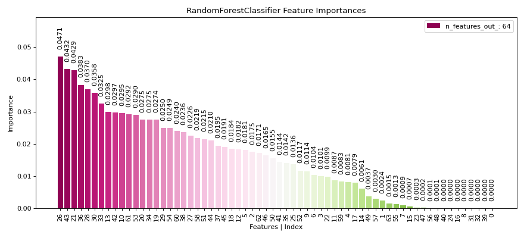

# plot\_feature\_importances[#](#plot-feature-importances "Link to this heading")

scikitplot.api.estimators.plot\_feature\_importances(**estimator**, **\***, **feature\_names=None**, **class\_index=None**, **threshold=None**, **title='Feature Importances'**, **title\_fontsize='large'**, **text\_fontsize='medium'**, **cmap='PiYG'**, **order=None**, **orientation='vertical'**, **x\_tick\_rotation=None**, **bar\_padding=11**, **digits=4**, **display\_bar\_label=True**, **\*\*kwargs**)[[source]](https://github.com/scikit-plots/scikit-plots/blob/71eae2e/scikitplot/api/estimators/_classifier/_feature_importances.py#L44)[#](#scikitplot.api.estimators.plot_feature_importances "Link to this definition")
:   Generate a plot of a sklearn model’s feature importances.

    This function handles different types of classifiers and their respective
    feature importances (`feature_importances_`) or coefficient (`coef_`) attributes,
    if not provide its compute sklearn permutation importances.
    It supports models wrapped in pipelines.

    Supports models like:

    * [`LinearRegression`](https://scikit-learn.org/dev/modules/generated/sklearn.linear_model.LinearRegression.html#sklearn.linear_model.LinearRegression "(in scikit-learn v1.10)")
    * [`LogisticRegression`](https://scikit-learn.org/dev/modules/generated/sklearn.linear_model.LogisticRegression.html#sklearn.linear_model.LogisticRegression "(in scikit-learn v1.10)")
    * [`KNeighborsClassifier`](https://scikit-learn.org/dev/modules/generated/sklearn.neighbors.KNeighborsClassifier.html#sklearn.neighbors.KNeighborsClassifier "(in scikit-learn v1.10)")
    * [`LinearSVC`](https://scikit-learn.org/dev/modules/generated/sklearn.svm.LinearSVC.html#sklearn.svm.LinearSVC "(in scikit-learn v1.10)")
    * [`SVC`](https://scikit-learn.org/dev/modules/generated/sklearn.svm.SVC.html#sklearn.svm.SVC "(in scikit-learn v1.10)")
    * [`DecisionTreeClassifier`](https://scikit-learn.org/dev/modules/generated/sklearn.tree.DecisionTreeClassifier.html#sklearn.tree.DecisionTreeClassifier "(in scikit-learn v1.10)")
    * [`RandomForestClassifier`](https://scikit-learn.org/dev/modules/generated/sklearn.ensemble.RandomForestClassifier.html#sklearn.ensemble.RandomForestClassifier "(in scikit-learn v1.10)")
    * [`PCA`](https://scikit-learn.org/dev/modules/generated/sklearn.decomposition.PCA.html#sklearn.decomposition.PCA "(in scikit-learn v1.10)")
    * [“XGBoost Python API”](https://xgboost.readthedocs.io/en/stable/python/python_api.html#module-xgboost.sklearn)
    * [“CatBoost Python API”](https://catboost.ai/en/docs/concepts/python-quickstart)

    Parameters:
    :   ****estimator****fitted estimator object
        :   Fitted classifier or a fitted [`Pipeline`](https://scikit-learn.org/dev/modules/generated/sklearn.pipeline.Pipeline.html#sklearn.pipeline.Pipeline "(in scikit-learn v1.10)")
            in which the last estimator is a classifier.

        ****feature\_names****list of str, optional, default=None
        :   List of feature names corresponding to the features. If None, feature
            indices are used.

        ****class\_index****int, optional, default=None
        :   Index of the class of interest for multi-class classification.
            Defaults to None.

        ****threshold****float, optional, default=None
        :   Threshold for filtering features by absolute importance. Only
            features with an absolute importance greater than this threshold will
            be plotted. Defaults to None (plot all features).

        ****title****str, optional, default=’Feature Importances’
        :   Title of the generated plot.

        ****title\_fontsize****str or int, optional, default=’large’
        :   Matplotlib-style fontsizes. Use e.g. “small”, “medium”, “large” or
            integer-values.

        ****text\_fontsize****str or int, optional, default=’medium’
        :   Matplotlib-style fontsizes. Use e.g. “small”, “medium”, “large” or
            integer-values.

        ****cmap****None, str or matplotlib.colors.Colormap, optional, default=’PiYG’
        :   Colormap used for plotting.
            Options include ‘viridis’, ‘PiYG’, ‘plasma’, ‘inferno’, etc.
            See Matplotlib Colormap documentation for available choices.
            - <https://matplotlib.org/stable/users/explain/colors/index.html>

        ****order****{‘ascending’, ‘descending’, None}, optional, default=None
        :   Order of feature importance in the plot. Defaults to None
            (automatically set based on orientation).

        ****orientation****{‘vertical’ | ‘v’ | ‘y’, ‘horizontal’ | ‘h’ | ‘y’}, optional
        :   Orientation of the bar plot. Defaults to ‘vertical’.

        ****x\_tick\_rotation****int, optional, default=None
        :   Rotates x-axis tick labels by the specified angle. Defaults to None
            (automatically set based on orientation).

        ****bar\_padding****float, optional, default=11
        :   Padding between bars in the plot.

        ****digits****int, optional, default=4
        :   Number of digits for formatting AUC values in the plot.

        ****display\_bar\_label****bool, optional, default=True
        :   Whether to display the bar labels.

            Added in version 0.3.9.

        ****\*\*kwargs: dict****
        :   Generic keyword arguments.

    Returns:
    :   ****ax****matplotlib.axes.Axes
        :   The axes on which the plot was drawn.

    Other Parameters:
    :   ****ax****matplotlib.axes.Axes, optional, default=None
        :   The axis to plot the figure on. If None is passed in the current axes
            will be used (or generated if required).

            Added in version 0.4.0.

        ****fig****matplotlib.pyplot.figure, optional, default: None
        :   The figure to plot the Visualizer on. If None is passed in the current
            plot will be used (or generated if required).

            Added in version 0.4.0.

        ****figsize****tuple, optional, default=None
        :   Width, height in inches.
            Tuple denoting figure size of the plot e.g. (12, 5)

            Added in version 0.4.0.

        ****nrows****int, optional, default=1
        :   Number of rows in the subplot grid.

            Added in version 0.4.0.

        ****ncols****int, optional, default=1
        :   Number of columns in the subplot grid.

            Added in version 0.4.0.

        ****plot\_style****str, optional, default=None
        :   Check available styles with “plt.style.available”. Examples include:
            [‘ggplot’, ‘seaborn’, ‘bmh’, ‘classic’, ‘dark\_background’, ‘fivethirtyeight’,
            ‘grayscale’, ‘seaborn-bright’, ‘seaborn-colorblind’, ‘seaborn-dark’,
            ‘seaborn-dark-palette’, ‘tableau-colorblind10’, ‘fast’].

            Added in version 0.4.0.

        ****show\_fig****bool, default=True
        :   Show the plot.

            Added in version 0.4.0.

        ****save\_fig****bool, default=False
        :   Save the plot.
            Used by `save_plot_decorator`.

            Added in version 0.4.0.

        ****save\_fig\_filename****str, optional, default=’’
        :   Specify the path and filetype to save the plot.
            If nothing specified, the plot will be saved as png
            inside `result_images` under to the current working directory.
            Defaults to plot image named to used `func.__name__`.
            Used by `save_plot_decorator`.

            Added in version 0.4.0.

        ****overwrite****bool, optional, default=True
        :   If False and a file exists, auto-increments the filename to avoid overwriting.

            Added in version 0.4.0.

        ****add\_timestamp****bool, optional, default=False
        :   Whether to append a timestamp to the filename.
            Default is False.

            Added in version 0.4.0.

        ****verbose****bool, optional
        :   If True, enables verbose output with informative messages during execution.
            Useful for debugging or understanding internal operations such as backend selection,
            font loading, and file saving status. If False, runs silently unless errors occur.

            Default is False.

            Added in version 0.4.0: The `verbose` parameter was added to control logging and user feedback verbosity.

    Examples

    Try it in your browser!
    ```
    >>> from sklearn.datasets import load_digits as data_10_classes
    >>> from sklearn.model_selection import train_test_split
    >>> from sklearn.ensemble import RandomForestClassifier
    >>> import scikitplot as skplt
    >>> X, y = data_10_classes(return_X_y=True, as_frame=False)
    >>> X_train, X_val, y_train, y_val = train_test_split(
    ...     X, y, test_size=0.5, random_state=0
    ... )
    >>> model = RandomForestClassifier(random_state=0).fit(X_train, y_train)
    >>> skplt.estimators.plot_feature_importances(
    >>>     model,
    >>>     orientation='y',
    >>>     figsize=(11, 5),
    >>> );

    ```

    ([`Source code`](../../_downloads/ddd2ab7b55561710d741d7da66889263/scikitplot-api-estimators-plot_feature_importances-1.py), [`png`](../../_downloads/7d3324c741f9e41a077c33893be5fd67/scikitplot-api-estimators-plot_feature_importances-1.png))

    
    Go BackOpen In Tab