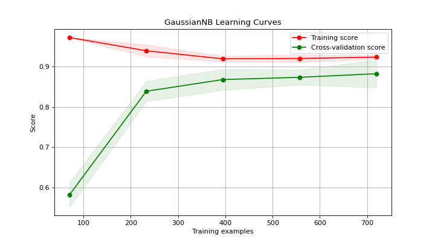

# plot\_learning\_curve[#](#plot-learning-curve "Link to this heading")

scikitplot.api.estimators.plot\_learning\_curve(**estimator**, **X**, **y**, **\***, **train\_sizes=None**, **cv=None**, **scoring=None**, **n\_jobs=None**, **verbose=0**, **shuffle=False**, **random\_state=None**, **fit\_params=None**, **title='Learning Curves'**, **title\_fontsize='large'**, **text\_fontsize='medium'**, **\*\*kwargs**)[[source]](https://github.com/scikit-plots/scikit-plots/blob/4094af5/scikitplot/api/estimators/_classifier/_learning_curve.py#L41)[#](#scikitplot.api.estimators.plot_learning_curve "Link to this definition")
:   Generates a plot of the train and test learning curves for a classifier.

    The learning curves plot the performance of a classifier as a function of the number of
    training samples. This helps in understanding how well the classifier performs
    with different amounts of training data.

    Parameters:
    :   ****estimator****object type that implements the “fit” method
        :   An object of that type which is cloned for each validation. It must
            also implement “predict” unless `scoring` is a callable that doesn’t
            rely on “predict” to compute a score.

        ****X****array-like, shape (n\_samples, n\_features)
        :   Training data, where `n_samples` is the number of samples
            and `n_features` is the number of features.

        ****y****array-like, shape (n\_samples,) or (n\_samples, n\_features), optional
        :   Target relative to `X` for classification or regression.
            None for unsupervised learning.

        ****train\_sizes****iterable, optional
        :   Determines the training sizes used to plot the learning curve.
            If None, `np.linspace(.1, 1.0, 5)` is used.

        ****cv****int, cross-validation generator, iterable or None, default=5
        :   Determines the cross-validation splitting strategy.
            Possible inputs for cv are:
            - None, to use the default 5-fold cross validation,
            - integer, to specify the number of folds.
            - [CV splitter](../../learn/glossary/_glossary_sklearn.html#term-CV-splitter),
            - An iterable that generates (train, test) splits as arrays of indices.

            For integer/None inputs, if classifier is True and `y` is either
            binary or multiclass, `StratifiedKFold` is used. In all other
            cases, `KFold` is used.

            Refer [User Guide](https://scikit-learn.org/dev/modules/cross_validation.html#cross-validation "(in scikit-learn v1.10)") for the various
            cross-validation strategies that can be used here.

        ****scoring****str, callable, or None, optional, default=None
        :   A string (see scikit-learn model evaluation documentation)
            or a scorer callable object/function
            with signature `scorer(estimator, X, y)`.

        ****n\_jobs****int, optional, default=None
        :   Number of jobs to run in parallel. Training the estimator and computing
            the score are parallelized over the different training and test sets.
            `None` means 1 unless in a [`joblib.parallel_backend`](https://joblib.readthedocs.io/en/latest/generated/joblib.parallel_backend.html#joblib.parallel_backend "(in joblib v1.6)") context.
            `-1` means using all processors. See [Glossary](../../learn/glossary/_glossary_sklearn.html#term-n_jobs)
            for more details.

        ****verbose****int, default=0
        :   Controls the verbosity: the higher, the more messages.

        ****shuffle****bool, optional, default=True
        :   Whether to shuffle the training data before splitting using cross-validation.

        ****random\_state****int or RandomState, optional
        :   Pseudo-random number generator state used for random sampling.

        ****fit\_params****dict, default=None
        :   Parameters to pass to the fit method of the estimator.

            Added in version 0.3.9.

        ****title****str, optional, default=”Learning Curves”
        :   Title of the generated plot.

        ****title\_fontsize****str or int, optional, default=’large’
        :   Font size for the plot title.
            Use e.g., “small”, “medium”, “large” or integer values.

        ****text\_fontsize****str or int, optional, default=’medium’
        :   Font size for the text in the plot.
            Use e.g., “small”, “medium”, “large” or integer values.

        ****\*\*kwargs: dict****
        :   Generic keyword arguments.

    Returns:
    :   ****ax****matplotlib.axes.Axes
        :   The axes on which the plot was drawn.

        References
        \* [“scikit-learn learning\_curve”](https://scikit-learn.org/stable/modules/generated/sklearn.model_selection.learning_curve.html#).[#](#references "Link to this dropdown")

    Other Parameters:
    :   ****ax****matplotlib.axes.Axes, optional, default=None
        :   The axis to plot the figure on. If None is passed in the current axes
            will be used (or generated if required).

            Added in version 0.4.0.

        ****fig****matplotlib.pyplot.figure, optional, default: None
        :   The figure to plot the Visualizer on. If None is passed in the current
            plot will be used (or generated if required).

            Added in version 0.4.0.

        ****figsize****tuple, optional, default=None
        :   Width, height in inches.
            Tuple denoting figure size of the plot e.g. (12, 5)

            Added in version 0.4.0.

        ****nrows****int, optional, default=1
        :   Number of rows in the subplot grid.

            Added in version 0.4.0.

        ****ncols****int, optional, default=1
        :   Number of columns in the subplot grid.

            Added in version 0.4.0.

        ****plot\_style****str, optional, default=None
        :   Check available styles with “plt.style.available”. Examples include:
            [‘ggplot’, ‘seaborn’, ‘bmh’, ‘classic’, ‘dark\_background’, ‘fivethirtyeight’,
            ‘grayscale’, ‘seaborn-bright’, ‘seaborn-colorblind’, ‘seaborn-dark’,
            ‘seaborn-dark-palette’, ‘tableau-colorblind10’, ‘fast’].

            Added in version 0.4.0.

        ****show\_fig****bool, default=True
        :   Show the plot.

            Added in version 0.4.0.

        ****save\_fig****bool, default=False
        :   Save the plot.
            Used by `save_plot_decorator`.

            Added in version 0.4.0.

        ****save\_fig\_filename****str, optional, default=’’
        :   Specify the path and filetype to save the plot.
            If nothing specified, the plot will be saved as png
            inside `result_images` under to the current working directory.
            Defaults to plot image named to used `func.__name__`.
            Used by `save_plot_decorator`.

            Added in version 0.4.0.

        ****overwrite****bool, optional, default=True
        :   If False and a file exists, auto-increments the filename to avoid overwriting.

            Added in version 0.4.0.

        ****add\_timestamp****bool, optional, default=False
        :   Whether to append a timestamp to the filename.
            Default is False.

            Added in version 0.4.0.

        ****verbose****bool, optional
        :   If True, enables verbose output with informative messages during execution.
            Useful for debugging or understanding internal operations such as backend selection,
            font loading, and file saving status. If False, runs silently unless errors occur.

            Default is False.

            Added in version 0.4.0: The `verbose` parameter was added to control logging and user feedback verbosity.

    Examples

    Try it in your browser!
    ```
    >>> from sklearn.datasets import load_digits as data_10_classes
    >>> from sklearn.model_selection import train_test_split
    >>> from sklearn.naive_bayes import GaussianNB
    >>> import scikitplot as skplt
    >>> X, y = data_10_classes(return_X_y=True, as_frame=False)
    >>> X_train, X_val, y_train, y_val = train_test_split(
    ...     X, y, test_size=0.5, random_state=0
    ... )
    >>> model = GaussianNB()
    >>> model.fit(X_train, y_train)
    >>> y_val_pred = model.predict(X_val)
    >>> skplt.estimators.plot_learning_curve(
    >>>     model, X_val, y_val_pred,
    >>> );

    ```

    ([`Source code`](../../_downloads/e01ef274d6d5b5cdcfedab1271a53197/scikitplot-api-estimators-plot_learning_curve-1.py), [`png`](../../_downloads/94c77bce36479cdca94670fca4edac4e/scikitplot-api-estimators-plot_learning_curve-1.png))

    
    Go BackOpen In Tab