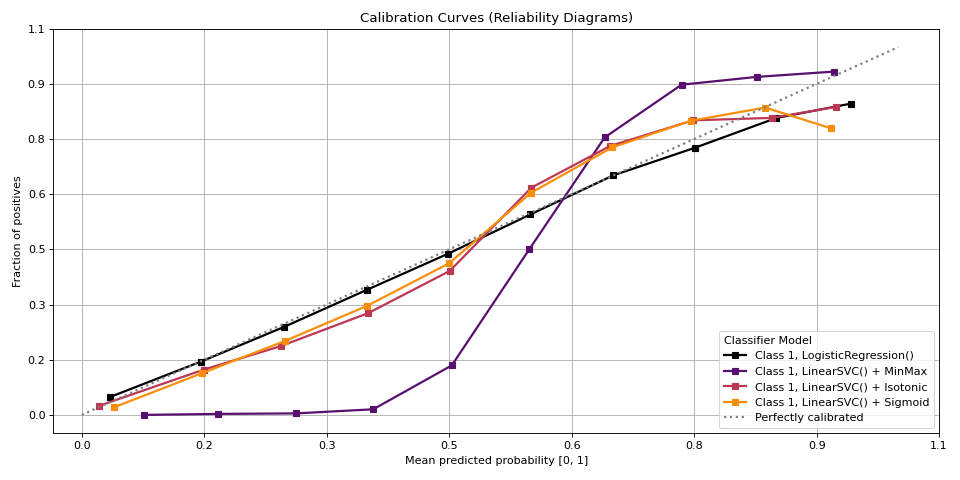

# plot\_calibration[#](#plot-calibration "Link to this heading")

scikitplot.api.metrics.plot\_calibration(**y\_true**, **y\_probas\_list**, **\***, **pos\_label=None**, **class\_index=None**, **class\_names=None**, **to\_plot\_class\_index=1**, **estimator\_names=None**, **n\_bins=10**, **strategy='uniform'**, **title='Calibration Curves (Reliability Diagrams)'**, **title\_fontsize='large'**, **text\_fontsize='medium'**, **cmap='inferno'**, **\*\*kwargs**)[[source]](https://github.com/scikit-plots/scikit-plots/blob/d0ea3951/scikitplot/api/metrics/_classification/_calibration.py#L43)[#](#scikitplot.api.metrics.plot_calibration "Link to this definition")
:   Plot calibration curves for a set of classifier probability estimates.

    This function plots calibration curves, also known as reliability curves,
    which are useful to assess the calibration of probabilistic models.
    For a well-calibrated model, the predicted probability should match the
    observed frequency of the positive class.

    Parameters:
    :   ****y\_true****array-like of shape (n\_samples,)
        :   Ground truth (correct) target values.

        ****y\_probas\_list****list of array-like, shape (n\_samples, 2) or (n\_samples,)
        :   A list containing the outputs of classifiers’ `predict_proba` or
            `decision_function` methods.

        ****n\_bins****int, optional, default=10
        :   Number of bins to use in the calibration curve. A higher number requires
            more data to produce reliable results.

        ****strategy****str, optional, default=’uniform’
        :   Strategy used to define the widths of the bins:

            * ‘uniform’: Bins have identical widths.
            * ‘quantile’: Bins have the same number of samples and depend on `y_probas_list`.

            Added in version 0.3.9.

        ****estimator\_names****list of str or None, optional, default=None
        :   A list of classifier names corresponding to the probability estimates in
            `y_probas_list`. If None, the names will be generated automatically as
            “Classifier 1”, “Classifier 2”, etc.

        ****class\_names****list of str or None, optional, default=None
        :   List of class names for the legend. The order should match the classes in
            `y_probas_list`. If None, class indices will be used.

        ****multi\_class****{‘ovr’, ‘multinomial’, None}, optional, default=None
        :   Strategy for handling multiclass classification:
            - ‘ovr’: One-vs-Rest, plotting binary problems for each class.
            - ‘multinomial’ or None: Multinomial plot for the entire probability distribution.

        ****class\_index****int, optional, default=1
        :   Index of the class of interest for multiclass classification. Ignored for
            binary classification. Related to `multi_class` parameter. Not Implemented.

        ****to\_plot\_class\_index****int, list-like, optional, default=1
        :   Specific classes to plot. If a given class does not exist, it will be ignored.
            If None, all classes are plotted.

        ****title****str, optional, default=’Calibration plots (Reliability Curves)’
        :   Title of the generated plot.

        ****title\_fontsize****str or int, optional, default=’large’
        :   Font size of the plot title. Accepts Matplotlib-style sizes like “small”,
            “medium”, “large”, or an integer.

        ****text\_fontsize****str or int, optional, default=’medium’
        :   Font size of the plot text (axis labels). Accepts Matplotlib-style sizes
            like “small”, “medium”, “large”, or an integer.

        ****cmap****None, str or matplotlib.colors.Colormap, optional, default=None
        :   Colormap used for plotting.
            Options include ‘viridis’, ‘PiYG’, ‘plasma’, ‘inferno’, ‘nipy\_spectral’, etc.
            See Matplotlib Colormap documentation for available choices.

            * <https://matplotlib.org/stable/users/explain/colors/index.html>
            * plt.colormaps()
            * plt.get\_cmap() # None == ‘viridis’

        ****\*\*kwargs: dict****
        :   Generic keyword arguments.

    Returns:
    :   ****ax****matplotlib.axes.Axes
        :   The axes on which the plot was drawn.

    Other Parameters:
    :   ****ax****matplotlib.axes.Axes, optional, default=None
        :   The axis to plot the figure on. If None is passed in the current axes
            will be used (or generated if required).

            Added in version 0.4.0.

        ****fig****matplotlib.pyplot.figure, optional, default: None
        :   The figure to plot the Visualizer on. If None is passed in the current
            plot will be used (or generated if required).

            Added in version 0.4.0.

        ****figsize****tuple, optional, default=None
        :   Width, height in inches.
            Tuple denoting figure size of the plot e.g. (12, 5)

            Added in version 0.4.0.

        ****nrows****int, optional, default=1
        :   Number of rows in the subplot grid.

            Added in version 0.4.0.

        ****ncols****int, optional, default=1
        :   Number of columns in the subplot grid.

            Added in version 0.4.0.

        ****plot\_style****str, optional, default=None
        :   Check available styles with “plt.style.available”. Examples include:
            [‘ggplot’, ‘seaborn’, ‘bmh’, ‘classic’, ‘dark\_background’, ‘fivethirtyeight’,
            ‘grayscale’, ‘seaborn-bright’, ‘seaborn-colorblind’, ‘seaborn-dark’,
            ‘seaborn-dark-palette’, ‘tableau-colorblind10’, ‘fast’].

            Added in version 0.4.0.

        ****show\_fig****bool, default=True
        :   Show the plot.

            Added in version 0.4.0.

        ****save\_fig****bool, default=False
        :   Save the plot.
            Used by `save_plot_decorator`.

            Added in version 0.4.0.

        ****save\_fig\_filename****str, optional, default=’’
        :   Specify the path and filetype to save the plot.
            If nothing specified, the plot will be saved as png
            inside `result_images` under to the current working directory.
            Defaults to plot image named to used `func.__name__`.
            Used by `save_plot_decorator`.

            Added in version 0.4.0.

        ****overwrite****bool, optional, default=True
        :   If False and a file exists, auto-increments the filename to avoid overwriting.

            Added in version 0.4.0.

        ****add\_timestamp****bool, optional, default=False
        :   Whether to append a timestamp to the filename.
            Default is False.

            Added in version 0.4.0.

        ****verbose****bool, optional
        :   If True, enables verbose output with informative messages during execution.
            Useful for debugging or understanding internal operations such as backend selection,
            font loading, and file saving status. If False, runs silently unless errors occur.

            Default is False.

            Added in version 0.4.0: The `verbose` parameter was added to control logging and user feedback verbosity.

    Notes

    * The calibration curve is plotted for the class specified by `to_plot_class_index`.
    * This function currently supports binary and multiclass classification.

    References[#](#references "Link to this dropdown")

    * [“scikit-learn calibration\_curve”](https://scikit-learn.org/stable/modules/generated/sklearn.calibration.calibration_curve.html#).

    Examples

    Try it in your browser!
    ```
    >>> from sklearn.datasets import make_classification
    >>> from sklearn.model_selection import train_test_split
    >>> from sklearn.linear_model import LogisticRegression
    >>> from sklearn.naive_bayes import GaussianNB
    >>> from sklearn.svm import LinearSVC
    >>> from sklearn.calibration import CalibratedClassifierCV
    >>> from sklearn.ensemble import RandomForestClassifier
    >>> from sklearn.model_selection import cross_val_predict
    >>> import numpy as np
    ...
    ... np.random.seed(0)
    >>> # importing pylab or pyplot
    >>> import matplotlib.pyplot as plt
    >>>
    >>> # Import scikit-plot
    >>> import scikitplot as skplt
    >>>
    >>> # Load the data
    >>> X, y = make_classification(
    >>>     n_samples=100000,
    >>>     n_features=20,
    >>>     n_informative=4,
    >>>     n_redundant=2,
    >>>     n_repeated=0,
    >>>     n_classes=3,
    >>>     n_clusters_per_class=2,
    >>>     random_state=0
    >>> )
    >>> X_train, y_train, X_val, y_val = (
    ...     X[:1000],
    ...     y[:1000],
    ...     X[1000:],
    ...     y[1000:],
    ... )
    >>>
    >>> # Create an instance of the LogisticRegression
    >>> lr_probas = (
    ...     LogisticRegression(max_iter=int(1e5), random_state=0)
    ...     .fit(X_train, y_train)
    ...     .predict_proba(X_val)
    ... )
    >>> nb_probas = GaussianNB().fit(X_train, y_train).predict_proba(X_val)
    >>> svc_scores = LinearSVC().fit(X_train, y_train).decision_function(X_val)
    >>> svc_isotonic = (
    ...     CalibratedClassifierCV(LinearSVC(), cv=2, method='isotonic')
    ...     .fit(X_train, y_train)
    ...     .predict_proba(X_val)
    ... )
    >>> svc_sigmoid = (
    ...     CalibratedClassifierCV(LinearSVC(), cv=2, method='sigmoid')
    ...     .fit(X_train, y_train)
    ...     .predict_proba(X_val)
    ... )
    >>> rf_probas = (
    ...     RandomForestClassifier(random_state=0)
    ...     .fit(X_train, y_train)
    ...     .predict_proba(X_val)
    ... )
    >>>
    >>> probas_dict = {
    >>>     LogisticRegression(): lr_probas,
    >>> # GaussianNB(): nb_probas,
    >>>     "LinearSVC() + MinMax": svc_scores,
    >>>     "LinearSVC() + Isotonic": svc_isotonic,
    >>>     "LinearSVC() + Sigmoid": svc_sigmoid,
    >>> # RandomForestClassifier(): rf_probas,
    >>> }
    >>> # Plot!
    >>> fig, ax = plt.subplots(figsize=(12, 6))
    >>> ax = skplt.metrics.plot_calibration(
    >>>     y_val,
    >>>     y_probas_list=probas_dict.values(),
    >>>     estimator_names=probas_dict.keys(),
    >>>     ax=ax,
    >>> );

    ```

    ([`Source code`](../../_downloads/7b63d07523dbc87887d1eee368cb9ce7/scikitplot-api-metrics-plot_calibration-1.py), [`png`](../../_downloads/b5c95ad9a9fd93d64ac358928f597b44/scikitplot-api-metrics-plot_calibration-1.png))

    
    Go BackOpen In Tab