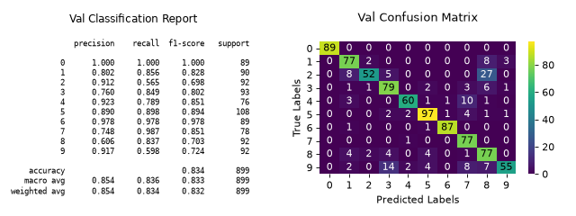

# plot\_classifier\_eval[#](#plot-classifier-eval "Link to this heading")

scikitplot.api.metrics.plot\_classifier\_eval(**y\_true**, **y\_pred**, **\***, **labels=None**, **normalize=None**, **digits=3**, **title='train'**, **title\_fontsize='large'**, **text\_fontsize='medium'**, **cmap=None**, **x\_tick\_rotation=0**, **figsize=(8, 3)**, **nrows=1**, **ncols=2**, **index=2**, **\*\*kwargs**)[[source]](https://github.com/scikit-plots/scikit-plots/blob/7b27db8/scikitplot/api/metrics/_classification/_confusion_matrix.py#L265)[#](#scikitplot.api.metrics.plot_classifier_eval "Link to this definition")
:   Generates various evaluation plots for a classifier, including confusion matrix,
    precision-recall curve, and ROC curve.

    This function provides a comprehensive view of a classifier’s performance through
    multiple plots, helping in the assessment of its effectiveness
    and areas for improvement.

    Parameters:
    :   ****y\_true****array-like, shape (n\_samples,)
        :   Ground truth (correct) target values.

        ****y\_pred****array-like, shape (n\_samples,)
        :   Predicted target values from the classifier.

        ****labels****list of string, optional
        :   List of labels for the classes.
            If None, labels are automatically generated based on the class indices.

        ****normalize****{‘true’, ‘pred’, ‘all’, None}, optional
        :   Normalizes the confusion matrix according to the specified mode. Defaults to None.

            * ‘true’: Normalizes by true (actual) values.
            * ‘pred’: Normalizes by predicted values.
            * ‘all’: Normalizes by total values.
            * None: No normalization.

        ****digits****int, optional, default=3
        :   Number of digits for formatting floating point values in the plots.

        ****title****string, optional, default=’train’
        :   Title of the generated plot.

        ****title\_fontsize****string or int, optional, default=”large”
        :   Font size for the plot title.
            Use e.g. “small”, “medium”, “large” or integer values.

        ****text\_fontsize****string or int, optional, default=”medium”
        :   Font size for the text in the plot.
            Use e.g. “small”, “medium”, “large” or integer values.

        ****cmap****None, str or matplotlib.colors.Colormap, optional, default=None
        :   Colormap used for plotting.
            Options include ‘viridis’, ‘PiYG’, ‘plasma’, ‘inferno’, ‘nipy\_spectral’, etc.
            See Matplotlib Colormap documentation for available choices.

            * <https://matplotlib.org/stable/users/explain/colors/index.html>
            * plt.colormaps()
            * plt.get\_cmap() # None == ‘viridis’

        ****x\_tick\_rotation****int, optional, default=0
        :   Rotates x-axis tick labels by the specified angle.

            Added in version 0.3.9.

        ****\*\*kwargs: dict****
        :   Generic keyword arguments.

    Returns:
    :   ****fig****matplotlib.figure.Figure
        :   The figure on which the plot was drawn.

    Other Parameters:
    :   ****ax****matplotlib.axes.Axes, optional, default=None
        :   The axis to plot the figure on. If None is passed in the current axes
            will be used (or generated if required).

            Added in version 0.4.0.

        ****fig****matplotlib.pyplot.figure, optional, default: None
        :   The figure to plot the Visualizer on. If None is passed in the current
            plot will be used (or generated if required).

            Added in version 0.4.0.

        ****figsize****tuple, optional, default=None
        :   Width, height in inches.
            Tuple denoting figure size of the plot e.g. (12, 5)

            Added in version 0.4.0.

        ****nrows****int, optional, default=1
        :   Number of rows in the subplot grid.

            Added in version 0.4.0.

        ****ncols****int, optional, default=1
        :   Number of columns in the subplot grid.

            Added in version 0.4.0.

        ****plot\_style****str, optional, default=None
        :   Check available styles with “plt.style.available”. Examples include:
            [‘ggplot’, ‘seaborn’, ‘bmh’, ‘classic’, ‘dark\_background’, ‘fivethirtyeight’,
            ‘grayscale’, ‘seaborn-bright’, ‘seaborn-colorblind’, ‘seaborn-dark’,
            ‘seaborn-dark-palette’, ‘tableau-colorblind10’, ‘fast’].

            Added in version 0.4.0.

        ****show\_fig****bool, default=True
        :   Show the plot.

            Added in version 0.4.0.

        ****save\_fig****bool, default=False
        :   Save the plot.
            Used by `save_plot_decorator`.

            Added in version 0.4.0.

        ****save\_fig\_filename****str, optional, default=’’
        :   Specify the path and filetype to save the plot.
            If nothing specified, the plot will be saved as png
            inside `result_images` under to the current working directory.
            Defaults to plot image named to used `func.__name__`.
            Used by `save_plot_decorator`.

            Added in version 0.4.0.

        ****overwrite****bool, optional, default=True
        :   If False and a file exists, auto-increments the filename to avoid overwriting.

            Added in version 0.4.0.

        ****add\_timestamp****bool, optional, default=False
        :   Whether to append a timestamp to the filename.
            Default is False.

            Added in version 0.4.0.

        ****verbose****bool, optional
        :   If True, enables verbose output with informative messages during execution.
            Useful for debugging or understanding internal operations such as backend selection,
            font loading, and file saving status. If False, runs silently unless errors occur.

            Default is False.

            Added in version 0.4.0: The `verbose` parameter was added to control logging and user feedback verbosity.

    Notes

    The function generates and displays multiple evaluation plots. Ensure that `y_true` and `y_pred`
    have the same shape and contain valid class labels. The `normalize` parameter is applicable
    to the confusion matrix plot. Adjust `cmap` and `x_tick_rotation` to customize the appearance
    of the plots.

    References[#](#references "Link to this dropdown")

    * [“scikit-learn classification\_report”](https://scikit-learn.org/stable/modules/generated/sklearn.metrics.classification_report.html#).
    * [“scikit-learn confusion\_matrix”](https://scikit-learn.org/stable/modules/generated/sklearn.metrics.confusion_matrix.html#).

    Examples

    Try it in your browser!
    ```
    >>> from sklearn.datasets import load_digits as data_10_classes
    >>> from sklearn.model_selection import train_test_split
    >>> from sklearn.naive_bayes import GaussianNB
    >>> import scikitplot as skplt
    >>> X, y = data_10_classes(return_X_y=True, as_frame=False)
    >>> X_train, X_val, y_train, y_val = train_test_split(X, y, test_size=0.5, random_state=0)
    >>> model = GaussianNB()
    >>> model.fit(X_train, y_train)
    >>> y_val_pred = model.predict(X_val)
    >>> skplt.metrics.plot_classifier_eval(
    >>>     y_val, y_val_pred,
    >>>     title='val',
    >>> );

    ```

    ([`Source code`](../../_downloads/c485df5546c6c7cbea44b17cfe781a83/scikitplot-api-metrics-plot_classifier_eval-1.py), [`png`](../../_downloads/5d3f89cc555847c857948aaa8233c0cc/scikitplot-api-metrics-plot_classifier_eval-1.png))

    
    Go BackOpen In Tab