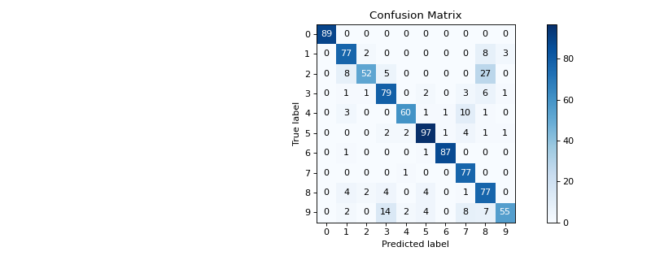

# plot\_confusion\_matrix[#](#plot-confusion-matrix "Link to this heading")

scikitplot.api.metrics.plot\_confusion\_matrix(**y\_true**, **y\_pred**, **\***, **labels=None**, **true\_labels=None**, **pred\_labels=None**, **normalize=False**, **hide\_zeros=False**, **hide\_counts=False**, **title=None**, **title\_fontsize='large'**, **text\_fontsize='medium'**, **x\_tick\_rotation=0**, **cmap='Blues'**, **show\_colorbar=True**, **\*\*kwargs**)[[source]](https://github.com/scikit-plots/scikit-plots/blob/e4af755/scikitplot/api/metrics/_classification/_confusion_matrix.py#L56)[#](#scikitplot.api.metrics.plot_confusion_matrix "Link to this definition")
:   Generates a confusion matrix plot from predictions and true labels.

    The confusion matrix is a summary of prediction results that shows the counts of true
    and false positives and negatives for each class. This function also provides options for
    normalizing, hiding zero values, and customizing the plot appearance.

    Parameters:
    :   ****y\_true****array-like, shape (n\_samples,)
        :   Ground truth (correct) target values.

        ****y\_pred****array-like, shape (n\_samples,)
        :   Estimated targets as returned by a classifier.

        ****labels****array-like, shape (n\_classes), optional
        :   List of labels to index the matrix. This may be used to reorder or select a subset
            of labels. If None, labels appearing at least once in `y_true` or `y_pred` are used
            in sorted order. (new in v0.2.5)

        ****true\_labels****array-like, optional
        :   The true labels to display. If None, all labels are used.

        ****pred\_labels****array-like, optional
        :   The predicted labels to display. If None, all labels are used.

        ****normalize****bool, optional, default=False
        :   If True, normalizes the confusion matrix before plotting.

        ****hide\_zeros****bool, optional, default=False
        :   If True, cells containing a value of zero are not plotted.

        ****hide\_counts****bool, optional, default=False
        :   If True, counts are not overlaid on the plot.

        ****title****string, optional
        :   Title of the generated plot. Defaults to “Confusion Matrix” if `normalize` is True.
            Otherwise, defaults to “Normalized Confusion Matrix”.

        ****title\_fontsize****string or int, optional, default=”large”
        :   Font size for the plot title. Use “small”, “medium”, “large”, or integer values.

        ****text\_fontsize****string or int, optional, default=”medium”
        :   Font size for text in the plot. Use “small”, “medium”, “large”, or integer values.

        ****x\_tick\_rotation****int, optional, default=0
        :   Rotates x-axis tick labels by the specified angle. Useful when labels overlap.

        ****cmap****None, str or matplotlib.colors.Colormap, optional, default=None
        :   Colormap used for plotting.
            Options include ‘viridis’, ‘PiYG’, ‘plasma’, ‘inferno’, ‘nipy\_spectral’, etc.
            See Matplotlib Colormap documentation for available choices.

            * <https://matplotlib.org/stable/users/explain/colors/index.html>
            * plt.colormaps()
            * plt.get\_cmap() # None == ‘viridis’

        ****show\_colorbar****bool, optional, default=True
        :   If False, the colorbar is not displayed.

            Added in version 0.3.9.

        ****\*\*kwargs: dict****
        :   Generic keyword arguments.

    Returns:
    :   ****ax****matplotlib.axes.Axes
        :   The axes on which the plot was drawn.

    Other Parameters:
    :   ****ax****matplotlib.axes.Axes, optional, default=None
        :   The axis to plot the figure on. If None is passed in the current axes
            will be used (or generated if required).

            Added in version 0.4.0.

        ****fig****matplotlib.pyplot.figure, optional, default: None
        :   The figure to plot the Visualizer on. If None is passed in the current
            plot will be used (or generated if required).

            Added in version 0.4.0.

        ****figsize****tuple, optional, default=None
        :   Width, height in inches.
            Tuple denoting figure size of the plot e.g. (12, 5)

            Added in version 0.4.0.

        ****nrows****int, optional, default=1
        :   Number of rows in the subplot grid.

            Added in version 0.4.0.

        ****ncols****int, optional, default=1
        :   Number of columns in the subplot grid.

            Added in version 0.4.0.

        ****plot\_style****str, optional, default=None
        :   Check available styles with “plt.style.available”. Examples include:
            [‘ggplot’, ‘seaborn’, ‘bmh’, ‘classic’, ‘dark\_background’, ‘fivethirtyeight’,
            ‘grayscale’, ‘seaborn-bright’, ‘seaborn-colorblind’, ‘seaborn-dark’,
            ‘seaborn-dark-palette’, ‘tableau-colorblind10’, ‘fast’].

            Added in version 0.4.0.

        ****show\_fig****bool, default=True
        :   Show the plot.

            Added in version 0.4.0.

        ****save\_fig****bool, default=False
        :   Save the plot.
            Used by `save_plot_decorator`.

            Added in version 0.4.0.

        ****save\_fig\_filename****str, optional, default=’’
        :   Specify the path and filetype to save the plot.
            If nothing specified, the plot will be saved as png
            inside `result_images` under to the current working directory.
            Defaults to plot image named to used `func.__name__`.
            Used by `save_plot_decorator`.

            Added in version 0.4.0.

        ****overwrite****bool, optional, default=True
        :   If False and a file exists, auto-increments the filename to avoid overwriting.

            Added in version 0.4.0.

        ****add\_timestamp****bool, optional, default=False
        :   Whether to append a timestamp to the filename.
            Default is False.

            Added in version 0.4.0.

        ****verbose****bool, optional
        :   If True, enables verbose output with informative messages during execution.
            Useful for debugging or understanding internal operations such as backend selection,
            font loading, and file saving status. If False, runs silently unless errors occur.

            Default is False.

            Added in version 0.4.0: The `verbose` parameter was added to control logging and user feedback verbosity.

    Notes

    Ensure that `y_true` and `y_pred` have the same shape and contain valid class labels.
    The `normalize` parameter applies only to the confusion matrix plot. Adjust `cmap` and
    `x_tick_rotation` to customize the appearance of the plot. The `show_colorbar` parameter
    controls whether a colorbar is displayed.

    Examples

    Try it in your browser!
    ```
    >>> from sklearn.datasets import load_digits as data_10_classes
    >>> from sklearn.model_selection import train_test_split
    >>> from sklearn.naive_bayes import GaussianNB
    >>> import scikitplot as skplt
    >>> X, y = data_10_classes(return_X_y=True, as_frame=False)
    >>> X_train, X_val, y_train, y_val = train_test_split(X, y, test_size=0.5, random_state=0)
    >>> model = GaussianNB()
    >>> model.fit(X_train, y_train)
    >>> y_val_pred = model.predict(X_val)
    >>> skplt.metrics.plot_confusion_matrix(
    >>>     y_val, y_val_pred,
    >>> );

    ```

    ([`Source code`](../../_downloads/59adc794d4ab495d22ba9511522b158a/scikitplot-api-metrics-plot_confusion_matrix-1.py), [`png`](../../_downloads/200f3145bbaf24595f743511ccd02b39/scikitplot-api-metrics-plot_confusion_matrix-1.png))

    
    Go BackOpen In Tab