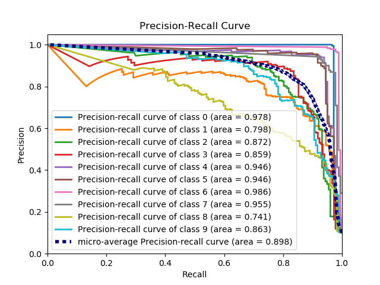

# plot\_precision\_recall\_curve[#](#plot-precision-recall-curve "Link to this heading")

scikitplot.api.metrics.plot\_precision\_recall\_curve(**y\_true**, **y\_probas**, **title='Precision-Recall Curve'**, **curves=('micro', 'each\_class')**, **ax=None**, **figsize=None**, **cmap='nipy\_spectral'**, **title\_fontsize='large'**, **text\_fontsize='medium'**)[[source]](https://github.com/scikit-plots/scikit-plots/blob/d0ea3951/scikitplot/api/metrics/_classification/_precision_recall_curve.py#L50)[#](#scikitplot.api.metrics.plot_precision_recall_curve "Link to this definition")
:   Generates the Precision Recall Curve from labels and probabilities

    Parameters:
    :   * ****y\_true**** (**array-like****,** **shape** **(****n\_samples****)**) – Ground truth (correct) target values.
        * ****y\_probas**** (**array-like****,** **shape** **(****n\_samples****,** **n\_classes****)**) – Prediction probabilities for each class returned by a classifier.
        * ****title**** (**string****,** **optional**) – Title of the generated plot. Defaults to
          “Precision-Recall curve”.
        * ****curves**** (**array-like**) – A listing of which curves should be plotted on the
          resulting plot. Defaults to `("micro", "each_class")`
          i.e. “micro” for micro-averaged curve
        * ****ax**** ([`matplotlib.axes.Axes`](https://matplotlib.org/devdocs/api/_as_gen/matplotlib.axes.Axes.html#matplotlib.axes.Axes "(in Matplotlib v3.12.0.dev415+ga888f5e9a)"), optional) – The axes upon which to
          plot the curve. If None, the plot is drawn on a new set of axes.
        * ****figsize**** (**2-tuple****,** **optional**) – Tuple denoting figure size of the plot
          e.g. (6, 6). Defaults to `None`.
        * ****cmap**** (string or [`matplotlib.colors.Colormap`](https://matplotlib.org/devdocs/api/_as_gen/matplotlib.colors.Colormap.html#matplotlib.colors.Colormap "(in Matplotlib v3.12.0.dev415+ga888f5e9a)") instance, optional) – Colormap used for plotting the projection. View Matplotlib Colormap
          documentation for available options.
          <https://matplotlib.org/users/colormaps.html>
        * ****title\_fontsize**** (**string** **or** [**int**](https://docs.python.org/3/library/functions.html#int "(in Python v3.14)")**,** **optional**) – Matplotlib-style fontsizes.
          Use e.g. “small”, “medium”, “large” or integer-values. Defaults to
          “large”.
        * ****text\_fontsize**** (**string** **or** [**int**](https://docs.python.org/3/library/functions.html#int "(in Python v3.14)")**,** **optional**) – Matplotlib-style fontsizes.
          Use e.g. “small”, “medium”, “large” or integer-values. Defaults to
          “medium”.

    Returns:
    :   The axes on which the plot was
        :   drawn.

    Return type:
    :   ax ([`matplotlib.axes.Axes`](https://matplotlib.org/devdocs/api/_as_gen/matplotlib.axes.Axes.html#matplotlib.axes.Axes "(in Matplotlib v3.12.0.dev415+ga888f5e9a)"))

    Example

    ```
    >>> import scikitplot as skplt
    >>> nb = GaussianNB()
    >>> nb.fit(X_train, y_train)
    >>> y_probas = nb.predict_proba(X_test)
    >>> skplt.metrics.plot_precision_recall_curve(y_test, y_probas)
    <matplotlib.axes._subplots.AxesSubplot object at 0x7fe967d64490>
    >>> plt.show()

    ```
    