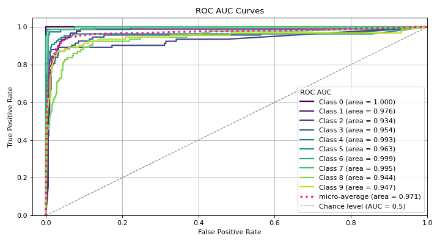

# plot\_roc[#](#plot-roc "Link to this heading")

scikitplot.api.metrics.plot\_roc(**y\_true**, **y\_probas**, **\***, **class\_index=None**, **class\_names=None**, **multi\_class=None**, **to\_plot\_class\_index=None**, **title='ROC AUC Curves'**, **title\_fontsize='large'**, **text\_fontsize='medium'**, **cmap=None**, **show\_labels=True**, **digits=4**, **plot\_micro=True**, **plot\_macro=False**, **\*\*kwargs**)[[source]](https://github.com/scikit-plots/scikit-plots/blob/b2a4600/scikitplot/api/metrics/_classification/_roc_curve.py#L216)[#](#scikitplot.api.metrics.plot_roc "Link to this definition")
:   Generates the ROC AUC curves from labels and predicted scores/probabilities.

    ROC (Receiver Operating Characteristic) curve plots the true positive rate
    against the false positive rate at various threshold settings. The AUC (Area Under
    the Curve) represents the degree of separability achieved by the classifier. This
    function supports both binary and multiclass classification tasks.

    Parameters:
    :   ****y\_true****array-like, shape (n\_samples,)
        :   Ground truth (correct) target values.

        ****y\_probas****array-like, shape (n\_samples,) or (n\_samples, n\_classes)
        :   Predicted probabilities for each class or only target class probabilities.
            If 1D, it is treated as probabilities for the positive class in binary
            or multiclass classification with the `class_index`.

        ****class\_names****list of str, optional, default=None
        :   List of class names for the legend.
            Order should match the order of classes in `y_probas`.

        ****multi\_class****{‘ovr’, ‘multinomial’, None}, optional, default=None
        :   Strategy for handling multiclass classification:
            :   * ‘ovr’: One-vs-Rest, plotting binary problems for each class.
                * ‘multinomial’ or None: Multinomial plot for the entire probability distribution.

        ****class\_index****int, optional, default=1
        :   Index of the class of interest for multi-class classification.
            Ignored for binary classification.

        ****to\_plot\_class\_index****list-like, optional, default=None
        :   Specific classes to plot. If a given class does not exist, it will be ignored.
            If None, all classes are plotted.

        ****title****str, optional, default=’ROC AUC Curves’
        :   Title of the generated plot.

        ****title\_fontsize****str or int, optional, default=’large’
        :   Font size for the plot title.

        ****text\_fontsize****str or int, optional, default=’medium’
        :   Font size for the text in the plot.

        ****cmap****None, str or matplotlib.colors.Colormap, optional, default=None
        :   Colormap used for plotting.
            Options include ‘viridis’, ‘PiYG’, ‘plasma’, ‘inferno’, ‘nipy\_spectral’, etc.
            See Matplotlib Colormap documentation for available choices.

            * <https://matplotlib.org/stable/users/explain/colors/index.html>
            * plt.colormaps()
            * plt.get\_cmap() # None == ‘viridis’

        ****show\_labels****bool, optional, default=True
        :   Whether to display the legend labels.

        ****digits****int, optional, default=3
        :   Number of digits for formatting ROC AUC values in the plot.

            Added in version 0.3.9.

        ****plot\_micro****bool, optional, default=False
        :   Whether to plot the micro-average ROC AUC curve.

        ****plot\_macro****bool, optional, default=False
        :   Whether to plot the macro-average ROC AUC curve.

        ****\*\*kwargs: dict****
        :   Generic keyword arguments.

    Returns:
    :   matplotlib.axes.Axes
        :   The axes with the plotted ROC AUC curves.

    Other Parameters:
    :   ****ax****matplotlib.axes.Axes, optional, default=None
        :   The axis to plot the figure on. If None is passed in the current axes
            will be used (or generated if required).

            Added in version 0.4.0.

        ****fig****matplotlib.pyplot.figure, optional, default: None
        :   The figure to plot the Visualizer on. If None is passed in the current
            plot will be used (or generated if required).

            Added in version 0.4.0.

        ****figsize****tuple, optional, default=None
        :   Width, height in inches.
            Tuple denoting figure size of the plot e.g. (12, 5)

            Added in version 0.4.0.

        ****nrows****int, optional, default=1
        :   Number of rows in the subplot grid.

            Added in version 0.4.0.

        ****ncols****int, optional, default=1
        :   Number of columns in the subplot grid.

            Added in version 0.4.0.

        ****plot\_style****str, optional, default=None
        :   Check available styles with “plt.style.available”. Examples include:
            [‘ggplot’, ‘seaborn’, ‘bmh’, ‘classic’, ‘dark\_background’, ‘fivethirtyeight’,
            ‘grayscale’, ‘seaborn-bright’, ‘seaborn-colorblind’, ‘seaborn-dark’,
            ‘seaborn-dark-palette’, ‘tableau-colorblind10’, ‘fast’].

            Added in version 0.4.0.

        ****show\_fig****bool, default=True
        :   Show the plot.

            Added in version 0.4.0.

        ****save\_fig****bool, default=False
        :   Save the plot.
            Used by `save_plot_decorator`.

            Added in version 0.4.0.

        ****save\_fig\_filename****str, optional, default=’’
        :   Specify the path and filetype to save the plot.
            If nothing specified, the plot will be saved as png
            inside `result_images` under to the current working directory.
            Defaults to plot image named to used `func.__name__`.
            Used by `save_plot_decorator`.

            Added in version 0.4.0.

        ****overwrite****bool, optional, default=True
        :   If False and a file exists, auto-increments the filename to avoid overwriting.

            Added in version 0.4.0.

        ****add\_timestamp****bool, optional, default=False
        :   Whether to append a timestamp to the filename.
            Default is False.

            Added in version 0.4.0.

        ****verbose****bool, optional
        :   If True, enables verbose output with informative messages during execution.
            Useful for debugging or understanding internal operations such as backend selection,
            font loading, and file saving status. If False, runs silently unless errors occur.

            Default is False.

            Added in version 0.4.0: The `verbose` parameter was added to control logging and user feedback verbosity.

    Notes

    The implementation is specific to binary classification. For multiclass problems,
    the ‘ovr’ or ‘multinomial’ strategies can be used. When `multi_class='ovr'`,
    the plot focuses on the specified class (`class_index`).

    References[#](#references "Link to this dropdown")

    * [“scikit-learn plot\_roc”](https://scikit-learn.org/stable/auto_examples/model_selection/plot_roc.html#).

    Examples

    Try it in your browser!
    ```
    >>> from sklearn.datasets import load_digits as data_10_classes
    >>> from sklearn.model_selection import train_test_split
    >>> from sklearn.naive_bayes import GaussianNB
    >>> import scikitplot as skplt
    >>> X, y = data_10_classes(return_X_y=True, as_frame=False)
    >>> X_train, X_val, y_train, y_val = train_test_split(
    ...     X, y, test_size=0.5, random_state=0
    ... )
    >>> model = GaussianNB()
    >>> model.fit(X_train, y_train)
    >>> y_probas = model.predict_proba(X_val)
    >>> skplt.metrics.plot_roc(
    >>>     y_val, y_probas,
    >>> );

    ```

    ([`Source code`](../../_downloads/fa282970ce4a2e77a4a2b60a6f957ae4/scikitplot-api-metrics-plot_roc-1.py), [`png`](../../_downloads/7280852cb80a17b0f8ccd41e94457e41/scikitplot-api-metrics-plot_roc-1.png))

    
    Go BackOpen In Tab