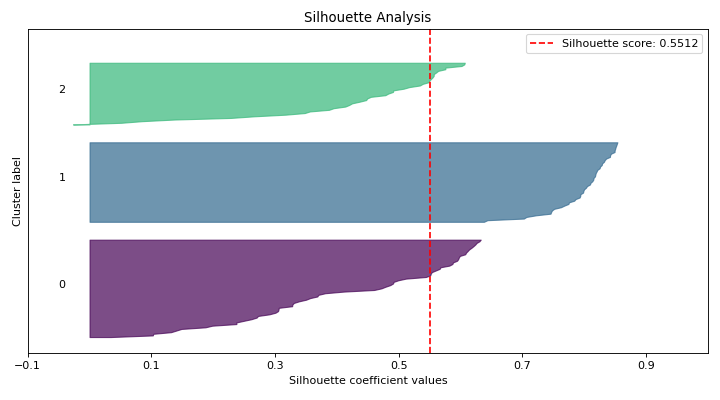

# plot\_silhouette[#](#plot-silhouette "Link to this heading")

scikitplot.api.metrics.plot\_silhouette(**X**, **cluster\_labels**, **\***, **metric='euclidean'**, **title='Silhouette Analysis'**, **title\_fontsize='large'**, **text\_fontsize='medium'**, **cmap=None**, **digits=4**, **\*\*kwargs**)[[source]](https://github.com/scikit-plots/scikit-plots/blob/7b27db8/scikitplot/api/metrics/_clustering/_silhouette.py#L40)[#](#scikitplot.api.metrics.plot_silhouette "Link to this definition")
:   Plots silhouette analysis of clusters provided.

    Silhouette analysis is a method of interpreting and validating the consistency
    within clusters of data. It measures how similar an object is to its own
    cluster compared to other clusters.

    Parameters:
    :   ****X****array-like, shape (n\_samples, n\_features)
        :   Data to cluster, where `n_samples` is the number of samples and
            `n_features` is the number of features.

        ****cluster\_labels****array-like, shape (n\_samples,)
        :   Cluster label for each sample.

        ****metric****str or callable, optional, default=’euclidean’
        :   The metric to use when calculating distance between instances in a feature array.
            If metric is a string, it must be one of the options allowed by
            `sklearn.metrics.pairwise.pairwise_distances`. If `X` is the distance array itself,
            use “precomputed” as the metric.

        ****copy****bool, optional, default=True
        :   Determines whether `fit` is used on `clf` or on a copy of `clf`.

        ****title****str, optional, default=’Silhouette Analysis’
        :   Title of the generated plot.

        ****title\_fontsize****str or int, optional, default=’large’
        :   Font size for the plot title.

        ****text\_fontsize****str or int, optional, default=’medium’
        :   Font size for the text in the plot.

        ****cmap****None, str or matplotlib.colors.Colormap, optional, default=None
        :   Colormap used for plotting.
            Options include ‘viridis’, ‘PiYG’, ‘plasma’, ‘inferno’, ‘nipy\_spectral’, etc.
            See Matplotlib Colormap documentation for available choices.

            * <https://matplotlib.org/stable/users/explain/colors/index.html>
            * plt.colormaps()
            * plt.get\_cmap() # None == ‘viridis’

        ****digits****int, optional, default=4
        :   Number of digits for formatting output floating point values.

            Added in version 0.3.9.

        ****\*\*kwargs: dict****
        :   Generic keyword arguments.

    Returns:
    :   ****ax****matplotlib.axes.Axes
        :   The axes on which the plot was drawn.

        References
        \* [“scikit-learn silhouette\_score”](https://scikit-learn.org/stable/modules/generated/sklearn.metrics.silhouette_score.html#).[#](#references "Link to this dropdown")

    Other Parameters:
    :   ****ax****matplotlib.axes.Axes, optional, default=None
        :   The axis to plot the figure on. If None is passed in the current axes
            will be used (or generated if required).

            Added in version 0.4.0.

        ****fig****matplotlib.pyplot.figure, optional, default: None
        :   The figure to plot the Visualizer on. If None is passed in the current
            plot will be used (or generated if required).

            Added in version 0.4.0.

        ****figsize****tuple, optional, default=None
        :   Width, height in inches.
            Tuple denoting figure size of the plot e.g. (12, 5)

            Added in version 0.4.0.

        ****nrows****int, optional, default=1
        :   Number of rows in the subplot grid.

            Added in version 0.4.0.

        ****ncols****int, optional, default=1
        :   Number of columns in the subplot grid.

            Added in version 0.4.0.

        ****plot\_style****str, optional, default=None
        :   Check available styles with “plt.style.available”. Examples include:
            [‘ggplot’, ‘seaborn’, ‘bmh’, ‘classic’, ‘dark\_background’, ‘fivethirtyeight’,
            ‘grayscale’, ‘seaborn-bright’, ‘seaborn-colorblind’, ‘seaborn-dark’,
            ‘seaborn-dark-palette’, ‘tableau-colorblind10’, ‘fast’].

            Added in version 0.4.0.

        ****show\_fig****bool, default=True
        :   Show the plot.

            Added in version 0.4.0.

        ****save\_fig****bool, default=False
        :   Save the plot.
            Used by `save_plot_decorator`.

            Added in version 0.4.0.

        ****save\_fig\_filename****str, optional, default=’’
        :   Specify the path and filetype to save the plot.
            If nothing specified, the plot will be saved as png
            inside `result_images` under to the current working directory.
            Defaults to plot image named to used `func.__name__`.
            Used by `save_plot_decorator`.

            Added in version 0.4.0.

        ****overwrite****bool, optional, default=True
        :   If False and a file exists, auto-increments the filename to avoid overwriting.

            Added in version 0.4.0.

        ****add\_timestamp****bool, optional, default=False
        :   Whether to append a timestamp to the filename.
            Default is False.

            Added in version 0.4.0.

        ****verbose****bool, optional
        :   If True, enables verbose output with informative messages during execution.
            Useful for debugging or understanding internal operations such as backend selection,
            font loading, and file saving status. If False, runs silently unless errors occur.

            Default is False.

            Added in version 0.4.0: The `verbose` parameter was added to control logging and user feedback verbosity.

    Examples

    Try it in your browser!
    ```
    >>> from sklearn.datasets import make_blobs
    >>> from sklearn.cluster import KMeans
    >>> from sklearn.datasets import load_iris as data_3_classes
    >>> import scikitplot as skplt
    >>> X, y = data_3_classes(return_X_y=True, as_frame=False)
    >>> kmeans = KMeans(n_clusters=3, random_state=0)
    >>> cluster_labels = kmeans.fit_predict(X)
    >>> skplt.metrics.plot_silhouette(
    >>>     X,
    >>>     cluster_labels,
    >>> );

    ```

    ([`Source code`](../../_downloads/1b35ca0cdd9d88eea26cd4777dc4f932/scikitplot-api-metrics-plot_silhouette-1.py), [`png`](../../_downloads/c173cd458e122a3ff955575f97a3a4e2/scikitplot-api-metrics-plot_silhouette-1.png))

    
    Go BackOpen In Tab