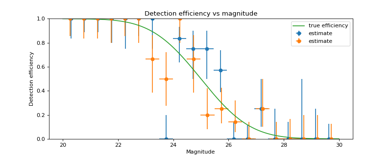
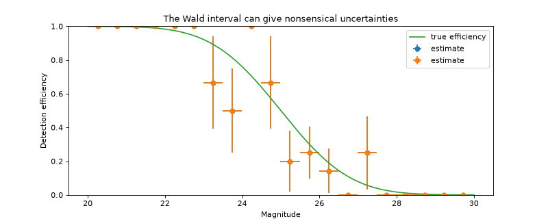

# binned\_binom\_proportion[#](#binned-binom-proportion "Link to this heading")

scikitplot.cexternals.\_astropy.stats.binned\_binom\_proportion(**x**, **success**, **bins=10**, **range=None**, **confidence\_level=0.68269**, **interval='wilson'**)[[source]](https://github.com/scikit-plots/scikit-plots/blob/c2567fd/scikitplot/cexternals/_astropy/stats/funcs.py#L298)[#](#scikitplot.cexternals._astropy.stats.binned_binom_proportion "Link to this definition")
:   Binomial proportion and confidence interval in bins of a continuous
    variable `x`.

    Given a set of datapoint pairs where the `x` values are
    continuously distributed and the `success` values are binomial
    (“success / failure” or “true / false”), place the pairs into
    bins according to `x` value and calculate the binomial proportion
    (fraction of successes) and confidence interval in each bin.

    Parameters:
    :   ****x****sequence
        :   Values.

        ****success****sequence of bool
        :   Success (`True`) or failure (`False`) corresponding to each value
            in `x`. Must be same length as `x`.

        ****bins****int or sequence of scalar, optional
        :   If bins is an int, it defines the number of equal-width bins
            in the given range (10, by default). If bins is a sequence, it
            defines the bin edges, including the rightmost edge, allowing
            for non-uniform bin widths (in this case, ‘range’ is ignored).

        ****range****(float, float), optional
        :   The lower and upper range of the bins. If `None` (default),
            the range is set to `(x.min(), x.max())`. Values outside the
            range are ignored.

        ****confidence\_level****float, optional
        :   Must be in range [0, 1].
            Desired probability content in the confidence
            interval `(p - perr[0], p + perr[1])` in each bin. Default is
            0.68269.

        ****interval****{‘wilson’, ‘jeffreys’, ‘flat’, ‘wald’}, optional
        :   Formula used to calculate confidence interval on the
            binomial proportion in each bin. See `binom_conf_interval` for
            definition of the intervals. The ‘wilson’, ‘jeffreys’,
            and ‘flat’ intervals generally give similar results. ‘wilson’
            should be somewhat faster, while ‘jeffreys’ and ‘flat’ are
            marginally superior, but differ in the assumed prior.
            The ‘wald’ interval is generally not recommended.
            It is provided for comparison purposes. Default is ‘wilson’.

    Returns:
    :   ****bin\_ctr****ndarray
        :   Central value of bins. Bins without any entries are not returned.

        ****bin\_halfwidth****ndarray
        :   Half-width of each bin such that `bin_ctr - bin_halfwidth` and
            `bin_ctr + bins_halfwidth` give the left and right side of each bin,
            respectively.

        ****p****ndarray
        :   Efficiency in each bin.

        ****perr****ndarray
        :   2-d array of shape (2, len(p)) representing the upper and lower
            uncertainty on p in each bin.

    Parameters:
    :   * ****x**** (**\_Buffer** **|** **\_SupportsArray****[**[**dtype**](https://numpy.org/devdocs/reference/generated/numpy.dtype.html#numpy.dtype "(in NumPy v2.5.dev0)")**[**[**Any**](https://docs.python.org/3/library/typing.html#typing.Any "(in Python v3.14)")**]****]** **|** **\_NestedSequence****[****\_SupportsArray****[**[**dtype**](https://numpy.org/devdocs/reference/generated/numpy.dtype.html#numpy.dtype "(in NumPy v2.5.dev0)")**[**[**Any**](https://docs.python.org/3/library/typing.html#typing.Any "(in Python v3.14)")**]****]****]** **|** [**complex**](https://docs.python.org/3/library/functions.html#complex "(in Python v3.14)") **|** [**bytes**](https://docs.python.org/3/library/stdtypes.html#bytes "(in Python v3.14)") **|** [**str**](https://docs.python.org/3/library/stdtypes.html#str "(in Python v3.14)") **|** **\_NestedSequence****[**[**complex**](https://docs.python.org/3/library/functions.html#complex "(in Python v3.14)") **|** [**bytes**](https://docs.python.org/3/library/stdtypes.html#bytes "(in Python v3.14)") **|** [**str**](https://docs.python.org/3/library/stdtypes.html#str "(in Python v3.14)")**]**)
        * ****success**** (**\_Buffer** **|** **\_SupportsArray****[**[**dtype**](https://numpy.org/devdocs/reference/generated/numpy.dtype.html#numpy.dtype "(in NumPy v2.5.dev0)")**[**[**Any**](https://docs.python.org/3/library/typing.html#typing.Any "(in Python v3.14)")**]****]** **|** **\_NestedSequence****[****\_SupportsArray****[**[**dtype**](https://numpy.org/devdocs/reference/generated/numpy.dtype.html#numpy.dtype "(in NumPy v2.5.dev0)")**[**[**Any**](https://docs.python.org/3/library/typing.html#typing.Any "(in Python v3.14)")**]****]****]** **|** [**complex**](https://docs.python.org/3/library/functions.html#complex "(in Python v3.14)") **|** [**bytes**](https://docs.python.org/3/library/stdtypes.html#bytes "(in Python v3.14)") **|** [**str**](https://docs.python.org/3/library/stdtypes.html#str "(in Python v3.14)") **|** **\_NestedSequence****[**[**complex**](https://docs.python.org/3/library/functions.html#complex "(in Python v3.14)") **|** [**bytes**](https://docs.python.org/3/library/stdtypes.html#bytes "(in Python v3.14)") **|** [**str**](https://docs.python.org/3/library/stdtypes.html#str "(in Python v3.14)")**]**)
        * ****bins**** ([**int**](https://docs.python.org/3/library/functions.html#int "(in Python v3.14)") **|** **\_Buffer** **|** **\_SupportsArray****[**[**dtype**](https://numpy.org/devdocs/reference/generated/numpy.dtype.html#numpy.dtype "(in NumPy v2.5.dev0)")**[**[**Any**](https://docs.python.org/3/library/typing.html#typing.Any "(in Python v3.14)")**]****]** **|** **\_NestedSequence****[****\_SupportsArray****[**[**dtype**](https://numpy.org/devdocs/reference/generated/numpy.dtype.html#numpy.dtype "(in NumPy v2.5.dev0)")**[**[**Any**](https://docs.python.org/3/library/typing.html#typing.Any "(in Python v3.14)")**]****]****]** **|** [**complex**](https://docs.python.org/3/library/functions.html#complex "(in Python v3.14)") **|** [**bytes**](https://docs.python.org/3/library/stdtypes.html#bytes "(in Python v3.14)") **|** [**str**](https://docs.python.org/3/library/stdtypes.html#str "(in Python v3.14)") **|** **\_NestedSequence****[**[**complex**](https://docs.python.org/3/library/functions.html#complex "(in Python v3.14)") **|** [**bytes**](https://docs.python.org/3/library/stdtypes.html#bytes "(in Python v3.14)") **|** [**str**](https://docs.python.org/3/library/stdtypes.html#str "(in Python v3.14)")**]**)
        * ****range**** ([**tuple**](https://docs.python.org/3/library/stdtypes.html#tuple "(in Python v3.14)")**[**[**float**](https://docs.python.org/3/library/functions.html#float "(in Python v3.14)")**,** [**float**](https://docs.python.org/3/library/functions.html#float "(in Python v3.14)")**]** **|** **None**)
        * ****confidence\_level**** ([**float**](https://docs.python.org/3/library/functions.html#float "(in Python v3.14)"))
        * ****interval**** ([**Literal**](https://docs.python.org/3/library/typing.html#typing.Literal "(in Python v3.14)")**[****'wilson'****,** **'jeffreys'****,** **'flat'****,** **'wald'****]**)

    Return type:
    :   [tuple](https://docs.python.org/3/library/stdtypes.html#tuple "(in Python v3.14)")[[**ndarray**](https://numpy.org/devdocs/reference/generated/numpy.ndarray.html#numpy.ndarray "(in NumPy v2.5.dev0)")[[tuple](https://docs.python.org/3/library/stdtypes.html#tuple "(in Python v3.14)")[[**Any**](https://docs.python.org/3/library/typing.html#typing.Any "(in Python v3.14)"), …], [**dtype**](https://numpy.org/devdocs/reference/generated/numpy.dtype.html#numpy.dtype "(in NumPy v2.5.dev0)")[**\_ScalarT**]], [**ndarray**](https://numpy.org/devdocs/reference/generated/numpy.ndarray.html#numpy.ndarray "(in NumPy v2.5.dev0)")[[tuple](https://docs.python.org/3/library/stdtypes.html#tuple "(in Python v3.14)")[[**Any**](https://docs.python.org/3/library/typing.html#typing.Any "(in Python v3.14)"), …], [**dtype**](https://numpy.org/devdocs/reference/generated/numpy.dtype.html#numpy.dtype "(in NumPy v2.5.dev0)")[**\_ScalarT**]], [**ndarray**](https://numpy.org/devdocs/reference/generated/numpy.ndarray.html#numpy.ndarray "(in NumPy v2.5.dev0)")[[tuple](https://docs.python.org/3/library/stdtypes.html#tuple "(in Python v3.14)")[[**Any**](https://docs.python.org/3/library/typing.html#typing.Any "(in Python v3.14)"), …], [**dtype**](https://numpy.org/devdocs/reference/generated/numpy.dtype.html#numpy.dtype "(in NumPy v2.5.dev0)")[**\_ScalarT**]], [**ndarray**](https://numpy.org/devdocs/reference/generated/numpy.ndarray.html#numpy.ndarray "(in NumPy v2.5.dev0)")[[tuple](https://docs.python.org/3/library/stdtypes.html#tuple "(in Python v3.14)")[[**Any**](https://docs.python.org/3/library/typing.html#typing.Any "(in Python v3.14)"), …], [**dtype**](https://numpy.org/devdocs/reference/generated/numpy.dtype.html#numpy.dtype "(in NumPy v2.5.dev0)")[**\_ScalarT**]]]

    > **See also**
    > [`binom_conf_interval`](scikitplot.cexternals._astropy.stats.binom_conf_interval.html#scikitplot.cexternals._astropy.stats.binom_conf_interval "scikitplot.cexternals._astropy.stats.binom_conf_interval")
    :   Function used to estimate confidence interval in each bin.

    Notes

    This function requires `scipy` for all interval types.

    Examples

    Try it in your browser!

    Suppose we wish to estimate the efficiency of a survey in
    detecting astronomical sources as a function of magnitude (i.e.,
    the probability of detecting a source given its magnitude). In a
    realistic case, we might prepare a large number of sources with
    randomly selected magnitudes, inject them into simulated images,
    and then record which were detected at the end of the reduction
    pipeline. As a toy example, we generate 100 data points with
    randomly selected magnitudes between 20 and 30 and “observe” them
    with a known detection function (here, the error function, with
    50% detection probability at magnitude 25):

    ```
    >>> import numpy as np
    >>> import matplotlib.pyplot as plt
    >>> from scikitplot.stats import binned_binom_proportion
    >>> from scipy.special import erf
    >>> from scipy.stats.distributions import binom
    >>> def true_efficiency(x):
    ...     return 0.5 - 0.5 * erf((x - 25.) / 2.)
    >>> mag = 20. + 10. * np.random.rand(100)
    >>> detected = binom.rvs(1, true_efficiency(mag))
    >>> bins, binshw, p, perr = binned_binom_proportion(mag, detected, bins=20)
    >>> plt.errorbar(bins, p, xerr=binshw, yerr=perr, ls='none', marker='o',
    ...              label='estimate')

    ```
    ```
    >>> import numpy as np
    >>> from scipy.special import erf
    >>> from scipy.stats.distributions import binom
    >>> import matplotlib.pyplot as plt
    >>> from scikitplot.stats import binned_binom_proportion
    >>> def true_efficiency(x):
    >>>     return 0.5 - 0.5 * erf((x - 25.) / 2.)
    >>> np.random.seed(400)
    >>> mag = 20. + 10. * np.random.rand(100)
    >>> np.random.seed(600)
    >>> detected = binom.rvs(1, true_efficiency(mag))
    >>> bins, binshw, p, perr = binned_binom_proportion(mag, detected, bins=20)
    >>> plt.errorbar(bins, p, xerr=binshw, yerr=perr, ls='none', marker='o',
    >>>             label='estimate')
    >>> X = np.linspace(20., 30., 1000)
    >>> plt.plot(X, true_efficiency(X), label='true efficiency')
    >>> plt.ylim(0., 1.)
    >>> plt.title('Detection efficiency vs magnitude')
    >>> plt.xlabel('Magnitude')
    >>> plt.ylabel('Detection efficiency')
    >>> plt.legend()
    >>> plt.show()

    ```

    ([`Source code`](../../_downloads/4dff9c5fe8e3c70e9f5fc0ca99f5031a/scikitplot-cexternals-_astropy-stats-binned_binom_proportion-1.py), [`png`](../../_downloads/1aecd8b504f33f8a3bba284a74739568/scikitplot-cexternals-_astropy-stats-binned_binom_proportion-1_00_00.png))

    

    The above example uses the Wilson confidence interval to calculate
    the uncertainty `perr` in each bin (see the definition of various
    confidence intervals in `binom_conf_interval`). A commonly used
    alternative is the Wald interval. However, the Wald interval can
    give nonsensical uncertainties when the efficiency is near 0 or 1,
    and is therefore ****not**** recommended. As an illustration, the
    following example shows the same data as above but uses the Wald
    interval rather than the Wilson interval to calculate `perr`:

    ```
    >>> import matplotlib.pyplot as plt
    >>> from scikitplot.stats import binned_binom_proportion
    >>> bins, binshw, p, perr = binned_binom_proportion(mag, detected, bins=20,
    ...                                                 interval='wald')
    >>> plt.errorbar(bins, p, xerr=binshw, yerr=perr, ls='none', marker='o',
    ...              label='estimate')

    ```
    ```
    >>> import numpy as np
    >>> from scipy.special import erf
    >>> from scipy.stats.distributions import binom
    >>> import matplotlib.pyplot as plt
    >>> from scikitplot.stats import binned_binom_proportion
    >>> def true_efficiency(x):
    >>>     return 0.5 - 0.5 * erf((x - 25.) / 2.)
    >>> np.random.seed(400)
    >>> mag = 20. + 10. * np.random.rand(100)
    >>> np.random.seed(600)
    >>> detected = binom.rvs(1, true_efficiency(mag))
    >>> bins, binshw, p, perr = binned_binom_proportion(mag, detected, bins=20,
    >>>                                                 interval='wald')
    >>> plt.errorbar(bins, p, xerr=binshw, yerr=perr, ls='none', marker='o',
    >>>             label='estimate')
    >>> X = np.linspace(20., 30., 1000)
    >>> plt.plot(X, true_efficiency(X), label='true efficiency')
    >>> plt.ylim(0., 1.)
    >>> plt.title('The Wald interval can give nonsensical uncertainties')
    >>> plt.xlabel('Magnitude')
    >>> plt.ylabel('Detection efficiency')
    >>> plt.legend()
    >>> plt.show()

    ```

    ([`png`](../../_downloads/fe7f62361258475505499fed67a94793/scikitplot-cexternals-_astropy-stats-binned_binom_proportion-1_01_00.png))

    
    Go BackOpen In Tab