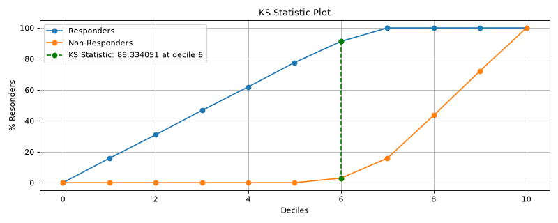

# plot\_ks\_statistic[#](#plot-ks-statistic "Link to this heading")

scikitplot.decile.kds.plot\_ks\_statistic(**y\_true**, **y\_score**, **\***, **pos\_label=None**, **class\_index=1**, **title='KS Statistic Plot'**, **title\_fontsize='large'**, **text\_fontsize='medium'**, **digits=2**, **data=None**, **\*\*kwargs**)[[source]](https://github.com/scikit-plots/scikit-plots/blob/7b27db8/scikitplot/decile/kds/_kds.py#L756)[#](#scikitplot.decile.kds.plot_ks_statistic "Link to this definition")
:   Generate the KS Statistic Plot from labels and probabilities.

    Kolmogorov-Smirnov (KS) statistic is used to measure how well the
    binary classifier model separates the Responder class (Yes) from
    Non-Responder class (No). The range of K-S statistic is between 0 and 1.
    Higher the KS statistic value better the model in separating the
    Responder class from Non-Responder class.

    Parameters:
    :   ****y\_true****array-like, shape (n\_samples)
        :   Ground truth (correct) target values.

        ****y\_score****array-like, shape (n\_samples, n\_classes)
        :   Prediction probabilities for each class returned by a classifier.

        ****class\_index****int, optional, default=1
        :   Index of the class of interest for multi-class classification. Ignored for
            binary classification.

        ****title****str, optional, default=’KS Statistic Plot’
        :   Title of the generated plot.

        ****title\_fontsize****str or int, optional
        :   Matplotlib-style fontsizes. Use e.g. “small”, “medium”, “large” or integer-values.
            Defaults to “large”.

        ****text\_fontsize****str or int, optional
        :   Matplotlib-style fontsizes. Use e.g. “small”, “medium”, “large” or integer-values.
            Defaults to “medium”.

        ****digits****int, optional
        :   Number of digits for formatting output floating point values. Use e.g. 2 or 4.
            Defaults to 2.

            Added in version 0.3.9.

        ****\*\*kwargs****dict, optional
        :   Generic keyword arguments.

    Returns:
    :   ****ax****matplotlib.axes.Axes
        :   The axes on which the plot was drawn.

    Other Parameters:
    :   ****ax****matplotlib.axes.Axes, optional, default=None
        :   The axis to plot the figure on. If None is passed in the current axes
            will be used (or generated if required).

            Added in version 0.4.0.

        ****fig****matplotlib.pyplot.figure, optional, default: None
        :   The figure to plot the Visualizer on. If None is passed in the current
            plot will be used (or generated if required).

            Added in version 0.4.0.

        ****figsize****tuple, optional, default=None
        :   Width, height in inches.
            Tuple denoting figure size of the plot e.g. (12, 5)

            Added in version 0.4.0.

        ****nrows****int, optional, default=1
        :   Number of rows in the subplot grid.

            Added in version 0.4.0.

        ****ncols****int, optional, default=1
        :   Number of columns in the subplot grid.

            Added in version 0.4.0.

        ****plot\_style****str, optional, default=None
        :   Check available styles with “plt.style.available”. Examples include:
            [‘ggplot’, ‘seaborn’, ‘bmh’, ‘classic’, ‘dark\_background’, ‘fivethirtyeight’,
            ‘grayscale’, ‘seaborn-bright’, ‘seaborn-colorblind’, ‘seaborn-dark’,
            ‘seaborn-dark-palette’, ‘tableau-colorblind10’, ‘fast’].

            Added in version 0.4.0.

        ****show\_fig****bool, default=True
        :   Show the plot.

            Added in version 0.4.0.

        ****save\_fig****bool, default=False
        :   Save the plot.
            Used by `save_plot_decorator`.

            Added in version 0.4.0.

        ****save\_fig\_filename****str, optional, default=’’
        :   Specify the path and filetype to save the plot.
            If nothing specified, the plot will be saved as png
            inside `result_images` under to the current working directory.
            Defaults to plot image named to used `func.__name__`.
            Used by `save_plot_decorator`.

            Added in version 0.4.0.

        ****overwrite****bool, optional, default=True
        :   If False and a file exists, auto-increments the filename to avoid overwriting.

            Added in version 0.4.0.

        ****add\_timestamp****bool, optional, default=False
        :   Whether to append a timestamp to the filename.
            Default is False.

            Added in version 0.4.0.

        ****verbose****bool, optional
        :   If True, enables verbose output with informative messages during execution.
            Useful for debugging or understanding internal operations such as backend selection,
            font loading, and file saving status. If False, runs silently unless errors occur.

            Default is False.

            Added in version 0.4.0: The `verbose` parameter was added to control logging and user feedback verbosity.

    > **See also**
    > [`print_labels`](scikitplot.decile.kds.print_labels.html#scikitplot.decile.kds.print_labels "scikitplot.decile.kds.print_labels")
    :   A legend for the abbreviations of decile table column names.

    [`decile_table`](scikitplot.decile.kds.decile_table.html#scikitplot.decile.kds.decile_table "scikitplot.decile.kds.decile_table")
    :   Generates the Decile Table from labels and probabilities.

    [`plot_lift`](scikitplot.decile.kds.plot_lift.html#scikitplot.decile.kds.plot_lift "scikitplot.decile.kds.plot_lift")
    :   Generates the Decile based cumulative Lift Plot from labels and probabilities.

    [`plot_lift_decile_wise`](scikitplot.decile.kds.plot_lift_decile_wise.html#scikitplot.decile.kds.plot_lift_decile_wise "scikitplot.decile.kds.plot_lift_decile_wise")
    :   Generates the Decile-wise Lift Plot from labels and probabilities.

    [`plot_cumulative_gain`](scikitplot.decile.kds.plot_cumulative_gain.html#scikitplot.decile.kds.plot_cumulative_gain "scikitplot.decile.kds.plot_cumulative_gain")
    :   Generates the cumulative Gain Plot from labels and probabilities.

    [`plot_ks_statistic`](#scikitplot.decile.kds.plot_ks_statistic "scikitplot.decile.kds.plot_ks_statistic")
    :   Generates the Kolmogorov-Smirnov (KS) Statistic Plot from labels and probabilities.

    References

    [1] [tensorbored/kds](https://github.com/tensorbored/kds/blob/master/kds/metrics.py#L382)

    Examples

    Try it in your browser!
    ```
    >>> from sklearn.datasets import (
    ...     load_breast_cancer as data_2_classes,
    ... )
    >>> from sklearn.model_selection import train_test_split
    >>> from sklearn.linear_model import LogisticRegression
    ...
    >>> X, y = data_2_classes(return_X_y=True, as_frame=False)
    >>> X_train, X_val, y_train, y_val = train_test_split(
    ...     X, y, test_size=0.5, random_state=0
    ... )
    >>> model = LogisticRegression(max_iter=int(1e5), random_state=0).fit(
    ...     X_train, y_train
    ... )
    >>> y_score = model.predict_proba(X_val)
    ...
    >>> import scikitplot.decile.kds as kds
    >>> kds.plot_ks_statistic(
    >>>     y_val, y_score, class_index=1,
    >>> );

    ```

    ([`Source code`](../../_downloads/71753a436f977b34d3021b0cc738bbaa/scikitplot-decile-kds-plot_ks_statistic-1.py), [`png`](../../_downloads/6d3ad4a536e051cf73a386701fc0280b/scikitplot-decile-kds-plot_ks_statistic-1.png))

    
    Go BackOpen In Tab

## Gallery examples[#](#gallery-examples "Link to this heading")


[plot\_ks\_statistic with examples](../../auto_examples/decile/plot_ks_statistic_script.html)

plot\_ks\_statistic with examples