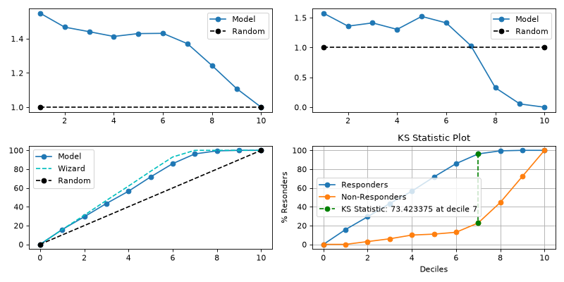

# report[#](#report "Link to this heading")

scikitplot.decile.kds.report(**y\_true**, **y\_score**, **\***, **pos\_label=None**, **class\_index=1**, **feature\_infos=True**, **digits=3**, **title\_fontsize='large'**, **text\_fontsize='medium'**, **plot\_style=None**, **figsize=(10, 5)**, **nrows=2**, **ncols=2**, **data=None**, **\*\*kwargs**)[[source]](https://github.com/scikit-plots/scikit-plots/blob/d6e9440d/scikitplot/decile/kds/_kds.py#L925)[#](#scikitplot.decile.kds.report "Link to this definition")
:   Generate a decile table and four plots.

    * `Lift` -> [`plot_lift`](scikitplot.decile.kds.plot_lift.html#scikitplot.decile.kds.plot_lift "scikitplot.decile.kds.plot_lift")
    * `Lift@Decile` -> [`plot_lift_decile_wise`](scikitplot.decile.kds.plot_lift_decile_wise.html#scikitplot.decile.kds.plot_lift_decile_wise "scikitplot.decile.kds.plot_lift_decile_wise")
    * `Gain` -> [`plot_cumulative_gain`](scikitplot.decile.kds.plot_cumulative_gain.html#scikitplot.decile.kds.plot_cumulative_gain "scikitplot.decile.kds.plot_cumulative_gain")
    * `KS` -> [`plot_ks_statistic`](scikitplot.decile.kds.plot_ks_statistic.html#scikitplot.decile.kds.plot_ks_statistic "scikitplot.decile.kds.plot_ks_statistic")

    from labels and probabilities.

    Parameters:
    :   ****y\_true****array-like, shape (n\_samples,)
        :   Ground truth (correct) target values.

        ****y\_score****array-like, shape (n\_samples, n\_classes)
        :   Prediction probabilities for each class returned by a classifier.

        ****class\_index****int, optional, default=1
        :   Index of the class of interest for multi-class classification. Ignored for
            binary classification.

        ****labels****bool, optional, default=True
        :   If True, prints a legend for the abbreviations of decile table column names.

            Deprecated since version 0.3.9: This parameter is deprecated and will be removed in version 0.5.0. Use
            `feature_infos` instead.

        ****feature\_infos****bool, optional, default=True
        :   If True, prints a legend for the abbreviations of decile table column names.

            Added in version 0.3.9.

        ****title\_fontsize****str or int, optional, default=’large’
        :   Font size for the plot title. Use e.g., “small”, “medium”, “large” or integer-values.

        ****text\_fontsize****str or int, optional, default=’medium’
        :   Font size for the text in the plot. Use e.g., “small”, “medium”, “large” or integer-values.

        ****digits****int, optional, default=3
        :   Number of digits for formatting output floating point values. Use e.g., 2 or 4.

            Added in version 0.3.9.

        ****\*\*kwargs****dict, optional
        :   Generic keyword arguments.

    Returns:
    :   pandas.DataFrame
        :   The dataframe containing the decile table with the deciles and related information.

    Other Parameters:
    :   ****ax****matplotlib.axes.Axes, optional, default=None
        :   The axis to plot the figure on. If None is passed in the current axes
            will be used (or generated if required).

            Added in version 0.4.0.

        ****fig****matplotlib.pyplot.figure, optional, default: None
        :   The figure to plot the Visualizer on. If None is passed in the current
            plot will be used (or generated if required).

            Added in version 0.4.0.

        ****figsize****tuple, optional, default=None
        :   Width, height in inches.
            Tuple denoting figure size of the plot e.g. (12, 5)

            Added in version 0.4.0.

        ****nrows****int, optional, default=1
        :   Number of rows in the subplot grid.

            Added in version 0.4.0.

        ****ncols****int, optional, default=1
        :   Number of columns in the subplot grid.

            Added in version 0.4.0.

        ****plot\_style****str, optional, default=None
        :   Check available styles with “plt.style.available”. Examples include:
            [‘ggplot’, ‘seaborn’, ‘bmh’, ‘classic’, ‘dark\_background’, ‘fivethirtyeight’,
            ‘grayscale’, ‘seaborn-bright’, ‘seaborn-colorblind’, ‘seaborn-dark’,
            ‘seaborn-dark-palette’, ‘tableau-colorblind10’, ‘fast’].

            Added in version 0.4.0.

        ****show\_fig****bool, default=True
        :   Show the plot.

            Added in version 0.4.0.

        ****save\_fig****bool, default=False
        :   Save the plot.
            Used by `save_plot_decorator`.

            Added in version 0.4.0.

        ****save\_fig\_filename****str, optional, default=’’
        :   Specify the path and filetype to save the plot.
            If nothing specified, the plot will be saved as png
            inside `result_images` under to the current working directory.
            Defaults to plot image named to used `func.__name__`.
            Used by `save_plot_decorator`.

            Added in version 0.4.0.

        ****overwrite****bool, optional, default=True
        :   If False and a file exists, auto-increments the filename to avoid overwriting.

            Added in version 0.4.0.

        ****add\_timestamp****bool, optional, default=False
        :   Whether to append a timestamp to the filename.
            Default is False.

            Added in version 0.4.0.

        ****verbose****bool, optional
        :   If True, enables verbose output with informative messages during execution.
            Useful for debugging or understanding internal operations such as backend selection,
            font loading, and file saving status. If False, runs silently unless errors occur.

            Default is False.

            Added in version 0.4.0: The `verbose` parameter was added to control logging and user feedback verbosity.

    > **See also**
    > [`print_labels`](scikitplot.decile.kds.print_labels.html#scikitplot.decile.kds.print_labels "scikitplot.decile.kds.print_labels")
    :   A legend for the abbreviations of decile table column names.

    [`decile_table`](scikitplot.decile.kds.decile_table.html#scikitplot.decile.kds.decile_table "scikitplot.decile.kds.decile_table")
    :   Generates the Decile Table from labels and probabilities.

    [`plot_lift`](scikitplot.decile.kds.plot_lift.html#scikitplot.decile.kds.plot_lift "scikitplot.decile.kds.plot_lift")
    :   Generates the Decile based cumulative Lift Plot from labels and probabilities.

    [`plot_lift_decile_wise`](scikitplot.decile.kds.plot_lift_decile_wise.html#scikitplot.decile.kds.plot_lift_decile_wise "scikitplot.decile.kds.plot_lift_decile_wise")
    :   Generates the Decile-wise Lift Plot from labels and probabilities.

    [`plot_cumulative_gain`](scikitplot.decile.kds.plot_cumulative_gain.html#scikitplot.decile.kds.plot_cumulative_gain "scikitplot.decile.kds.plot_cumulative_gain")
    :   Generates the cumulative Gain Plot from labels and probabilities.

    [`plot_ks_statistic`](scikitplot.decile.kds.plot_ks_statistic.html#scikitplot.decile.kds.plot_ks_statistic "scikitplot.decile.kds.plot_ks_statistic")
    :   Generates the Kolmogorov-Smirnov (KS) Statistic Plot from labels and probabilities.

    References

    [1] [tensorbored/kds](https://github.com/tensorbored/kds/blob/master/kds/metrics.py#L382)

    Examples

    Try it in your browser!
    ```
    >>> from sklearn.datasets import (
    ...     load_breast_cancer as data_2_classes,
    ... )
    >>> from sklearn.model_selection import train_test_split
    >>> from sklearn.tree import DecisionTreeClassifier
    ...
    >>> X, y = data_2_classes(return_X_y=True, as_frame=True)
    >>> X_train, X_test, y_train, y_test = train_test_split(
    ...     X, y, test_size=0.5, random_state=0
    ... )
    >>> clf = DecisionTreeClassifier(max_depth=1, random_state=0).fit(
    ...     X_train, y_train
    ... )
    >>> y_prob = clf.predict_proba(X_test)
    ...
    >>> import scikitplot.decile.kds as kds
    >>> dt = kds.report(
    >>>     y_test, y_prob, class_index=1
    >>> )
    >>> dt

    ```

    ([`Source code`](../../_downloads/ef67bd6f940cac6d8e9ca407b6d361ce/scikitplot-decile-kds-report-1.py), [`png`](../../_downloads/70436a8f494480a6d734b0c17e739a2d/scikitplot-decile-kds-report-1.png))

    
    Go BackOpen In Tab