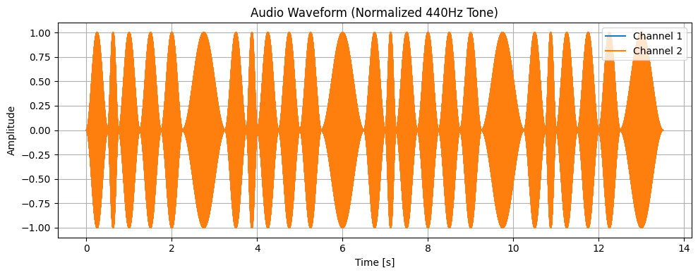

# plot\_waveform[#](#plot-waveform "Link to this heading")

scikitplot.experimental.\_doremi.plot\_waveform(**data**, **sample\_rate=None**, **normalize=False**, **title='Audio Waveform (Normalized 440Hz Tone)'**, **figsize=(10, 4)**)[[source]](https://github.com/scikit-plots/scikit-plots/blob/f02632e/scikitplot/experimental/_doremi/waveform_viz.py#L23)[#](#scikitplot.experimental._doremi.plot_waveform "Link to this definition")
:   Plot the waveform of mono or multi-channel audio data.

    Parameters:
    :   ****data****np.ndarray
        :   1D or 2D audio data. 1D for mono or 2D for multi-channel.
            If 2D, shape must be (samples, channels) or (channels, samples).

        ****sample\_rate****int, default=44100
        :   Sampling rate in Hz.

        ****title****str, default=”Audio Waveform”
        :   Title of the plot.

        ****figsize****tuple, default=(10, 4)
        :   Matplotlib figure size.

        ****normalize****bool, default=False
        :   Normalize audio to [-1, 1] range before plotting.

    Raises:
    :   ValueError
        :   If data is not 1D or 2D array.

    Parameters:
    :   * ****data**** ([**ndarray**](https://numpy.org/devdocs/reference/generated/numpy.ndarray.html#numpy.ndarray "(in NumPy v2.5.dev0)"))
        * ****sample\_rate**** ([**int**](https://docs.python.org/3/library/functions.html#int "(in Python v3.14)") **|** **None**)
        * ****normalize**** ([**bool**](https://docs.python.org/3/library/functions.html#bool "(in Python v3.14)"))
        * ****title**** ([**str**](https://docs.python.org/3/library/stdtypes.html#str "(in Python v3.14)"))

    Notes

    * Mono: plotted directly.
    * Stereo or more: plots each channel in the same figure.

    Examples

    Try it in your browser!
    ```
    >>> t = np.linspace(0, 1, 44100)
    >>> data = 0.5 * np.sin(2 * np.pi * 440 * t)
    >>> plot_waveform(data, sample_rate=44100, title="440Hz Sine Wave")

    ```
    ```
    >>> from scikitplot.experimental import _doremi as doremi

    ```

    Sample Sheet:

    ```
    >>> print(doremi.SHEET)

    ```
    ```

    # Format: NoteOctave-Duration
    # NoteOctave: Musical note + octave number (e.g., G4 means G in the 4th octave)
    # Duration: Length of the note (relative)
    #   1   = quarter note
    #  0.5  = eighth note
    #   2   = half note
    #
    # Happy Birthday Melody — Western notation with lyrics:

    G4-0.5    -  G4-0.25   -  A4-0.5    -  G4-0.5    -  C5-0.5    -  B4-1
    # "Happy"    "birth-"   "day"     "to"     "you"

    G4-0.5    -  G4-0.25   -  A4-0.5    -  G4-0.5    -  D5-0.5    -  C5-1
    # "Happy"    "birth-"   "day"     "to"     "you"

    G4-0.5    -  G4-0.25   -  G5-0.5    -  E5-0.5    -  C5-0.5    -  B4-0.5    -  A4-1
    # "Happy"    "birth-"   "day"     "dear"    "[Name]"

    F5-0.5    -  F5-0.25   -  E5-0.5    -  C5-0.5    -  D5-0.5    -  C5-1
    # "Happy"    "birth-"   "day"     "to"     "you"


    ```

    Compose as Waveform:

    ```
    >>> music = doremi.compose_as_waveform(doremi.SHEET, envelope="hann")
    >>> music

    ```
    ```
    array([0.0000000e+00, 1.1331281e-09, 9.0508916e-09, ..., 4.4606871e-08,
           2.0095062e-08, 5.0633040e-09], shape=(595350,), dtype=float32)

    ```

    Play waveform:

    ```
    >>> doremi.play_waveform(music)

    ```

    Your browser does not support the audio element.
    ```
    {'status': 'success',
     'backend': 'jupyter',
     'blocking': True,
     'error': None,
     'source': 'music'}

    ```

    Plot waveform:

    ```
    >>> doremi.plot_waveform(music)

    ```
    

    Save waveform:

    ```
    >>> # doremi.save_waveform(music)

    ```
    Go BackOpen In Tab

Make live