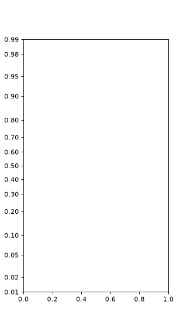

# ProbScale[#](#probscale "Link to this heading")

class scikitplot.externals.\_probscale.ProbScale(**\*args**, **\*\*kwargs**)[[source]](https://github.com/scikit-plots/scikit-plots/blob/b2a4600/scikitplot/externals/_probscale/probscale.py#L240)[#](#scikitplot.externals._probscale.ProbScale "Link to this definition")
:   A probability scale for matplotlib Axes.

    Transforms an axis so that normally distributed data plot as a straight
    line. Tick locations correspond to probability (or percentage) values;
    the underlying quantile mapping is supplied by **dist**.

    Parameters:
    :   ****\*args****positional arguments (absorbed, not used)
        :   Prior to matplotlib 3.11 `scale_factory` unconditionally passed
            the `axis` artist as the first positional argument to every scale
            constructor. From 3.11 onwards, the positional argument is only
            passed when `"axis"` appears in `inspect.signature(cls)`. Using
            `*args` absorbs the positional argument on older matplotlib
            versions without placing the string `"axis"` in the inspected
            signature, which would trigger a `PendingDeprecationWarning`.

        ****dist****scipy.stats-compatible distribution, optional
        :   Object that provides `ppf(q)` (quantile function) and `cdf(x)`
            (CDF) class or instance methods. Defaults to
            `_minimal_norm` so that scipy is not a hard dependency.

        ****as\_pct****bool, optional
        :   When `True` (default) tick labels are shown as percentages
            (0 – 100). When `False` they are shown as proportions (0 – 1).

        ****nonpos****{‘mask’, ‘clip’}, optional
        :   Strategy for data outside the valid probability range; forwarded to
            `ProbTransform`. Default is `'mask'`.

    Attributes:
    :   ****name****str
        :   The string name used to register this scale with matplotlib:
            `'prob'`.

        ****dist****distribution object
        :   The distribution used for the probability mapping.

        ****as\_pct****bool
        :   Whether tick labels are rendered as percentages.

        ****nonpos****str
        :   Out-of-bounds handling strategy (`'mask'` or `'clip'`).

    Parameters:
    :   * ****args**** (**Any**)
        * ****kwargs**** (**Any**)

    > **See also**
    > [`matplotlib.scale.ScaleBase`](https://matplotlib.org/devdocs/api/scale_api.html#matplotlib.scale.ScaleBase "(in Matplotlib v3.12.0.dev324+g9cc14f1ab)")
    :   Abstract base class for all scales.

    `transforms.ProbTransform`
    :   The underlying matplotlib Transform.

    `_minimal_norm`
    :   Default distribution (scipy-free).

    Notes

    ****User note**** — Register and use with:

    ```
    import scikitplot.externals._probscale  # registers 'prob' scale
    fig, ax = pyplot.subplots()
    ax.set_yscale('prob')
    ax.set_ylim(0.5, 99.5)

    ```

    ****Developer note**** — `*args` is intentional; see the module-level
    docstring for the complete compatibility matrix and rationale. The
    `axis` positional argument is **never** read inside this constructor;
    all configuration is driven by keyword arguments.

    References

    [1]

    matplotlib scales documentation:
    <https://matplotlib.org/stable/gallery/scales/scales.html>

    [2]

    mpl-probscale upstream:
    [matplotlib/mpl-probscale](https://github.com/matplotlib/mpl-probscale)

    Examples

    Try it in your browser!

    Basic probability scale (percentage labels):

    ```
    >>> import scikitplot.externals._probscale  # registers 'prob' scale
    >>> from matplotlib import pyplot
    >>> fig, ax = pyplot.subplots(figsize=(4, 7))
    >>> ax.set_ylim(bottom=0.5, top=99.5)
    >>> ax.set_yscale('prob')

    ```

    ([`Source code`](../../_downloads/19c42743b1f03ff955e629199f1e566c/scikitplot-externals-_probscale-ProbScale-1.py), [`png`](../../_downloads/b79c5e1d14ed3e553c8246f3fac6eeab/scikitplot-externals-_probscale-ProbScale-1.png))

    

    Proportion labels and a custom distribution:

    ```
    >>> from scipy import stats
    >>> fig, ax = pyplot.subplots(figsize=(4, 7))
    >>> ax.set_ylim(bottom=0.01, top=0.99)
    >>> ax.set_yscale('prob', as_pct=False, dist=stats.norm)

    ```

    ([`Source code`](../../_downloads/890eceae9bda5ce31d6afdfe495ab83c/scikitplot-externals-_probscale-ProbScale-2.py), [`png`](../../_downloads/1d65482abfce933c345ada6113475ace/scikitplot-externals-_probscale-ProbScale-2.png))

    
    Go BackOpen In Tab

    get\_transform()[[source]](https://github.com/scikit-plots/scikit-plots/blob/b2a4600/scikitplot/externals/_probscale/probscale.py#L427)[#](#scikitplot.externals._probscale.ProbScale.get_transform "Link to this definition")
    :   Return the probability transform for this scale.

        Returns:
        :   ****transform****.transforms.ProbTransform
            :   The [`Transform`](https://matplotlib.org/devdocs/api/transformations.html#matplotlib.transforms.Transform "(in Matplotlib v3.12.0.dev324+g9cc14f1ab)") instance that
                maps probability / percentage values to quantile space (and
                vice versa via its `inverted`
                twin `QuantileTransform`).

        Return type:
        :   **ProbTransform**

    limit\_range\_for\_scale(**vmin**, **vmax**, **minpos**)[[source]](https://github.com/scikit-plots/scikit-plots/blob/b2a4600/scikitplot/externals/_probscale/probscale.py#L440)[#](#scikitplot.externals._probscale.ProbScale.limit_range_for_scale "Link to this definition")
    :   Clamp axis limits to positive probability values.

        Any limit at or below zero is replaced by **minpos**, the smallest
        strictly-positive value on the axis, so that the probability
        transform (which is undefined at 0 and 1) always receives a
        valid input.

        Parameters:
        :   ****vmin****float
            :   Current lower axis limit.

            ****vmax****float
            :   Current upper axis limit.

            ****minpos****float
            :   Smallest strictly-positive data value visible on the axis;
                supplied by matplotlib.

        Returns:
        :   ****vmin\_new****float
            :   Clamped lower limit.

            ****vmax\_new****float
            :   Clamped upper limit.

        Parameters:
        :   * ****vmin**** ([**float**](https://docs.python.org/3/library/functions.html#float "(in Python v3.14)"))
            * ****vmax**** ([**float**](https://docs.python.org/3/library/functions.html#float "(in Python v3.14)"))
            * ****minpos**** ([**float**](https://docs.python.org/3/library/functions.html#float "(in Python v3.14)"))

        Return type:
        :   [tuple](https://docs.python.org/3/library/stdtypes.html#tuple "(in Python v3.14)")[[float](https://docs.python.org/3/library/functions.html#float "(in Python v3.14)"), [float](https://docs.python.org/3/library/functions.html#float "(in Python v3.14)")]

        Notes

        The original implementation used the Python-2-era idiom
        `vmin <= 0.0 and minpos or vmin`. This is equivalent to
        `minpos if vmin <= 0.0 else vmin` ****only**** when **minpos** is
        truthy. If **minpos** were `0` or `None` the idiom would
        silently return **vmin** (the wrong branch). The explicit ternary
        form used here is always correct regardless of the truthiness of
        **minpos**.

    name: [str](https://docs.python.org/3/library/stdtypes.html#str "(in Python v3.14)") = 'prob'[#](#scikitplot.externals._probscale.ProbScale.name "Link to this definition")

    set\_default\_locators\_and\_formatters(**axis**)[[source]](https://github.com/scikit-plots/scikit-plots/blob/b2a4600/scikitplot/externals/_probscale/probscale.py#L404)[#](#scikitplot.externals._probscale.ProbScale.set_default_locators_and_formatters "Link to this definition")
    :   Configure probability-scale locators and formatters.

        Sets a [`FixedLocator`](https://matplotlib.org/devdocs/api/ticker_api.html#matplotlib.ticker.FixedLocator "(in Matplotlib v3.12.0.dev324+g9cc14f1ab)") at standard
        probability tick positions, a [`FuncFormatter`](https://matplotlib.org/devdocs/api/ticker_api.html#matplotlib.ticker.FuncFormatter "(in Matplotlib v3.12.0.dev324+g9cc14f1ab)")
        that renders probabilities as percentages or proportions, and
        `NullLocator` / `NullFormatter` for minor ticks.

        Parameters:
        :   ****axis****matplotlib.axis.Axis
            :   The axis whose locators and formatters will be configured.

        Parameters:
        :   ****axis**** ([**Any**](https://docs.python.org/3/library/typing.html#typing.Any "(in Python v3.14)"))

        Return type:
        :   None

    val\_in\_range(**val**)[[source]](https://github.com/scikit-plots/scikit-plots/blob/b2a4600/scikitplot/../matplotlib/scale.py#L117)[#](#scikitplot.externals._probscale.ProbScale.val_in_range "Link to this definition")
    :   Return whether the value(s) are within the valid range for this scale.

        Accepts a scalar or array-like `val`. For a scalar, returns a
        Python `bool`. For an array, returns a bool ndarray of the same
        shape. This is a generic implementation, and subclasses may implement
        more efficient solutions for their domain.