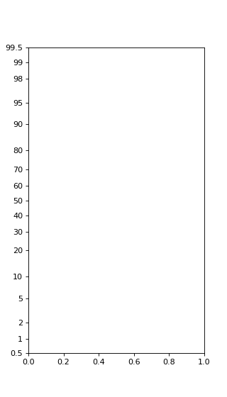

# ProbScale[#](#probscale "Link to this heading")

class scikitplot.externals.\_probscale.ProbScale(**axis**, **\*\*kwargs**)[[source]](https://github.com/scikit-plots/scikit-plots/blob/dff5f00/scikitplot/externals/_probscale/probscale.py#L76)[#](#scikitplot.externals._probscale.ProbScale "Link to this definition")
:   A probability scale for matplotlib Axes.

    Parameters:
    :   ****axis****a matplotlib axis artist
        :   The axis whose scale will be set.

        ****dist****scipy.stats probability distribution, optional
        :   The distribution whose ppf/cdf methods should be used to compute
            the tick positions. By default, a minimal implementation of the
            `scipy.stats.norm` class is used so that scipy is not a
            requirement.

    Examples

    Try it in your browser!

    The most basic use:

    ```
    >>> import scikitplot.externals._probscale  # nothing else needed
    >>> from matplotlib import pyplot
    >>> fig, ax = pyplot.subplots(figsize=(4, 7))
    >>> ax.set_ylim(bottom=0.5, top=99.5)
    >>> ax.set_yscale('prob')

    ```

    ([`Source code`](../../_downloads/19c42743b1f03ff955e629199f1e566c/scikitplot-externals-_probscale-ProbScale-1.py), [`png`](../../_downloads/b79c5e1d14ed3e553c8246f3fac6eeab/scikitplot-externals-_probscale-ProbScale-1.png))

    
    Go BackOpen In Tab

    get\_transform()[[source]](https://github.com/scikit-plots/scikit-plots/blob/dff5f00/scikitplot/externals/_probscale/probscale.py#L158)[#](#scikitplot.externals._probscale.ProbScale.get_transform "Link to this definition")
    :   Return a [`Transform`](https://matplotlib.org/devdocs/api/transformations.html#matplotlib.transforms.Transform "(in Matplotlib v3.12.0.dev80+g7499f38d2)") instance
        appropriate for the given logarithm base.

    limit\_range\_for\_scale(**vmin**, **vmax**, **minpos**)[[source]](https://github.com/scikit-plots/scikit-plots/blob/dff5f00/scikitplot/externals/_probscale/probscale.py#L165)[#](#scikitplot.externals._probscale.ProbScale.limit_range_for_scale "Link to this definition")
    :   Limit the domain to positive values.

    name = 'prob'[#](#scikitplot.externals._probscale.ProbScale.name "Link to this definition")

    set\_default\_locators\_and\_formatters(**axis**)[[source]](https://github.com/scikit-plots/scikit-plots/blob/dff5f00/scikitplot/externals/_probscale/probscale.py#L144)[#](#scikitplot.externals._probscale.ProbScale.set_default_locators_and_formatters "Link to this definition")
    :   Set the locators and formatters to specialized versions for
        log scaling.