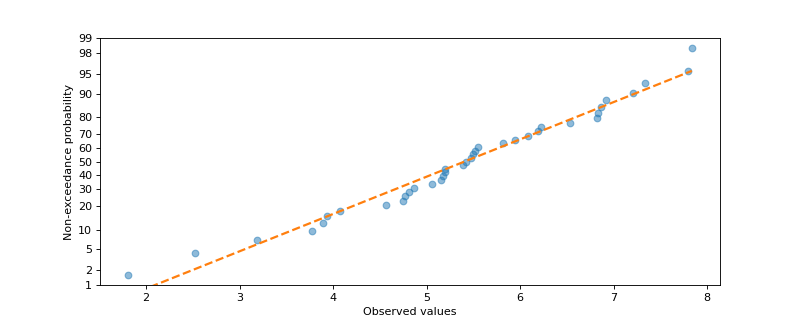
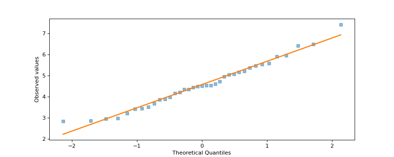

# probplot[#](#probplot "Link to this heading")

scikitplot.externals.\_probscale.probplot(**data**, **ax=None**, **plottype='prob'**, **dist=None**, **probax='x'**, **problabel=None**, **datascale='linear'**, **datalabel=None**, **bestfit=False**, **return\_best\_fit\_results=False**, **estimate\_ci=False**, **ci\_kws=None**, **pp\_kws=None**, **scatter\_kws=None**, **line\_kws=None**, **\*\*fgkwargs**)[[source]](https://github.com/scikit-plots/scikit-plots/blob/c8953a1/scikitplot/externals/_probscale/viz.py#L13)[#](#scikitplot.externals._probscale.probplot "Link to this definition")
:   Probability, percentile, and quantile plots.

    Parameters:
    :   ****data****array-like
        :   1-dimensional data to be plotted

        ****ax****matplotlib axes, optional
        :   The Axes on which to plot. If one is not provided, a new Axes
            will be created.

        ****plottype****string (default = ‘prob’)
        :   Type of plot to be created. Options are:

            > * ‘prob’: probability plot
            > * ‘pp’: percentile plot
            > * ‘qq’: quantile plot

        ****dist****scipy distribution, optional
        :   A distribution to compute the scale’s tick positions. If not
            specified, a standard normal distribution will be used.

        ****probax****string, optional (default = ‘x’)
        :   The axis (‘x’ or ‘y’) that will serve as the probability (or
            quantile) axis.

        ****problabel, datalabel****string, optional
        :   Axis labels for the probability/quantile and data axes
            respectively.

        ****datascale****string, optional (default = ‘log’)
        :   Scale for the other axis that is not the probability (or
            quantile) axis.

        ****bestfit****bool, optional (default is False)
        :   Specifies whether a best-fit line should be added to the plot.

        ****return\_best\_fit\_results****bool (default is False)
        :   If True a dictionary of results of is returned along with the
            figure.

        ****estimate\_ci****bool, optional (False)
        :   Estimate and draw a confidence band around the best-fit line
            using a percentile bootstrap.

        ****ci\_kws****dict, optional
        :   Dictionary of keyword arguments passed directly to
            `viz.fit_line` when computing the best-fit line.

        ****pp\_kws****dict, optional
        :   Dictionary of keyword arguments passed directly to
            `viz.plot_pos` when computing the plotting positions.

        ****scatter\_kws, line\_kws****dict, optional
        :   Dictionary of keyword arguments passed directly to `ax.plot`
            when drawing the scatter points and best-fit line, respectively.

    Returns:
    :   ****fig****matplotlib.Figure
        :   The figure on which the plot was drawn.

        ****result****dict of linear fit results, optional
        :   Keys are:

            > * q : array of quantiles
            > * x, y : arrays of data passed to function
            > * xhat, yhat : arrays of modeled data plotted in best-fit line
            > * res : array of coefficients of the best-fit line.

    Other Parameters:
    :   ****color****string, optional
        :   A directly-specified matplotlib color argument for both the
            data series and the best-fit line if drawn. This argument is
            made available for compatibility for the seaborn package and
            is not recommended for general use. Instead colors should be
            specified within `scatter_kws` and `line_kws`.

            > **Note**
            > Users should not specify this parameter. It is intended to
            only be used by seaborn when operating within a
            `FacetGrid`.

        ****label****string, optional
        :   A directly-specified legend label for the data series. This
            argument is made available for compatibility for the seaborn
            package and is not recommended for general use. Instead the
            data series label should be specified within `scatter_kws`.

            > **Note**
            > Users should not specify this parameter. It is intended to
            only be used by seaborn when operating within a
            `FacetGrid`.

    > **See also**
    > `viz.plot_pos`


    `viz.fit_line`


    [`numpy.polyfit`](https://numpy.org/devdocs/reference/generated/numpy.polyfit.html#numpy.polyfit "(in NumPy v2.6.dev0)")


    [`scipy.stats.probplot`](https://scipy.github.io/devdocs/reference/generated/scipy.stats.probplot.html#scipy.stats.probplot "(in SciPy v2.0.0.dev)")


    [`scipy.stats.mstats.plotting_positions`](https://scipy.github.io/devdocs/reference/generated/scipy.stats.mstats.plotting_positions.html#scipy.stats.mstats.plotting_positions "(in SciPy v2.0.0.dev)")

    Examples

    Try it in your browser!

    Probability plot with the probabilities on the y-axis

    ```
    >>> import numpy
    ...
    ... numpy.random.seed(0)
    >>> from matplotlib import pyplot
    >>> from scipy import stats
    >>> import scikitplot.externals._probscale as probscale
    >>> data = numpy.random.normal(loc=5, scale=1.25, size=37)
    >>> fig = probscale.probplot(
    ...     data,
    ...     plottype='prob',
    ...     probax='y',
    ...     problabel='Non-exceedance probability',
    ...     datalabel='Observed values',
    ...     bestfit=True,
    ...     line_kws=dict(linestyle='--', linewidth=2),
    ...     scatter_kws=dict(marker='o', alpha=0.5),
    ... )

    ```

    ([`Source code`](../../_downloads/9072f3e53a7e62029b7aa9ecc4a2d1df/scikitplot-externals-_probscale-probplot-1.py), [`png`](../../_downloads/296c2e1a982d008f8f94ed9f580b9af3/scikitplot-externals-_probscale-probplot-1.png))

    

    Quantile plot with the quantiles on the x-axis

    ```
    >>> import scikitplot.externals._probscale as probscale
    >>> data = numpy.random.normal(loc=5, scale=1.25, size=37)
    >>> fig = probscale.probplot(
    ...     data,
    ...     plottype='qq',
    ...     probax='x',
    ...     problabel='Theoretical Quantiles',
    ...     datalabel='Observed values',
    ...     bestfit=True,
    ...     line_kws=dict(linestyle='-', linewidth=2),
    ...     scatter_kws=dict(marker='s', alpha=0.5),
    ... )

    ```

    ([`Source code`](../../_downloads/cdb4060c483ab3fa5d1fe8434135f598/scikitplot-externals-_probscale-probplot-2.py), [`png`](../../_downloads/2591fa093aef08a317476df0a53f801d/scikitplot-externals-_probscale-probplot-2.png))

    
    Go BackOpen In Tab