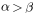

# scikitplot.externals.\_sphinxext.mathmpl[#](#scikitplot-externals-sphinxext-mathmpl "Link to this heading")

A role and directive to display mathtext in Sphinx.

The `mathmpl` Sphinx extension creates a mathtext image in Matplotlib and
shows it in html output. Thus, it is a true and faithful representation of what
you will see if you pass a given LaTeX string to Matplotlib (see
[Writing mathematical expressions](https://matplotlib.org/devdocs/users/explain/text/mathtext.html#mathtext "(in Matplotlib v3.12.0.dev91+gee4f47040)")).

> **Warning**
> In most cases, you will likely want to use one of [Sphinx’s builtin Math
extensions](https://www.sphinx-doc.org/en/master/usage/extensions/math.html)
instead of this one. The builtin Sphinx math directive uses MathJax to
render mathematical expressions, and addresses accessibility concerns that
`mathmpl` doesn’t address.

Mathtext may be included in two ways:

1. Inline, using the role:

   ```
   This text uses inline math: :mathmpl:`\alpha > \beta`.

   ```

   which produces:

   > This text uses inline math: .
2. Standalone, using the directive:

   ```
   Here is some standalone math:

   .. mathmpl::

       \alpha > \beta

   ```

   which produces:

   > Here is some standalone math:
   >
   > 

Options:

The `mathmpl` role and directive both support the following options:

fontsetstr, default: ‘cm’
:   The font set to use when displaying math. See `rcParams[“mathtext.fontset”]` (default: `'dejavusans'`).

fontsizefloat
:   The font size, in points. Defaults to the value from the extension
    configuration option defined below.

Configuration options:

The mathtext extension has the following configuration options:

mathmpl\_fontsizefloat, default: 10.0
:   Default font size, in points.

mathmpl\_srcsetlist of str, default: []
:   Additional image sizes to generate when embedding in HTML, to support
    [responsive resolution images](https://developer.mozilla.org/en-US/docs/Learn/HTML/Multimedia_and_embedding/Responsive_images).
    The list should contain additional x-descriptors (`'1.5x'`, `'2x'`,
    etc.) to generate (1x is the default and always included.)