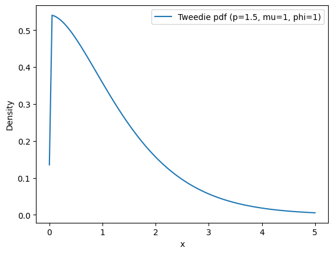
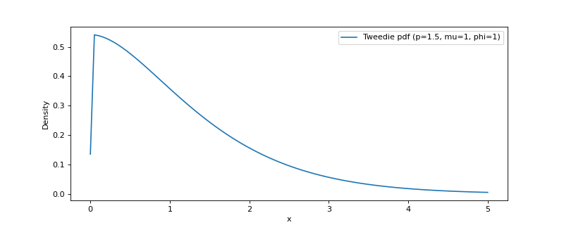

# tweedie[#](#tweedie "Link to this heading")

scikitplot.externals.\_tweedie.tweedie = <scikitplot.externals.\_tweedie.\_tweedie\_dist.tweedie\_gen object>[[source]](https://github.com/scikit-plots/scikit-plots/blob/d6e9440d/scikitplot/externals/_tweedie/_tweedie_dist.py#L)[#](#scikitplot.externals._tweedie.tweedie "Link to this definition")
:   An instance of [`tweedie_gen`](scikitplot.externals._tweedie.tweedie_gen.html#scikitplot.externals._tweedie.tweedie_gen "scikitplot.externals._tweedie.tweedie_gen"), providing Tweedie distribution functionality.

    This instance provides:

    * probability density function (pdf)
    * cumulative distribution function (cdf)
    * random sampling

    for the Tweedie distribution.

    The Tweedie distribution is part of the exponential dispersion family, characterized
    by a `p` parameter that determines its behavior:

    * `p = 0`: Gaussian distribution
    * `p = 1`: Poisson distribution
    * `p = 2`: Gamma distribution
    * `p = 3`: Inverse Gaussian distribution
    * `1 < p < 2`: Compound Poisson-Gamma distribution

    Parameters:
    :   ****p****float
        :   Tweedie power parameter.

        ****mu****float
        :   Mean or location parameter.

        ****phi****float
        :   Dispersion parameter, controlling the variance of the distribution.

    > **See also**
    > [`tweedie_gen`](scikitplot.externals._tweedie.tweedie_gen.html#scikitplot.externals._tweedie.tweedie_gen "scikitplot.externals._tweedie.tweedie_gen")
    :   A Tweedie continuous random variable.

    Examples

    Try it in your browser!

    Compute the pdf and cdf at a given point:

    ```
    >>> import numpy as np
    >>> from scikitplot.stats import tweedie
    >>> x = 2.0
    >>> pdf_val = tweedie.pdf(x, p=1.5, mu=1, phi=1)
    >>> cdf_val = tweedie.cdf(x, p=1.5, mu=1, phi=1)
    >>> pdf_val, cdf_val

    ```
    ```
    (np.float64(0.15640119832636348), np.float64(0.8519363569424107))

    ```

    Generate random variates:

    ```
    >>> import numpy as np
    >>> from scikitplot.stats import tweedie
    >>> rvs = tweedie.rvs(p=1.5, mu=1, phi=1, size=16)
    >>> rvs

    ```
    ```
    array([1.47152447, 0.63609549, 3.23324838, 3.13487541, 1.11835248,
           0.09628593, 0.4452656 , 2.57216257, 4.28939538, 0.76130255,
           2.7376018 , 3.2738927 , 2.04328978, 3.89789248, 0.29614867,
           0.        ])

    ```

    Plot the pdf over a range:

    ```
    >>> import numpy as np
    >>> from scikitplot.stats import tweedie
    >>> import matplotlib.pyplot as plt
    >>> x = np.linspace(0, 5, 100)
    >>> y = tweedie.pdf(x, p=1.5, mu=1, phi=1)
    >>> plt.plot(x, y, label='Tweedie pdf (p=1.5, mu=1, phi=1)')
    >>> plt.xlabel("x")
    >>> plt.ylabel("Density")
    >>> plt.legend()
    >>> plt.show()

    ```
    

    ([`Source code`](../../_downloads/637c2552e076b53b0ebfa0573e1abbeb/scikitplot-externals-_tweedie-tweedie-1.py), [`png`](../../_downloads/c42fb8be7ece17a106c1124dbe612404/scikitplot-externals-_tweedie-tweedie-1.png))

    
    Go BackOpen In Tab

Make live