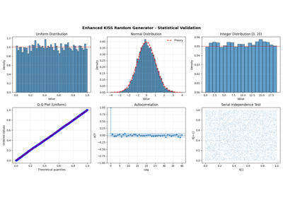

# Kiss64Random[#](#kiss64random "Link to this heading")

class scikitplot.random.Kiss64Random(**int seed: [int](https://docs.python.org/3/library/functions.html#int "(in Python v3.14)") | [None](https://docs.python.org/3/library/constants.html#None "(in Python v3.14)") = None**)[[source]](https://github.com/scikit-plots/scikit-plots/blob/c8f33de/scikitplot/random/__init__.py#L)[#](#scikitplot.random.Kiss64Random "Link to this definition")
:   Low-level 64-bit KISS RNG with context manager support.

    This class provides direct access to the C++ Kiss64Random implementation.
    For most use cases, prefer KissGenerator or default\_rng() instead.
    Period: ~2^250 (suitable for billions of data points)

    Parameters:
    :   ****seed****int or None, default=None
        :   Initial seed value. If None, uses default seed (1234567890987654321).
            Must be in range [0, 2^64-1].

    Attributes:
    :   ****default\_seed****int
        :   Default seed value (1234567890987654321)

        [`seed`](#scikitplot.random.Kiss64Random.seed "scikitplot.random.Kiss64Random.seed")int
        :   Kiss64Random.seed: int

        ****lock****threading.RLock
        :   Thread lock (for shared access)

    > **See also**
    > [`Kiss32Random`](scikitplot.random.Kiss32Random.html#scikitplot.random.Kiss32Random "scikitplot.random.Kiss32Random")
    :   32-bit version for smaller datasets

    [`KissRandom`](scikitplot.random.KissRandom.html#scikitplot.random.KissRandom "scikitplot.random.KissRandom")
    :   Factory function for auto-detecting

    [`KissSeedSequence`](scikitplot.random.KissSeedSequence.html#scikitplot.random.KissSeedSequence "scikitplot.random.KissSeedSequence")
    :   Seed sequence for initialization

    [`KissBitGenerator`](scikitplot.random.KissBitGenerator.html#scikitplot.random.KissBitGenerator "scikitplot.random.KissBitGenerator")
    :   NumPy-compatible bit generator

    [`KissGenerator`](scikitplot.random.KissGenerator.html#scikitplot.random.KissGenerator "scikitplot.random.KissGenerator")
    :   High-level generator using this BitGenerator

    [`KissRandomState`](scikitplot.random.KissRandomState.html#scikitplot.random.KissRandomState "scikitplot.random.KissRandomState")
    :   Inherites from KissGenerator

    [`default_rng`](scikitplot.random.default_rng.html#scikitplot.random.default_rng "scikitplot.random.default_rng")
    :   Convenience function to create generator

    Notes

    * Period: approximately 2^250
    * Not cryptographically secure
    * Recommended for datasets larger than ~16 million points
    * Slightly slower than Kiss32Random but much longer period
    * Thread-safe via context manager
    * Deterministic: same seed → same sequence
    * Complete pickle/JSON support
    * Preferred for large-scale applications

    Examples

    Try it in your browser!
    ```
    >>> rng = Kiss64Random(42)
    >>> rng.kiss()  # Random uint64
    >>>
    >>> # Context manager (thread-safe)
    >>> with rng:
    ...     value = rng.kiss()
    >>>
    >>> # Serialization
    >>> import pickle
    >>> restored = pickle.loads(pickle.dumps(rng))

    ```
    Go BackOpen In Tab

    default\_seed = 1234567890987654321[#](#scikitplot.random.Kiss64Random.default_seed "Link to this definition")

    classmethod deserialize(**cls**, **data**)[#](#scikitplot.random.Kiss64Random.deserialize "Link to this definition")
    :   Deserialize from dict.

        Parameters:
        :   ****data****dict
            :   Serialized state

        Returns:
        :   Kiss64Random
            :   Restored instance

        Examples

        Try it in your browser!
        ```
        >>> import json
        >>> rng = Kiss64Random(42)
        >>> json_str = json.dumps(rng.serialize())
        >>> data = json.loads(json_str)
        >>> restored = Kiss64Random.deserialize(data)

        ```
        Go BackOpen In Tab

    flip(**self**) → [int](https://docs.python.org/3/library/functions.html#int "(in Python v3.14)")[#](#scikitplot.random.Kiss64Random.flip "Link to this definition")
    :   Generate random binary value (0 or 1).

    classmethod from\_dict(**cls**, **data**)[#](#scikitplot.random.Kiss64Random.from_dict "Link to this definition")
    :   Alias for deserialize().

    static get\_default\_seed() → [int](https://docs.python.org/3/library/functions.html#int "(in Python v3.14)")[#](#scikitplot.random.Kiss64Random.get_default_seed "Link to this definition")
    :   Get default seed value.

        Return type:
        :   [int](https://docs.python.org/3/library/functions.html#int "(in Python v3.14)")

    get\_params(**self**, **deep=True**)[#](#scikitplot.random.Kiss64Random.get_params "Link to this definition")
    :   Get parameters (sklearn-style).

        Parameters:
        :   ****deep****bool, default=True
            :   Unused, for sklearn compatibility

        Returns:
        :   dict
            :   Constructor parameters

        Examples

        Try it in your browser!
        ```
        >>> rng = Kiss64Random(42)
        >>> params = rng.get_params()
        >>> print(params)
        {'seed': 42}

        ```
        Go BackOpen In Tab

    get\_state(**self**)[#](#scikitplot.random.Kiss64Random.get_state "Link to this definition")
    :   Get state dictionary.

        Returns:
        :   dict
            :   Complete state

        Examples

        Try it in your browser!
        ```
        >>> rng = Kiss64Random(42)
        >>> state = rng.get_state()
        >>> print(state["seed"])
        42

        ```
        Go BackOpen In Tab

    index(**self**, **size\_t n**) → size\_t[#](#scikitplot.random.Kiss64Random.index "Link to this definition")
    :   Generate random index in range [0, n-1].

    kiss(**self**) → uint64\_t[#](#scikitplot.random.Kiss64Random.kiss "Link to this definition")
    :   Generate next random 64-bit unsigned integer.

        Returns:
        :   int
            :   Random value in [0, 2^64-1]

    lock[#](#scikitplot.random.Kiss64Random.lock "Link to this definition")
    :   !! processed by numpydoc !!

    static normalize\_seed(**int seed: [int](https://docs.python.org/3/library/functions.html#int "(in Python v3.14)")**) → [int](https://docs.python.org/3/library/functions.html#int "(in Python v3.14)")[#](#scikitplot.random.Kiss64Random.normalize_seed "Link to this definition")
    :   Normalize seed to valid non-zero value.

        Parameters:
        :   ****seed**** ([**int**](https://docs.python.org/3/library/functions.html#int "(in Python v3.14)"))

        Return type:
        :   [int](https://docs.python.org/3/library/functions.html#int "(in Python v3.14)")

    reset(**self**, **int seed: [int](https://docs.python.org/3/library/functions.html#int "(in Python v3.14)")**) → [None](https://docs.python.org/3/library/constants.html#None "(in Python v3.14)")[#](#scikitplot.random.Kiss64Random.reset "Link to this definition")
    :   Reset RNG state with new seed.

        Parameters:
        :   ****seed**** ([**int**](https://docs.python.org/3/library/functions.html#int "(in Python v3.14)"))

        Return type:
        :   None

    reset\_default(**self**) → [None](https://docs.python.org/3/library/constants.html#None "(in Python v3.14)")[#](#scikitplot.random.Kiss64Random.reset_default "Link to this definition")
    :   Reset to default seed.

        Return type:
        :   None

    seed[#](#scikitplot.random.Kiss64Random.seed "Link to this definition")
    :   int

        Get current seed value.

        Type:
        :   [Kiss64Random.seed](#scikitplot.random.Kiss64Random.seed "scikitplot.random.Kiss64Random.seed")

    serialize(**self**)[#](#scikitplot.random.Kiss64Random.serialize "Link to this definition")
    :   Serialize to JSON-compatible dict.

        Returns:
        :   dict
            :   JSON-serializable state

        Examples

        Try it in your browser!
        ```
        >>> import json
        >>> rng = Kiss64Random(42)
        >>> data = rng.serialize()
        >>> json_str = json.dumps(data)

        ```
        Go BackOpen In Tab

    set\_params(**self**, **\*\*params**)[#](#scikitplot.random.Kiss64Random.set_params "Link to this definition")
    :   Set parameters (sklearn-style).

        Parameters:
        :   ****\*\*params****dict
            :   Parameters to set

        Returns:
        :   self
            :   For chaining

        Examples

        Try it in your browser!
        ```
        >>> rng = Kiss64Random(42)
        >>> rng.set_params(seed=123)
        >>> print(rng.seed)
        123

        ```
        Go BackOpen In Tab

    set\_seed(**self**, **int seed: [int](https://docs.python.org/3/library/functions.html#int "(in Python v3.14)")**) → [None](https://docs.python.org/3/library/constants.html#None "(in Python v3.14)")[#](#scikitplot.random.Kiss64Random.set_seed "Link to this definition")
    :   Set new seed (alias for reset).

        Parameters:
        :   ****seed**** ([**int**](https://docs.python.org/3/library/functions.html#int "(in Python v3.14)"))

        Return type:
        :   None

    set\_state(**self**, **state**)[#](#scikitplot.random.Kiss64Random.set_state "Link to this definition")
    :   Set state from dictionary.

        Parameters:
        :   ****state****dict
            :   State from get\_state()

        Examples

        Try it in your browser!
        ```
        >>> rng1 = Kiss64Random(42)
        >>> state = rng1.get_state()
        >>> rng2 = Kiss64Random(0)
        >>> rng2.set_state(state)

        ```
        Go BackOpen In Tab

    to\_dict(**self**)[#](#scikitplot.random.Kiss64Random.to_dict "Link to this definition")
    :   Alias for serialize().

## Gallery examples[#](#gallery-examples "Link to this heading")



[Enhanced KISS Random Generator - Complete Usage Examples](../../auto_examples/random/plot_kiss_random.html)

Enhanced KISS Random Generator - Complete Usage Examples