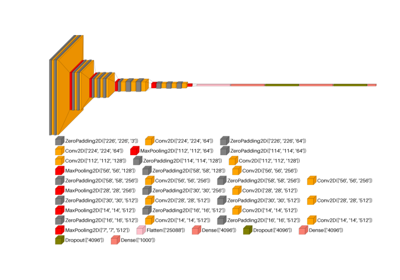

# SpacingDummyLayer[#](#spacingdummylayer "Link to this heading")

class scikitplot.visualkeras.SpacingDummyLayer(**\*args**, **spacing=50**, **\*\*kwargs**)[[source]](https://github.com/scikit-plots/scikit-plots/blob/db9d710b/scikitplot/visualkeras/_layer_utils.py#L183)[#](#scikitplot.visualkeras.SpacingDummyLayer "Link to this definition")
:   A factory class for dynamically generating a dummy Keras layer with custom spacing.

    This is useful in model visualization pipelines where visual gaps or structural separation
    between layers need to be represented without introducing real computation.

    TensorFlow is only imported when the class is instantiated to avoid unnecessary dependencies.

    This class dynamically inherits from TensorFlow’s [`tf.keras.layers.Layer`](https://www.tensorflow.org/api_docs/python/tf/keras/layers/Layer "(in TensorFlow v2.8)")
    class, ensuring that TensorFlow is only imported when this class is instantiated.

    Parameters:
    :   ****spacing**** ([**int**](https://docs.python.org/3/library/functions.html#int "(in Python v3.14)"))

## Gallery examples[#](#gallery-examples "Link to this heading")

[visualkeras: custom vgg16 example](../../auto_examples/visualkeras/plot_dl_cnn_custom_vgg16.html)

visualkeras: custom vgg16 example

[visualkeras: custom vgg16 show dimension example](../../auto_examples/visualkeras/plot_dl_cnn_custom_vgg16_show_dimension.html)

visualkeras: custom vgg16 show dimension example