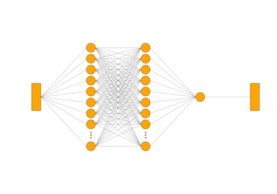

# graph\_view[#](#graph-view "Link to this heading")

scikitplot.visualkeras.graph\_view(**model**, **to\_file=None**, **color\_map=None**, **node\_size=50**, **background\_fill='white'**, **padding=10**, **layer\_spacing=250**, **node\_spacing=10**, **connector\_fill='gray'**, **connector\_width=1**, **ellipsize\_after=10**, **inout\_as\_tensor=True**, **show\_neurons=True**, **backend=None**, **show\_os\_viewer=False**, **show\_fig=True**, **save\_fig=False**, **save\_fig\_filename=''**, **overwrite=True**, **add\_timestamp=False**, **verbose=False**, **\*\*kwargs**)[[source]](https://github.com/scikit-plots/scikit-plots/blob/5fb281e/scikitplot/visualkeras/_graph.py#L120)[#](#scikitplot.visualkeras.graph_view "Link to this definition")
:   Generates an architectural visualization for a given linear Keras
    [`tf.keras.Model`](https://www.tensorflow.org/api_docs/python/tf/keras/Model "(in TensorFlow v2.8)") model
    (i.e., one input and output tensor for each layer) in graph style.

    Parameters:
    :   ****model****tensorflow.keras.Model
        :   A Keras [`tf.keras.Model`](https://www.tensorflow.org/api_docs/python/tf/keras/Model "(in TensorFlow v2.8)") model to be visualized.

        ****to\_file****str, optional
        :   Path to the file where the generated image will be saved.
            The file type is inferred from the file extension.
            If None, the image is not saved.

            Changed in version 0.4.0: The `to_file` is now deprecated, and will be removed in a future release.
            Users are encouraged to use `'save_fig'` and `'save_fig_filename'`
            instead for improved compatibility.

        ****color\_map****dict, optional
        :   A dictionary defining the fill and outline colors for each layer type.
            Layers not specified will use default (None uses default colors).

        ****node\_size****int, optional
        :   The size (in pixels) of each node (default is 50).

        ****background\_fill****str or tuple, optional
        :   Background color of the image (default is “white”).
            Can be a string or a tuple (R, G, B, A).

        ****padding****int, optional
        :   Padding before and after layers (default is 10).
            Distance (in pixels) before the first and
            after the last layer in the visualization.

        ****layer\_spacing****int, optional
        :   Horizontal spacing (in pixels) between consecutive layers (default is 250).

        ****node\_spacing****int, optional
        :   Horizontal spacing (in pixels) between nodes within the layer (default is 10).

        ****connector\_fill****str or tuple, optional
        :   Color of connectors between layers (default is “gray”).
            Can be a string or a tuple (R, G, B, A).

        ****connector\_width****int, optional
        :   Line width (in pixels) of the connectors between nodes (default is 1).

        ****ellipsize\_after****int, optional
        :   Maximum number of neurons per layer to visualize.
            Layers exceeding this limit will represent
            the remaining neurons as ellipses (default is 10).

        ****inout\_as\_tensor****bool, optional
        :   If True, one input and output node will be created for each tensor.
            If False, tensors will be flattened, and one node for each scalar will be created
            (e.g., a tensor with shape (10, 10) will be represented by 100 nodes)
            (default is True).

        ****show\_neurons****bool, optional
        :   If True, each neuron in supported layers will be represented as a node
            (subject to `ellipsize_after` limit).
            If False, each layer is represented by a single node
            (default is True).

        ****\*\*kwargs****dict
        :   Generic keyword arguments.

    Returns:
    :   PIL.Image.Image or matplotlib.image.AxesImage
        :   The generated image visualizing the model’s architecture.

    Other Parameters:
    :   ****backend****bool, str, optional, default=None
        :   Specifies the backend used to process and save the image.
            If the value is one of `'matplotlib'`, `'true'`, or `'none'` (case-insensitive),
            the Matplotlib backend will be used. This is useful for better DPI control and
            consistent rendering. Any other value will fall back to using the PIL backend.
            Default is `None`. Common values include:

            * `'matplotlib'`, `'true'`, `'none'` : Use Matplotlib
            * `'pil'`, `'fast'`, etc. : Use PIL (Python Imaging Library)

            Added in version 0.4.0: The `backend` parameter was added to allow switching between PIL and Matplotlib.

        ****show\_os\_viewer****bool, optional, default=False
        :   If True, displays the saved image (by PIL) in the system’s default image viewer
            using PIL’s `.show()` method. Default is False.

            Added in version 0.4.0.

        ****show\_fig****bool, default=True
        :   Show the plot.

            Added in version 0.4.0.

        ****save\_fig****bool, default=False
        :   Save the plot.

            Added in version 0.4.0.

        ****save\_fig\_filename****str, optional, default=’’
        :   Specify the path and filetype to save the plot.
            If nothing specified, the plot will be saved as png
            inside `result_images` under to the current working directory.
            Defaults to plot image named to used `func.__name__`.

            Added in version 0.4.0.

        ****overwrite****bool, optional, default=True
        :   If False and a file exists, auto-increments the filename to avoid overwriting.

            Added in version 0.4.0.

        ****add\_timestamp****bool, optional, default=False
        :   Whether to append a timestamp to the filename.
            Default is False.

            Added in version 0.4.0.

        ****verbose****bool, optional
        :   If True, enables verbose output with informative messages during execution.
            Useful for debugging or understanding internal operations such as backend selection,
            font loading, and file saving status. If False, runs silently unless errors occur.

            Default is False.

            Added in version 0.4.0: The `verbose` parameter was added to control logging and user feedback verbosity.

    Parameters:
    :   * ****to\_file**** (**Optional****[**[**str**](https://docs.python.org/3/library/stdtypes.html#str "(in Python v3.14)")**]**)
        * ****color\_map**** (**Optional****[****"dict"****]**)
        * ****node\_size**** ([**int**](https://docs.python.org/3/library/functions.html#int "(in Python v3.14)"))
        * ****background\_fill**** (**any**)
        * ****padding**** ([**int**](https://docs.python.org/3/library/functions.html#int "(in Python v3.14)"))
        * ****layer\_spacing**** ([**int**](https://docs.python.org/3/library/functions.html#int "(in Python v3.14)"))
        * ****node\_spacing**** ([**int**](https://docs.python.org/3/library/functions.html#int "(in Python v3.14)"))
        * ****connector\_fill**** (**any**)
        * ****connector\_width**** ([**int**](https://docs.python.org/3/library/functions.html#int "(in Python v3.14)"))
        * ****ellipsize\_after**** ([**int**](https://docs.python.org/3/library/functions.html#int "(in Python v3.14)"))
        * ****inout\_as\_tensor**** ([**bool**](https://docs.python.org/3/library/functions.html#bool "(in Python v3.14)"))
        * ****show\_neurons**** ([**bool**](https://docs.python.org/3/library/functions.html#bool "(in Python v3.14)"))
        * ****backend**** (**Optional****[****Union****[**[**bool**](https://docs.python.org/3/library/functions.html#bool "(in Python v3.14)")**,**[**str**](https://docs.python.org/3/library/stdtypes.html#str "(in Python v3.14)")**]****]**)
        * ****show\_os\_viewer**** ([**bool**](https://docs.python.org/3/library/functions.html#bool "(in Python v3.14)"))
        * ****show\_fig**** ([**bool**](https://docs.python.org/3/library/functions.html#bool "(in Python v3.14)"))
        * ****save\_fig**** ([**bool**](https://docs.python.org/3/library/functions.html#bool "(in Python v3.14)"))
        * ****save\_fig\_filename**** ([**str**](https://docs.python.org/3/library/stdtypes.html#str "(in Python v3.14)"))
        * ****overwrite**** ([**bool**](https://docs.python.org/3/library/functions.html#bool "(in Python v3.14)"))
        * ****verbose**** ([**bool**](https://docs.python.org/3/library/functions.html#bool "(in Python v3.14)"))

    Return type:
    :   [PIL.Image.Image](https://pillow.readthedocs.io/en/stable/reference/Image.html#PIL.Image.Image "(in Pillow (PIL Fork) v12.2.0)") | [matplotlib.image.AxesImage](https://matplotlib.org/devdocs/api/image_api.html#matplotlib.image.AxesImage "(in Matplotlib v3.12.0.dev87+g5ffcca935)")

## Gallery examples[#](#gallery-examples "Link to this heading")

[visualkeras: Spam Dense example](../../auto_examples/visualkeras/plot_dl_ann_dense.html)

visualkeras: Spam Dense example