:orphan:

# Gallery of sites using this theme[#](#gallery-of-sites-using-this-theme "Link to this heading")

This is a gallery of documentation sites built with `pydata-sphinx-theme`. If you’d like
to add your documentation to this list, add an entry (in alphabetical order) to the list
at the end of [this page](https://github.com/pydata/pydata-sphinx-theme/blob/main/docs/examples/gallery.md)
and open a Pull Request to add it.

## Featured projects[#](#featured-projects "Link to this heading")

These projects are our earliest adopters and/or present some interesting customization.
Check their repositories for more information.

ArviZ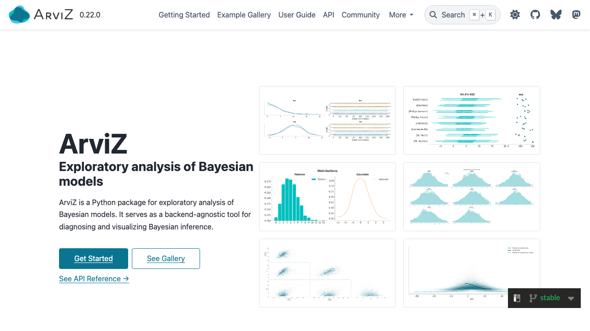
[ArviZ Python docs](https://python.arviz.org/)Bokeh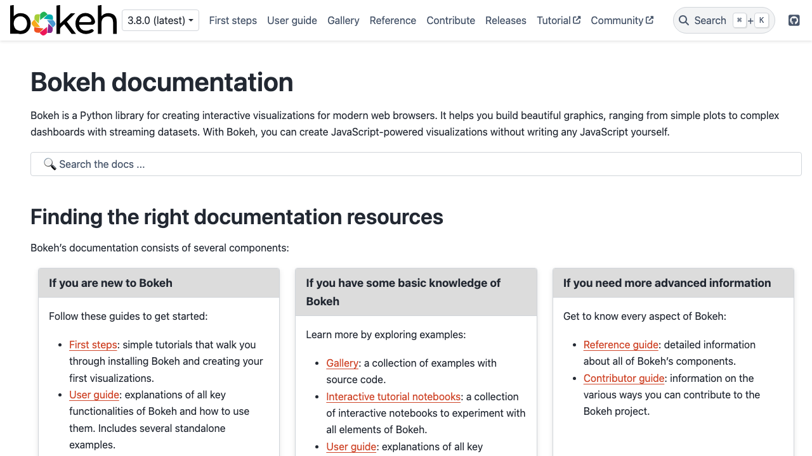
[Bokeh docs](https://docs.bokeh.org/en/latest/)Brightway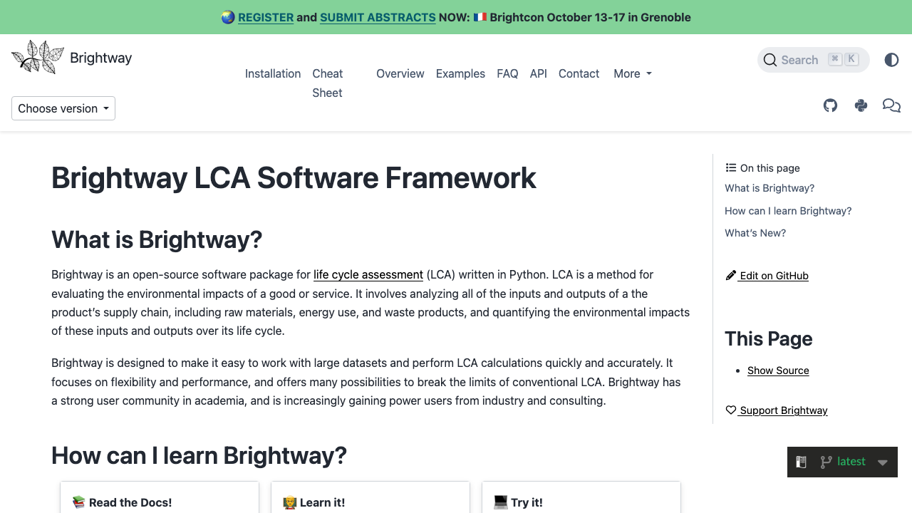
[Brightway docs](https://docs.brightway.dev/en/latest/)Jupyter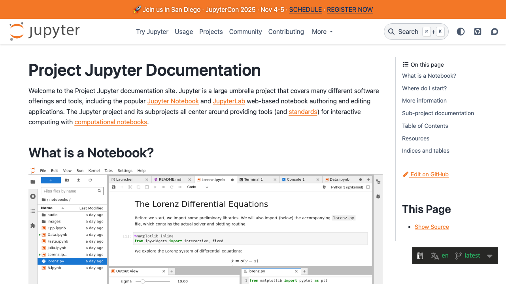
[Jupyter docs](https://docs.jupyter.org/en/latest/)Jupyter Book
[Jupyter Book docs](https://jupyterbook.org/v1/intro.html)Matplotlib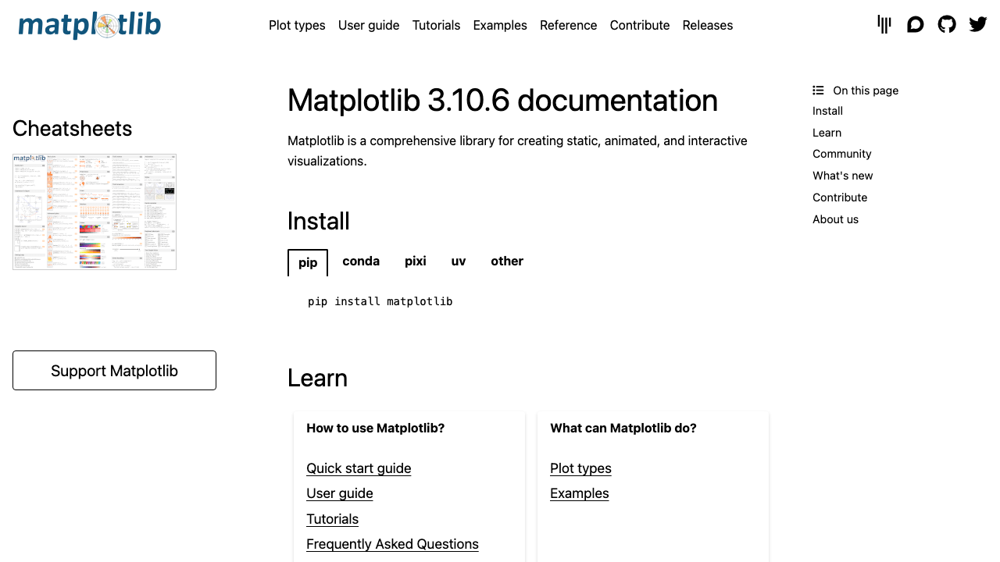
[Matplotlib docs](https://matplotlib.org/stable/)MNE-Python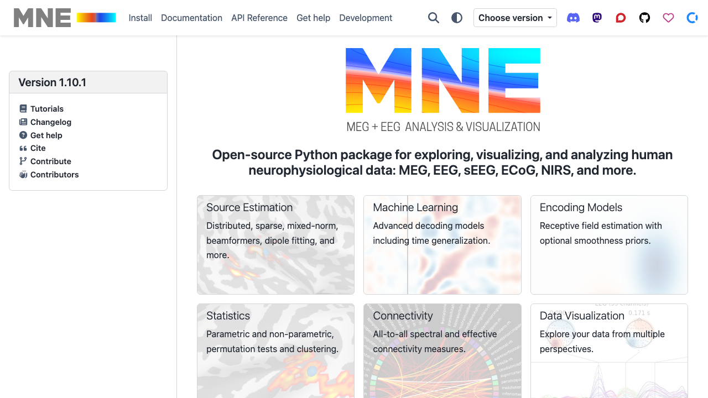
[MNE-Python docs](https://mne.tools/stable/index.html)NetworkX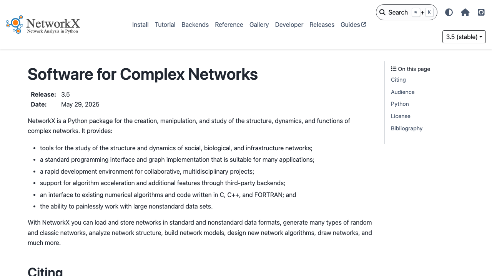
[NetworkX docs](https://networkx.org/documentation/stable/)NumPy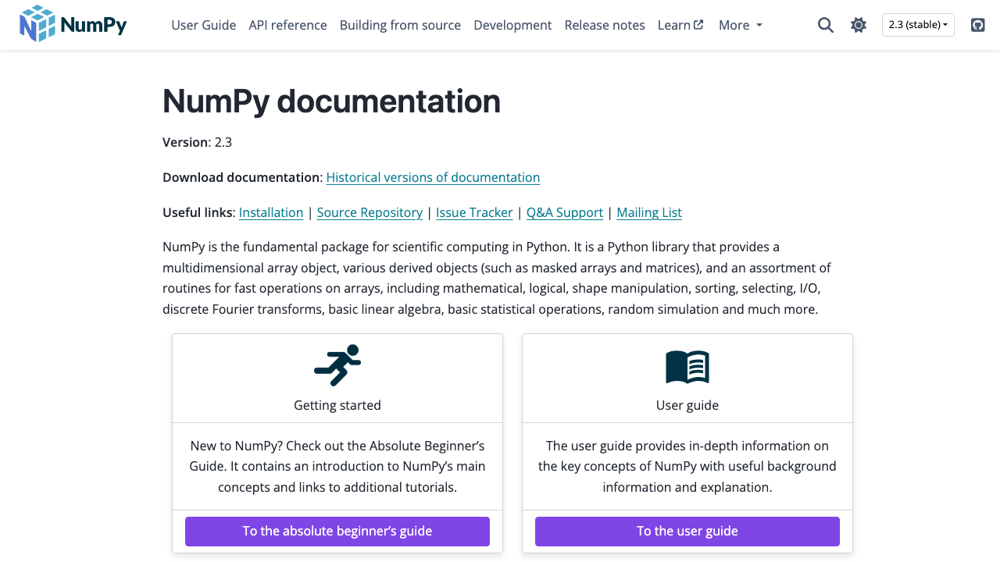
[NumPy docs](https://numpy.org/doc/stable/)Pandas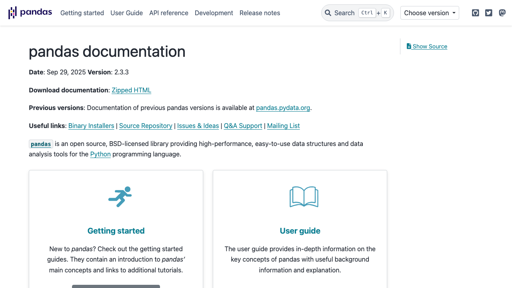
[Pandas docs](https://pandas.pydata.org/docs/)SciPy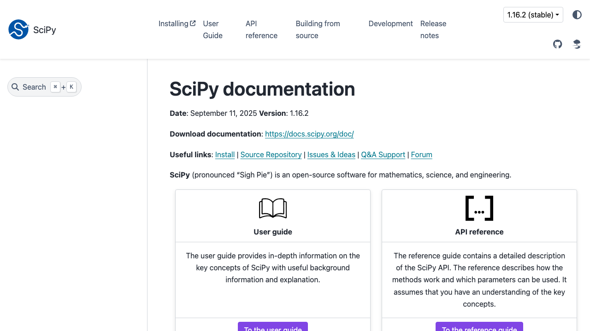
[SciPy docs](https://docs.scipy.org/doc/scipy/)scikit-learn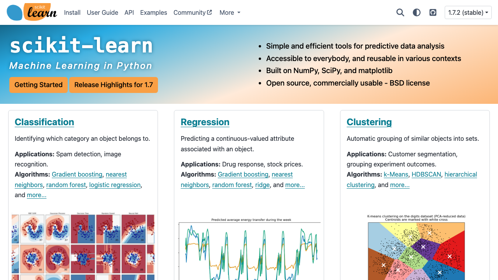
[scikit-learn docs](https://scikit-learn.org/stable/)SEPAL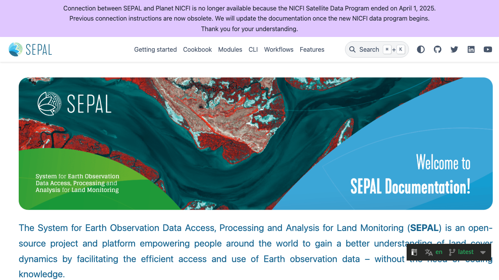
[SEPAL docs](https://docs.sepal.io/en/latest/index.html)

## Other projects using this theme[#](#other-projects-using-this-theme "Link to this heading")

Here are some other projects using `pydata-sphinx-theme` for their documentation.
Thanks for your support!

Binder[Binder docs](https://mybinder.readthedocs.io/en/latest/index.html)BrainGlobe[BrainGlobe docs](https://brainglobe.info)cashocs[cashocs docs](https://cashocs.readthedocs.io/en/stable/)CuPy[CuPy docs](https://docs.cupy.dev/en/stable/index.html)DecentralChain[DecentralChain docs](https://docs.decentralchain.io/en/master/)Fairlearn[Fairlearn docs](https://fairlearn.org/main/about/)Falcon web framework[The Falcon web framework](https://falcon.readthedocs.io/)Feature-engine[Feature-engine docs](https://feature-engine.readthedocs.io/)idtracker.ai[idtracker&period;ai docs](https://idtracker.ai/)itom measurement and simulation software[itom documentation](https://itom-project.github.io/latest/docs/index.html)movement[movement docs](https://movement.neuroinformatics.dev)Pastas[Pastas docs](https://pastas.readthedocs.io/)PhaseFieldX[PhaseFieldX docs](https://phasefieldx.readthedocs.io/en/latest/index.html)PyVista[PyVista docs](https://docs.pyvista.org)